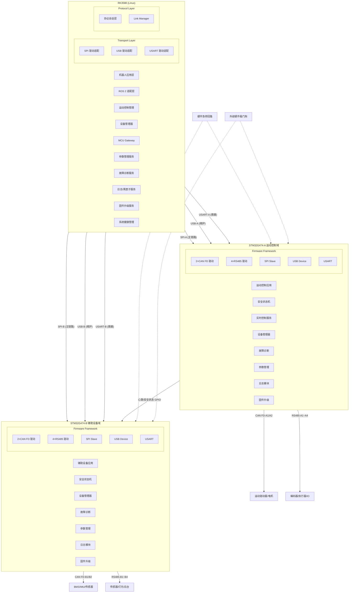
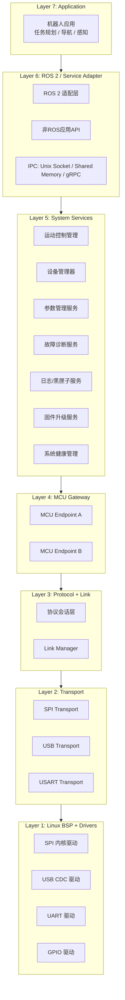
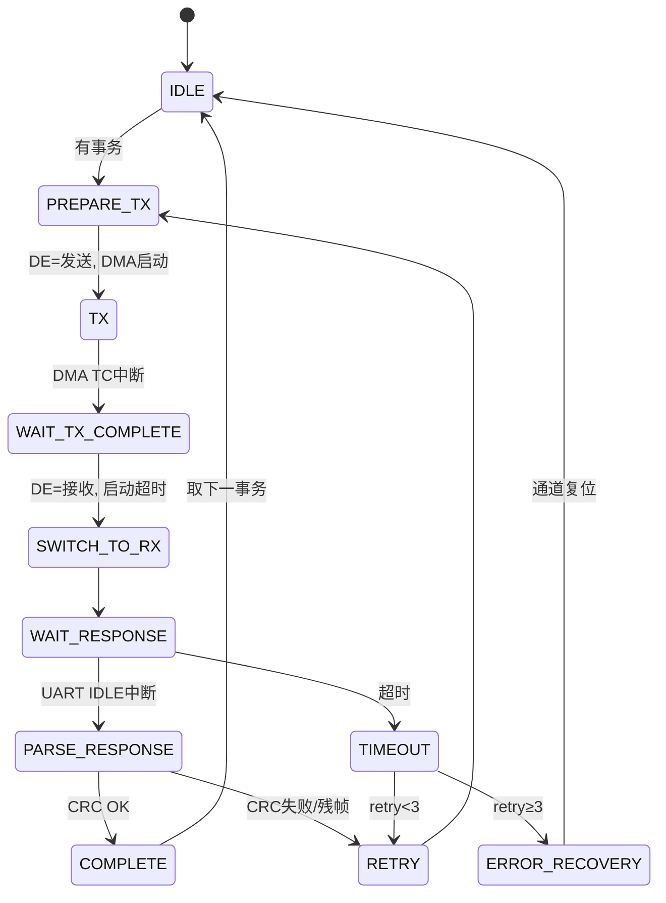
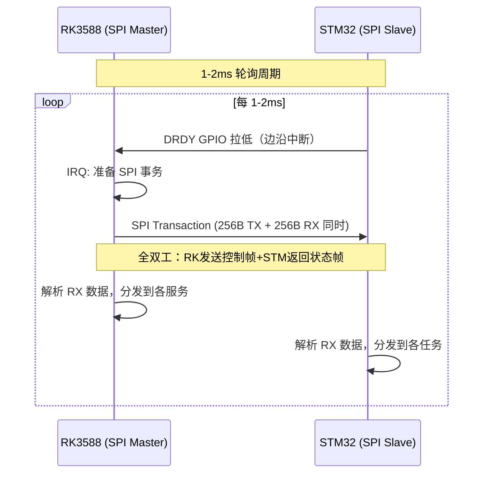
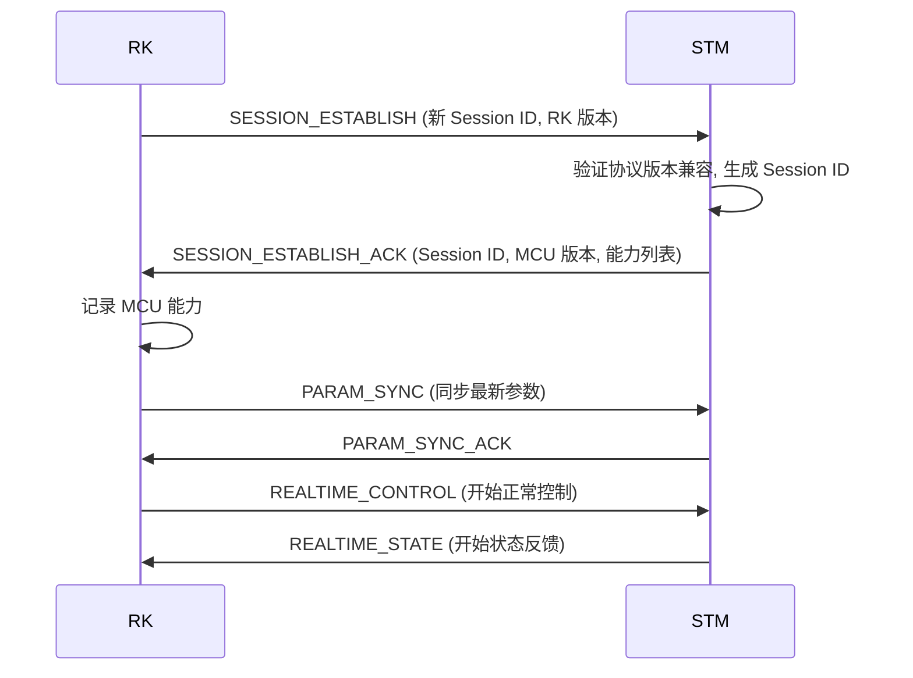
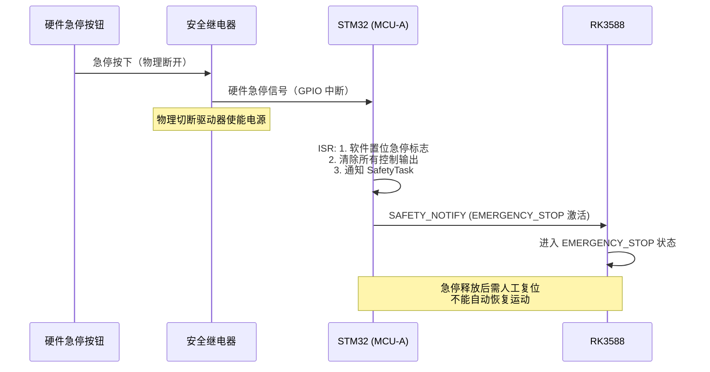
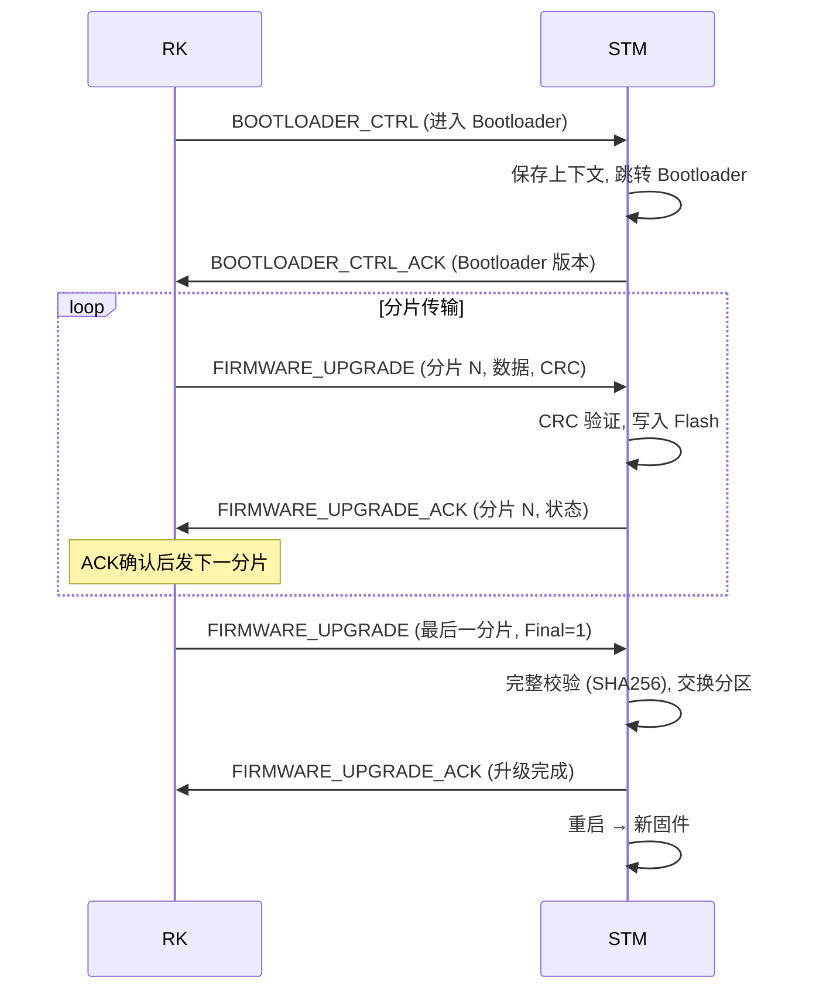
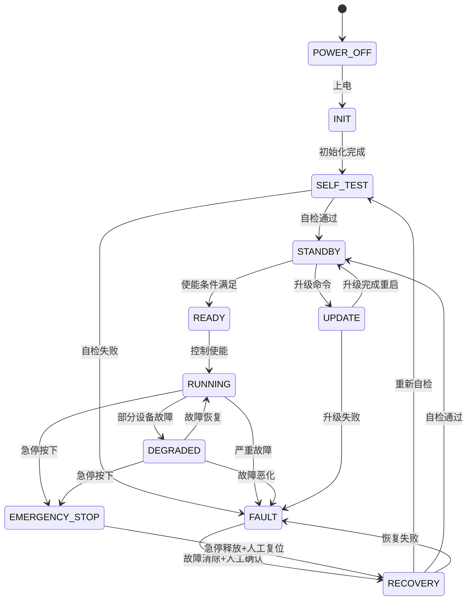
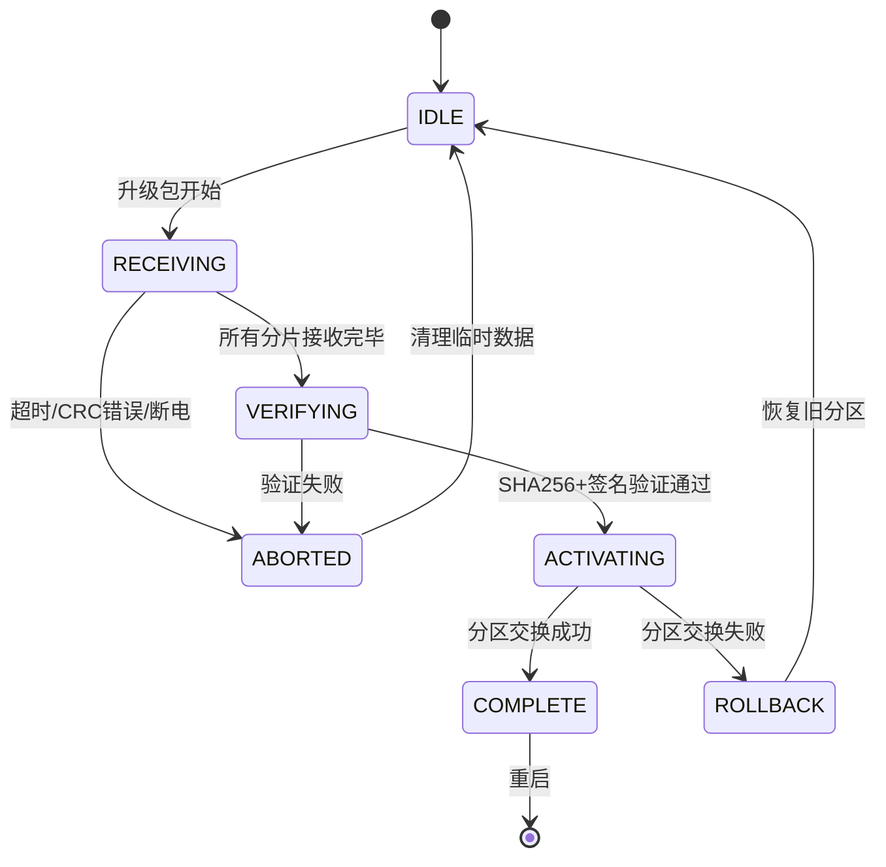

# RK3588 + 双 STM32G474 机器人控制器软硬件架构设计

> **文档版本**: v1.0
> **目标硬件**: RK3588 (Linux) + 2× STM32G474 (FreeRTOS)
> **设计阶段**: 总体架构设计（指导后续详细设计）

---

## 目录

1. [需求理解](#1-需求理解)
2. [已知硬件条件](#2-已知硬件条件)
3. [关键假设](#3-关键假设)
4. [架构约束](#4-架构约束)
5. [硬实时、软实时和非实时功能划分](#5-硬实时软实时和非实时功能划分)
6. [双STM32职责方案对比](#6-双stm32职责方案对比)
7. [推荐的双STM32职责划分](#7-推荐的双stm32职责划分)
8. [推荐硬件通信拓扑](#8-推荐硬件通信拓扑)
9. [SPI、USB和USART职责矩阵](#9-spiusb和usart职责矩阵)
10. [系统总体架构图](#10-系统总体架构图)
11. [RK3588软件分层](#11-rk3588软件分层)
12. [STM32软件分层](#12-stm32软件分层)
13. [MCU-A功能模块](#13-mcu-a功能模块)
14. [MCU-B功能模块](#14-mcu-b功能模块)
15. [RK侧多MCU实例设计](#15-rk侧多mcu实例设计)
16. [STM32多通道对象模型](#16-stm32多通道对象模型)
17. [FreeRTOS任务设计](#17-freertos任务设计)
18. [CAN FD模块设计](#18-can-fd模块设计)
19. [RS485模块设计](#19-rs485模块设计)
20. [RK与STM32统一协议](#20-rk与stm32统一协议)
21. [SPI通信机制](#21-spi通信机制)
22. [关键通信时序图](#22-关键通信时序图)
23. [数据字典与代码生成](#23-数据字典与代码生成)
24. [系统安全状态机](#24-系统安全状态机)
25. [双STM32协同机制](#25-双stm32协同机制)
26. [故障处理矩阵](#26-故障处理矩阵)
27. [参数管理方案](#27-参数管理方案)
28. [固件升级方案](#28-固件升级方案)
29. [故障诊断与日志方案](#29-故障诊断与日志方案)
30. [看门狗和健康监控](#30-看门狗和健康监控)
31. [时间同步方案](#31-时间同步方案)
32. [性能预算表](#32-性能预算表)
33. [RAM、Flash和任务栈预算](#33-ramflash和任务栈预算)
34. [代码仓库目录树](#34-代码仓库目录树)
35. [核心接口定义](#35-核心接口定义)
36. [关键模块伪代码](#36-关键模块伪代码)
37. [测试方案](#37-测试方案)
38. [CI/CD方案](#38-cicd方案)
39. [分阶段开发计划](#39-分阶段开发计划)
40. [架构风险审查](#40-架构风险审查)
41. [需要硬件团队确认的事项](#41-需要硬件团队确认的事项)
42. [需要产品团队确认的事项](#42-需要产品团队确认的事项)
43. [是否可以进入详细设计阶段](#43-是否可以进入详细设计阶段的结论)

---

## 1. 需求理解

本项目旨在设计一款基于 **RK3588 + 双 STM32G474** 的机器人控制器，用于工业/移动机器人的运动控制、设备管理和安全保护。核心需求如下：

- **RK3588** 作为主控，运行 Linux，承担高层算法、任务规划、系统管理、诊断、日志、参数管理和 ROS 2/应用层业务
- **MCU-A (STM32G474)** 作为运动控制域 MCU，负责高实时运动控制、驱动器管理、运动安全保护
- **MCU-B (STM32G474)** 作为辅助设备与系统监控域 MCU，负责 BMS、传感器、辅助执行器、系统状态汇总
- 整机提供 **4 路 CAN FD + 8 路 RS485** 对外通信
- 控制器必须满足实时性、安全性、可测试性、可扩展性和可产品化的工程要求

---

## 2. 已知硬件条件

| 项目 | 规格 |
|------|------|
| 主处理器 | RK3588，运行 Linux |
| 协处理器 ×2 | STM32G474RETx（需确认具体封装），运行 FreeRTOS |
| RK↔MCU-A 接口 | SPI-A, USB-A, USART-A |
| RK↔MCU-B 接口 | SPI-B, USB-B, USART-B |
| MCU-A 外设 | 2×CAN FD, 4×RS485 |
| MCU-B 外设 | 2×CAN FD, 4×RS485 |
| 整机 CAN FD | 4 路 |
| 整机 RS485 | 8 路 |

> **⚠ 需要硬件原理图确认**：STM32G474 具体封装型号，确认 FDCAN、UART、SPI、USB 实例数量及引脚复用冲突。

---

## 3. 关键假设

| 编号 | 假设 | 影响范围 |
|------|------|----------|
| A1 | STM32G474RETx（64pin或更大封装），具备至少 2 个 FDCAN 实例 | CAN FD 架构 |
| A2 | 具备 4 个以上 UART/USART 实例用于 RS485 | RS485 架构 |
| A3 | SPI 从机可用，支持 DMA | SPI 通信性能 |
| A4 | USB 为 USB Device 模式，支持 CDC | USB 链路设计 |
| A5 | RK3588 提供至少 2 路独立 SPI 控制器 | SPI 拓扑 |
| A6 | 外部硬件看门狗独立于 MCU | 安全架构 |
| A7 | 硬件急停回路独立于软件 | 功能安全 |
| A8 | 机器人为工业/移动机器人，非人形机器人 | 运动控制模型 |
| A9 | 运行环境温度 -20°C ~ 60°C，工业级 | 器件选型 |
| A10 | Flash 容量 ≥ 512KB, RAM ≥ 128KB per MCU | 内存预算 |
| A11 | STM32G474 的 USB 和 CAN 共享 SRAM 不影响同时使用 | 资源分配 |

---

## 4. 架构约束

### 4.1 强制约束

| 编号 | 约束 | 来源 |
|------|------|------|
| C1 | RK3588 不能直接承担需要确定性周期和低抖动的底层安全控制 | 原则 2 |
| C2 | STM32 不能依赖 RK3588 持续在线才能保证安全 | 原则 3 |
| C3 | 实时控制路径禁止使用 malloc/free | 原则 11 |
| C4 | ISR 中禁止复杂业务、协议解析、日志格式化和阻塞操作 | 原则 12 |
| C5 | 所有硬件驱动必须支持多实例 | 原则 13 |
| C6 | 每个 CAN FD 通道拥有独立上下文 | 原则 15 |
| C7 | 每个 RS485 通道拥有独立上下文 | 原则 16 |
| C8 | 同一执行器禁止被两块 STM32 同时控制 | 原则 20 |
| C9 | 单通道故障不能拖垮同一个 STM32 上的其他通道 | 设计目标 10 |
| C10 | 一块 STM32 异常时，不应通过软件阻塞另一块 STM32 | 设计目标 11 |
| C11 | USB 和 USART 不得在无仲裁情况下绕过 SPI 直接控制执行器 | 原则 22 |
| C12 | 调试接口不得默认具备运动控制权限 | 原则 23 |
| C13 | 急停不能只通过软件消息实现 | 设计建议 |
| C14 | 业务代码不得直接调用 HAL_xxx 函数 | 原则 |

### 4.2 设计偏好

| 编号 | 偏好 | 理由 |
|------|------|------|
| P1 | 功能域划分优先于通信接口类型划分 | 故障隔离、职责清晰 |
| P2 | 两组独立 SPI 连接两个 MCU | 故障隔离、并行能力 |
| P3 | 同类通道共用任务而非每通道独立任务 | RAM 和调度开销 |
| P4 | 配置结构 + 接口注入 > 条件编译 | 代码可维护性 |
| P5 | 自定义定长二进制协议 > 通用序列化框架 | 实时性、资源效率 |

---

## 5. 硬实时、软实时和非实时功能划分

### 5.1 硬实时 (Hard Real-Time) — 确定性截止时间，超时即失败

| 功能 | 运行位置 | 周期/延迟要求 | 失败后果 |
|------|----------|---------------|----------|
| 运动控制命令执行 | MCU-A | 1-2ms 周期 | 运动失控 |
| 电机/驱动器状态采集 | MCU-A | 1-5ms 周期 | 闭环失效 |
| 控制命令超时保护 | MCU-A | < 10ms 检测 | 执行器保持最后状态 |
| 紧急停车输出切断 | MCU-A | < 5ms 响应 | 安全风险 |
| 速度/位置/力矩限制 | MCU-A | 每控制周期 | 机械损坏 |
| 加减速/斜坡限制 | MCU-A | 每控制周期 | 冲击载荷 |
| CAN FD 实时帧收发 | MCU-A/B | < 1ms 延迟 | 通信超时 |
| 硬件急停响应 | MCU-A/B | < 5ms | 安全风险 |
| 控制命令有效性检查(序列号/时间戳/有效期) | MCU-A/B | 每帧检查 | 过期命令执行 |

### 5.2 软实时 (Soft Real-Time) — 有截止时间，偶发超时可容忍

| 功能 | 运行位置 | 周期/延迟要求 | 超时容忍度 |
|------|----------|---------------|------------|
| 设备状态上报 | MCU-A/B → RK | 10-50ms | 偶发丢帧可接受 |
| 参数同步 | RK ↔ MCU | 100-500ms | 重试即可 |
| 心跳检测 | RK ↔ MCU | 10-50ms | 单次丢失触发告警 |
| 故障事件上报 | MCU → RK | < 50ms | 少量延迟可接受 |
| CAN FD 诊断帧收发 | MCU-A/B | 100-1000ms | 重试不影响安全 |
| RS485 设备轮询 | MCU-A/B | 10-100ms/设备 | 单次超时重试 |
| 日志上传 | MCU → RK | 按需/周期 | 缓冲可排队 |
| 时间同步 | RK → MCU | 1-10s | 漂移可接受 |

### 5.3 非实时 (Non-Real-Time) — 无硬性截止时间

| 功能 | 运行位置 | 触发方式 |
|------|----------|----------|
| 参数配置/管理 | RK | 事件驱动 |
| 固件升级 | RK + MCU | 事件驱动 |
| 日志导出/分析 | RK | 按需 |
| 机器人任务规划 | RK | 事件驱动 |
| ROS 2 高层应用 | RK | 事件/周期 |
| 产线测试/调试 | RK + MCU | 人工触发 |
| 设备能力查询 | RK ↔ MCU | 启动时/按需 |
| 黑匣子数据导出 | RK | 维护模式 |

---

## 6. 双STM32职责方案对比

### 6.1 方案概述

**方案一：运动控制域 vs 辅助设备域**（推荐）
- MCU-A：所有与运动控制直接相关的设备（行走/转向/关节电机、编码器、运动安全IO）
- MCU-B：BMS、IMU、传感器、灯光、云台、辅助执行器等非运动核心设备

**方案二：空间区域划分**（左/右，前/后）
- MCU-A：左侧/前部所有设备
- MCU-B：右侧/后部所有设备

**方案三：主控制 vs 监控**
- MCU-A：主要实时控制
- MCU-B：监控、安全和辅助

**方案四：子系统划分**（底盘 vs 上装）
- MCU-A：底盘系统
- MCU-B：机械臂、云台、上装

### 6.2 多维度对比

| 维度 | 方案一（运动/辅助域） | 方案二（空间区域） | 方案三（主控/监控） | 方案四（子系统） |
|------|----------------------|--------------------|--------------------|--------------------|
| **实时性** | ★★★★★ 运动域完全独立，无干扰 | ★★★ 两侧对称，无优先级差 | ★★★★ 主MCU可专注控制 | ★★★★ 底盘独立 |
| **故障隔离** | ★★★★★ 运动故障不影响辅助设备 | ★★★ 一侧故障损失一半功能 | ★★★★ 监控独立于控制 | ★★★★ 子系统独立 |
| **安全性** | ★★★★★ 安全链路集中在MCU-A | ★★★ 两侧均有运动设备 | ★★★★ 监控可检测控制异常 | ★★★★ 底盘安全独立 |
| **代码复用** | ★★★ MCU-A/B业务差异大 | ★★★★★ 两侧完全对称 | ★★★ 角色差异大 | ★★★ 子系统差异大 |
| **扩展性** | ★★★★★ 新增辅助设备只影响MCU-B | ★★★ 左右不对称时麻烦 | ★★★★ 辅助设备统一扩展 | ★★★ 子系统变更需重新划分 |
| **总线负载** | ★★★★ CAN/485按域分，自然均衡 | ★★★ 依赖实际布局 | ★★★★ 可控 | ★★★ 底盘总线可能重载 |
| **硬件资源利用** | ★★★★ 按需分配 | ★★★ 可能不均衡 | ★★★★ 按需分配 | ★★★ 可能不均衡 |
| **产品系列化** | ★★★★★ 不同型号调整域划分清晰 | ★★★ 两驱/四驱型号不适用 | ★★★★ 可从主控扩展到多域 | ★★★★ 子系统可增减 |
| **测试复杂度** | ★★★★★ 运动域和辅助域可独立测试 | ★★★ 两侧需对称测试 | ★★★★ 分层测试清晰 | ★★★★ 子系统独立测试 |
| **维护成本** | ★★★★ 域职责明确 | ★★★ 需同时理解两侧 | ★★★ 需理解主从关系 | ★★★ 子系统内聚 |

### 6.3 结论

**推荐方案一（运动控制域 vs 辅助设备域）**，理由：
1. 与实时性要求天然对齐 — 运动控制域全部为硬实时
2. 故障隔离效果最好 — MCU-B 任何故障不影响运动安全核心
3. 安全链路集中在 MCU-A，简化安全认证
4. 产品系列化时，改变辅助设备配置只影响 MCU-B
5. 方案二（空间划分）在非对称布局机器人上暴露出严重的复用问题

---

## 7. 推荐的双STM32职责划分

### MCU-A：运动控制域

```
MCU-A (STM32G474) — 运动控制域
├── CAN FD-A1: 主要运动驱动器 (行走/转向电机驱动器)
├── CAN FD-A2: 辅助运动驱动器 (关节电机/舵轮模组)
├── RS485-A1: 编码器 / 位置传感器
├── RS485-A2: 运动执行器 (伺服/步进)
├── RS485-A3: 运动安全 IO (限位/防撞)
├── RS485-A4: 预留 / 制动执行器
├── 控制命令超时保护
├── 速度/位置/力矩限制
├── 加减速斜坡管理
├── 运动使能管理
├── 紧急停车输出切断
├── 运动域故障诊断
└── 与 MCU-B 交换心跳/安全状态
```

**核心职责**：
- 高频控制命令执行 (1-2ms)
- 电机/驱动器状态采集 (1-5ms)
- 控制命令有效性验证 (序列号+时间戳+有效期+会话ID)
- 速度、位置、力矩限制
- 紧急停车后立即切断输出
- 运动使能/失能管理
- 驱动器故障响应
- 运动域故障诊断与上报

### MCU-B：辅助设备与系统监控域

```
MCU-B (STM32G474) — 辅助设备与系统监控域
├── CAN FD-B1: BMS / 电源管理
├── CAN FD-B2: IMU / 辅助传感器 / 扩展设备
├── RS485-B1: 超声波传感器
├── RS485-B2: 灯光 / 声光报警
├── RS485-B3: 云台 / 升降机构
├── RS485-B4: 环境传感器 / 防撞条 / GPIO 扩展
├── 电源和 BMS 状态监控
├── 辅助执行器控制
├── 系统级状态汇总
├── 参与整机使能条件判断
├── 辅助域故障诊断
└── 与 MCU-A 交换心跳/安全状态
```

**核心职责**：
- BMS/电源状态监控
- 非核心传感器数据采集
- 辅助执行机构控制
- 系统级运行状态汇总
- 辅助域故障诊断
- 作为整机使能条件的一部分

---

## 8. 推荐硬件通信拓扑

### 8.1 推荐方案：两组独立 SPI

```
┌──────────────────────────────────────────┐
│                 RK3588                    │
│  ┌──────────┐  ┌──────────┐             │
│  │ SPI0 CS0 │  │ SPI1 CS0 │             │
│  │ MOSI/MISO│  │ MOSI/MISO│             │
│  │ CLK      │  │ CLK      │             │
│  └────┬─────┘  └────┬─────┘             │
│       │DRDY_GPIO   │DRDY_GPIO            │
│  ┌────┴─────┐  ┌────┴─────┐             │
│  │ USB0 OTG │  │ USB1 OTG │             │
│  └────┬─────┘  └────┬─────┘             │
│  ┌────┴─────┐  ┌────┴─────┐             │
│  │ UART0    │  │ UART1    │             │
│  └────┬─────┘  └────┬─────┘             │
│       │RST_GPIO    │RST_GPIO             │
└───────┼────────────┼─────────────────────┘
        │            │
  ┌─────┴────────────┴─────┐
  │  ┌─────────────────┐   │
  │  │  Hardware E-Stop│   │  ← 独立硬件急停回路
  │  │  External WDT   │   │  ← 独立硬件看门狗
  │  │  Safety Relay   │   │  ← 安全继电器
  │  └─────────────────┘   │
  └─────┬────────────┬─────┘
        │            │
┌───────┴──────┐ ┌───┴──────────┐
│ STM32G474-A  │ │ STM32G474-B  │
│ 运动控制域   │ │ 辅助设备域   │
├──────────────┤ ├──────────────┤
│ SPI Slave    │ │ SPI Slave    │
│ USB Device   │ │ USB Device   │
│ USART        │ │ USART        │
│ 2×CAN FD     │ │ 2×CAN FD     │
│ 4×RS485      │ │ 4×RS485      │
│ DRDY GPIO→RK │ │ DRDY GPIO→RK │
│ RST←RK GPIO  │ │ RST←RK GPIO  │
└──────┬───────┘ └──────┬───────┘
       │                │
  ┌────┴────┐      ┌────┴────┐
  │Heartbeat│←────→│Heartbeat│  ← MCU间GPIO直连
  │Safety   │      │Safety   │    仅心跳+安全状态
  └─────────┘      └─────────┘
```

### 8.2 SPI方案对比与选择

| 维度 | 方案一：两组独立SPI ★ | 方案二：共享SPI总线 | 方案三：级联 |
|------|----------------------|--------------------|-------------|
| 故障隔离 | ★★★★★ 完全隔离 | ★★ 一MCU拉低总线影响另一MCU | ★★ 上游MCU故障阻断下游 |
| 并行能力 | ★★★★★ 真正并行 | ★★ 分时复用 | ★ 串行 |
| 有效带宽 | ★★★★★ 2×带宽 | ★★★ 1×带宽分时 | ★ 单链路 |
| Linux驱动复杂度 | ★★★★ 标准独立设备 | ★★★ 片选管理 | ★★★★ 标准 |
| DMA支持 | ★★★★★ 独立DMA通道 | ★★★★ 共享DMA | ★★★★ 标准 |
| 从机实现 | ★★★★ 标准SPI Slave | ★★★ 需配合片选 | ★★★ 需转发逻辑 |
| 引脚资源 | ★★★ 多一组SPI | ★★★★ 少一组SPI | ★★★★★ 最少 |
| 升级便利性 | ★★★★★ 独立升级 | ★★★★ | ★★ 需转发 |

**推荐**：两组独立 SPI（方案一）。代价是 RK3588 需提供 2 路 SPI 控制器，多占用 4 个引脚（CLK/MOSI/MISO/CS）。选择理由：故障隔离是硬约束 — 任何情况下一块 MCU 的 SPI 故障（包括引脚短路拉低总线）都不得影响另一块 MCU 的通信。

### 8.3 USB 方案

- 两块 STM32 分别连接 RK3588 **独立 USB Host 口**
- 使用 **USB CDC (虚拟串口)**，无需自定义驱动
- USB 默认角色：**调试、日志导出、参数配置、固件升级、产线测试**
- USB **不拥有运动控制权限**（由 Link Manager 强制）
- 不使用 USB Hub：避免 Hub 故障导致两块 MCU 同时失联
- 每块 STM32 集成 USB DFU 支持救援升级

### 8.4 USART 方案

- RK3588 分别连接两块 STM32 **独立 USART**
- 使用 115200-921600 bps，**需要硬件流控 (RTS/CTS)**
- 角色：**Bootloader、救援升级、低速诊断**
- USART 救援模式只能执行有限命令集：
  - 固件升级
  - 版本查询
  - 状态查询
  - 参数恢复出厂
  - **不得包含运动控制命令**

### 8.5 额外硬件信号

| 信号 | 方向 | 用途 |
|------|------|------|
| SPI_DRDY_A | MCU-A → RK | MCU 有数据待发送，通知 RK 发起 SPI 事务 |
| SPI_DRDY_B | MCU-B → RK | 同上 |
| MCU_RST_A | RK → MCU-A | RK 硬件复位 MCU-A |
| MCU_RST_B | RK → MCU-B | RK 硬件复位 MCU-B |
| MCU_HB_A | MCU-A ↔ MCU-B | MCU 间心跳 GPIO |
| MCU_SAFE_A | MCU-A → MCU-B | MCU-A 安全状态（可进入安全模式） |
| MCU_SAFE_B | MCU-B → MCU-A | MCU-B 安全状态 |
| HW_ESTOP | 硬件急停按钮 → 安全继电器 | 硬件急停，绕过所有软件 |
| EXT_WDT_RST | 外部 WDT → MCU-A/B | 独立硬件看门狗复位 |
| DRV_ENABLE | MCU-A → 驱动器 | 硬件使能线，软件不干预时物理切断 |
| PWR_GOOD | 电源模块 → MCU-A/B | 电源状态监控 |

---

## 9. SPI、USB和USART职责矩阵

### 9.1 职责分配

| 功能 | SPI (主链路) | USB (维护链路) | USART (救援链路) |
|------|:-----------:|:------------:|:---------------:|
| 实时控制命令 | ✅ **拥有控制权** | ❌ 禁止 | ❌ 禁止 |
| 高频状态反馈 | ✅ | ❌ | ❌ |
| 心跳 | ✅ | ❌ | ❌ |
| 时间同步 | ✅ | ❌ | ❌ |
| 参数同步 | ✅ | ✅ (低速) | ❌ |
| 故障事件 | ✅ (主动上报) | ✅ (查询) | ❌ |
| 设备状态 | ✅ | ✅ (查询) | ❌ |
| 固件升级 | ✅ (SPI 在线) | ✅ (USB DFU) | ✅ (救援) |
| 日志导出 | ❌ (带宽有限) | ✅ | ❌ |
| 调试命令 | ❌ | ✅ | ❌ |
| 参数配置 | ❌ | ✅ | ❌ |
| 产线测试 | ❌ | ✅ | ✅ (烧录) |
| Bootloader | ❌ | ✅ (DFU) | ✅ |
| 抓包/诊断 | ❌ | ✅ | ❌ |
| 版本查询 | ✅ | ✅ | ✅ |
| 能力查询 | ✅ | ✅ | ❌ |
| 运动控制 | ❌ | ❌ | ❌ |

### 9.2 Link Manager 设计

```
Link Manager — 每 MCU 一个实例
┌────────────────────────────────┐
│ current_active_link: enum      │  ← SPI / USB / USART / NONE
│ link_states[3]: struct         │  ← 每个链路状态
│ link_priority: [SPI > USB > USART]
│ session_id: uint32_t           │  ← 当前有效会话
│ control_owner: enum            │  ← 谁拥有控制权
│ main_link_switch_policy: enum  │  ← AUTO / MANUAL / DISABLED
│ debug_permission: bool         │  ← USB调试权限
│ rescue_mode: bool              │  ← 救援模式标志
└────────────────────────────────┘
```

**Link Manager 规则**：

1. **正常运行**：SPI 拥有控制权，USB 仅用于维护，USART 仅用于救援
2. **SPI 故障**：不会自动切换到 USB/USART 作为控制链路。机器人进入 DEGRADED 或 FAULT 状态
3. **USB 安全**：USB 链路上的所有消息标记为 `source=MAINTENANCE`，Link Manager 拒绝带有运动控制指令的消息
4. **旧命令防护**：每条控制命令带有 session_id + seq_num，Link Manager 维护最后接受的 seq_num，拒绝过期/重复/乱序命令
5. **会话恢复**：SPI 恢复后，RK 必须发起新的会话建立流程（新的 session_id），旧会话中的所有未执行命令作废
6. **控制权切换**：需要人工确认（通过物理开关或调试工具显式授权），不可自动切换
7. **多连接**：USB 同时只允许一个 Host 连接。新连接自动断开旧连接
8. **Bootloader 协议**：与应用程序协议独立，使用简化的帧格式，仅支持升级和版本查询
9. **维护模式隔离**：维护模式下所有运动使能线物理断开（通过安全继电器控制 DRV_ENABLE）

---

## 10. 系统总体架构图



---

## 11. RK3588软件分层



**分层依赖规则**：
- 每层只能向下依赖相邻层
- **禁止反向依赖**（底层不能依赖上层）
- **禁止跨层依赖**（Layer 5 不能直接调用 Layer 1）
- Layer 3 (Protocol) 是物理链路无关的
- Layer 5 (System Services) 不直接依赖 ROS 2 — ROS 2 适配在 Layer 6

### ROS 2 架构说明

**适合做 ROS 2 Node 的模块**（L6）：
- MCU Gateway（发布设备状态 Topic，订阅控制命令 Topic）
- 运动控制管理（发布运动状态，提供控制 Action）
- 故障诊断服务（发布故障 Topic，提供诊断 Service）
- 参数管理服务（提供参数读写 Service）
- 日志服务（发布日志 Topic）
- 固件升级（提供升级 Action）

**不应直接依赖 ROS 2 的模块**（保留在 L5 纯 C++ 实现）：
- Transport Layer
- Protocol Layer
- 所有底层驱动适配

**关键设计决策**：
- ROS 消息结构 ≠ RK-MCU 通信协议。ROS 消息变化不应影响 MCU 协议
- 实时控制命令通过 ROS 2 Action + 自定义 QoS (RELIABLE + TRANSIENT_LOCAL)
- 非实时状态反馈使用 ROS 2 Topic + BEST_EFFORT QoS
- 使用 Lifecycle Node 管理 MCU Gateway 生命周期
- ROS 节点崩溃 → MCU Gateway 检测通信中断 → MCU 独立执行安全策略

---

## 12. STM32软件分层

```mermaid
graph TB
    subgraph L7S["Layer 7: Application"]
        APP_A[MCU-A 运动控制应用]
        APP_B[MCU-B 辅助设备应用]
    end
    
    subgraph L6S["Layer 6: System Services"]
        REALTIME[实时控制服务]
        SAFETY_FSM[安全状态机]
        DEV_MGR_M[设备管理器]
        DIAG_M[故障诊断模块]
        PARAM_M[参数管理模块]
        LOG_M[日志模块]
        FW_UPDATE[固件升级模块]
    end
    
    subgraph L5S["Layer 5: Device Protocol Adapter"]
        CANOPEN_ADPT[CANopen 适配]
        MODBUS_ADPT[Modbus RTU 适配]
        CUSTOM_ADPT[自定义协议适配]
    end
    
    subgraph L4S["Layer 4: Communication"]
        PROTO_CODEC[协议编解码层]
        LINK_MGR_M[Link Manager]
        TRANS_M[通信传输层]
    end
    
    subgraph L3S["Layer 3: Peripheral Drivers"]
        SPI_SLAVE[SPI Slave 驱动]
        USB_DEV[USB Device 驱动]
        UART_DRV_M[USART 驱动]
        CANFD_DRV[2×CAN FD 驱动]
        RS485_DRV[4×RS485 驱动]
        DMA_MGR[DMA 管理]
    end
    
    subgraph L2S["Layer 2: HAL/LL + OSAL"]
        HAL_LL[HAL/LL 封装层]
        OSAL[OSAL 操作系统抽象层]
    end
    
    subgraph L1S["Layer 1: Board + BSP"]
        BOARD[Board 板级配置]
        BSP[BSP 层]
        PIN_MUX[引脚复用配置]
        CLOCK[时钟配置]
    end
    
    L7S --> L6S
    L6S --> L5S
    L5S --> L4S
    L4S --> L3S
    L3S --> L2S
    L2S --> L1S
```



**分层依赖规则**：
- 业务代码**禁止**直接调用 HAL_CAN_*, HAL_FDCAN_*, HAL_UART_*, HAL_SPI_*, HAL_GPIO_*
- 所有硬件访问必须经过 L3 驱动接口或 L5 设备抽象
- L2 HAL/LL 封装提供统一的错误码和回调机制
- OSAL 抽象 FreeRTOS API，支持在 PC 上移植测试（替换为 pthread）

**MCU-A 和 MCU-B 代码共享策略**：
- `mcu_common/`：共享 L1-L5 所有公共代码
- `mcu_a/` 和 `mcu_b/`：各自 L6-L7 业务代码
- 角色差异通过**编译目标配置** + **配置结构体注入**实现，**禁止** #ifdef MCU_A / MCU_B

---

## 13. MCU-A功能模块

| 模块 | 功能描述 | 周期/触发 |
|------|----------|-----------|
| 实时控制执行器 | 解析并执行运动控制命令（速度/位置/力矩） | 1-2ms 周期 |
| 控制命令验证器 | 检查序列号、时间戳、有效期、会话ID | 每帧 |
| 速度/位置/力矩限制器 | 硬限幅保护 | 每控制周期 |
| 加减速斜坡发生器 | S曲线/梯形加减速 | 每控制周期 |
| 运动使能管理器 | 管理驱动器使能/失能序列 | 事件驱动 |
| 紧急停车处理器 | 硬件急停 → 立即切断输出 | < 5ms ISR |
| CAN FD-A1 管理器 | 主要运动驱动器通信 | 1-2ms 周期帧 |
| CAN FD-A2 管理器 | 辅助运动设备通信 | 1-10ms |
| RS485-A1~A4 管理器 | 编码器/执行器/IO 轮询 | 按设备周期 |
| 运动域故障诊断 | 驱动器故障、通信超时、数据异常 | 事件驱动 |
| 安全状态机 | 管理 MCU-A 安全状态迁移 | 连续运行 |
| MCU-B 心跳监控 | 监控 MCU-B 存活和状态 | 10ms 周期 |
| 参数管理器 | 本地参数存储和同步 | 按需 |

---

## 14. MCU-B功能模块

| 模块 | 功能描述 | 周期/触发 |
|------|----------|-----------|
| BMS 管理器 | 电池状态、SOC、温度、充放电管理 | 100-1000ms |
| 电源监控器 | 各路电压/电流监控 | 100ms |
| IMU/姿态传感器采集 | 姿态数据采集和预处理 | 5-10ms |
| 超声波传感器管理 | 多路超声波测距数据采集 | 50-200ms |
| 防撞条管理器 | 碰撞检测和响应 | < 10ms 中断 |
| 灯光/声光报警 | 状态指示灯和报警控制 | 100ms |
| 云台/升降管理器 | 云台角度、升降位置控制 | 20-50ms |
| 环境传感器采集 | 温湿度/气压等环境数据 | 100-1000ms |
| 系统状态汇总 | 汇总辅助域设备状态 | 50ms |
| 整机使能条件判断 | 评估辅助域是否满足整机使能 | 连续 |
| 辅助域故障诊断 | BMS/传感器/执行器故障检测 | 事件驱动 |
| 安全状态机 | 管理 MCU-B 安全状态迁移 | 连续运行 |
| MCU-A 心跳监控 | 监控 MCU-A 存活和状态 | 10ms 周期 |
| 参数管理器 | 本地参数存储和同步 | 按需 |


---

## 15. RK侧多MCU实例设计

### 15.1 McuEndpoint 核心结构

```cpp
// rk3588/mcu_gateway/mcu_endpoint.h

struct McuEndpointConfig {
    uint8_t node_id;           // 1 = MCU-A, 2 = MCU-B
    McuRole role;              // MOTION_CONTROL / AUXILIARY_SYSTEM
    std::string spi_dev;       // "/dev/spidev0.0" or "/dev/spidev1.0"
    std::string usb_dev;       // "/dev/ttyACM0" or "/dev/ttyACM1"
    std::string uart_dev;      // "/dev/ttyS0" or "/dev/ttyS1"
    uint32_t spi_speed_hz;
    uint32_t uart_baudrate;
    int drdy_gpio;             // Data Ready 中断 GPIO
    int rst_gpio;              // MCU 硬件复位 GPIO
};

class McuEndpoint {
public:
    int Initialize(const McuEndpointConfig& config);
    int Start();
    int Stop();

    // 控制命令（仅 SPI 主链路有效）
    int SendControlCommand(const MotionCommand& cmd, uint32_t timeout_ms);
    // 状态获取
    int GetMotionState(MotionState& state, uint32_t timeout_ms);
    int GetDeviceState(uint8_t device_id, DeviceState& state);
    // 参数操作
    int ReadParameter(uint16_t param_id, ParameterValue& value);
    int WriteParameter(uint16_t param_id, const ParameterValue& value);
    // 维护操作
    int EnterBootloader(LinkType via_link = LINK_USB);
    int SendFirmwareData(const uint8_t* data, uint32_t length);
    int QueryVersion(McuVersion& version);

    // 状态查询
    LinkType GetActiveLink() const;
    uint32_t GetSessionId() const;
    HeartbeatStatus GetHeartbeat() const;
    McuFaultState GetFaultState() const;
    McuDeviceDomain& GetDeviceDomain();

private:
    McuEndpointConfig config_;
    std::unique_ptr<SpiTransport>  spi_transport_;
    std::unique_ptr<UsbTransport>  usb_transport_;
    std::unique_ptr<UartTransport> uart_transport_;
    LinkManager link_manager_;
    ProtocolSession protocol_session_;
    McuDeviceDomain device_domain_;
    
    std::atomic<bool> heartbeat_alive_{false};
    // 每个 McuEndpoint 拥有独立的 poll 线程，不互相阻塞
    std::unique_ptr<std::thread> spi_poll_thread_;
    std::atomic<bool> spi_poll_running_{false};
    mutable std::mutex mutex_;
};
```

### 15.2 McuManager 结构

```cpp
class McuManager {
public:
    int Initialize();
    int StartAll();
    int StopAll();
    McuEndpoint& GetEndpointA() { return mcu_a_; }
    McuEndpoint& GetEndpointB() { return mcu_b_; }
    SystemSafetyState GetAggregatedSafetyState();
private:
    McuEndpoint mcu_a_;
    McuEndpoint mcu_b_;
    // 两个 Endpoint 完全独立，一块 MCU 离线不阻塞另一块的线程
};
```

---

## 16. STM32多通道对象模型

每个 CAN FD 通道和 RS485 通道拥有独立上下文。

```c
// CAN FD 通道 — 每块MCU实例化 2 个
typedef struct {
    uint8_t channel_id;
    FDCAN_HandleTypeDef *fdcan_handle;
    CanFdConfig config;              // 仲裁/数据段波特率、BRS
    CanFdChannelState state;         // IDLE/ACTIVE/ERROR_PASSIVE/BUS_OFF/RECOVERING
    CanFdRxRingBuffer rx_ring;       // 环形缓冲区（中断写入，零拷贝）
    CanFdTxQueue high_prio_queue;    // 紧急帧（长度4）
    CanFdTxQueue normal_queue;       // 普通帧（长度16）
    CanFdScheduleTable schedule;     // 周期帧调度表
    CanFdFilterEntry filters[32];
    CanFdStatistics stats;
    uint32_t last_rx_timestamp;
    uint32_t last_tx_timestamp;
    CanProtoAdapter *protocol;       // 当前协议适配器（多态）
    void *protocol_context;
    TaskHandle_t notify_task;        // 中断完成后通知的任务
} CanFdChannel;

// RS485 通道 — 每块MCU实例化 4 个
typedef struct {
    uint8_t channel_id;
    UART_HandleTypeDef *uart_handle;
    DMA_HandleTypeDef *tx_dma;
    DMA_HandleTypeDef *rx_dma;
    Rs485Config config;
    Rs485DirectionControl dir_ctrl;  // DE/RE 引脚控制
    Rs485RxRingBuffer rx_ring;       // DMA 循环接收
    Rs485Transaction current_txn;
    Rs485TransactionQueue txn_queue; // 事务队列（8个紧急+32个普通）
    Rs485PollEntry poll_table[32];   // 设备轮询表
    uint8_t poll_entry_count;
    uint8_t current_poll_index;
    Rs485TransactionState txn_state; // 事务状态机当前状态
    uint8_t retry_count;
    uint32_t txn_deadline_ms;
    Rs485Statistics stats;
    TaskHandle_t notify_task;
} Rs485Channel;

// 每块 MCU 的全局实例
CanFdChannel g_canfd_channels[2];
Rs485Channel g_rs485_channels[4];
```

---

## 17. FreeRTOS任务设计表

**推荐模型：同类通道共用任务**（而非每通道一个任务）。

| # | 任务名称 | 优先级 | 周期/触发 | 最坏执行 | 栈(KB) | 通信方式 | 阻塞 | 动态内存 |
|---|---------|--------|-----------|----------|--------|----------|------|----------|
| 1 | **SafetyTask** | 6(最高) | 1ms周期 | <200μs | 2 | TaskNotify+EventGroup | 否 | 否 |
| 2 | **RealtimeControlTask** | 5 | 1ms周期 | <500μs | 4 | Queue+直接调用 | 否 | 否 |
| 3 | **HostLinkRxTask** | 5 | SPI中断→Notify | <300μs | 3 | TaskNotify | 否 | 否 |
| 4 | **HostLinkTxTask** | 4 | 1-2ms周期+Queue | <300μs | 3 | Queue | 是(queue) | 否 |
| 5 | **CanFdRxTask** | 4 | CAN中断→Notify | <500μs | 2.5 | TaskNotify | 否 | 否 |
| 6 | **CanFdTxSchedulerTask** | 3 | 1ms周期 | <300μs | 2 | Queue | 是(queue) | 否 |
| 7 | **Rs485SchedulerTask** | 3 | 1ms tick+UART IDLE | <1ms | 3 | TaskNotify | 否 | 否 |
| 8 | **DeviceManagerTask** | 3 | 10ms周期 | <500μs | 2 | Queue | 否 | 否 |
| 9 | **DiagnosticsTask** | 3 | 10ms周期 | <500μs | 2 | Queue | 否 | 否 |
| 10 | **ParameterTask** | 2 | 事件驱动(Queue) | <2ms | 2 | Queue | 是(queue) | 否 |
| 11 | **LoggerTask** | 2 | 事件驱动(Queue) | <1ms | 2 | Queue | 是(queue) | 否 |
| 12 | **FirmwareUpdateTask** | 1 | 按需(升级时创建) | 不限 | 3 | Queue | 是(queue) | 否 |
| 13 | **WatchdogTask** | 6(最高) | 5ms周期 | <100μs | 1 | EventGroup | 否 | 否 |
| 14 | **TimeSyncTask** | 2 | 1s周期 | <200μs | 1.5 | Queue | 否 | 否 |

**关键设计规则**：
- SafetyTask 和 RealtimeControlTask **禁止持有互斥锁**，使用原子操作和 TaskNotify
- 每个任务维护 `last_exec_timestamp` 和 `max_exec_us`，WatchdogTask 检查
- 实时路径**禁止**打印日志 — 日志通过零拷贝推送至 LoggerTask 异步输出
- CAN Rx 中断只做帧拷贝+通知，协议解析在 CanFdRxTask 中完成
- RS485 使用非阻塞状态机，单 tick 最多推进 1 步，超时后跳过当前设备

---

## 18. CAN FD模块设计

### 18.1 多协议支持架构

每个 CAN FD 通道通过协议适配器接口支持多协议：

```c
typedef struct {
    CanProtocolType type;
    int (*parse_frame)(CanFdChannel *ch, const CanFdFrame *frame);
    int (*build_command)(CanFdChannel *ch, CanFdFrame *frame, const void *cmd);
    int (*process_sdo)(CanFdChannel *ch, uint8_t node, uint16_t idx, uint8_t sub, void *data);
    int (*process_pdo)(CanFdChannel *ch, uint8_t node, const void *data);
    int (*process_nmt)(CanFdChannel *ch, uint8_t node, uint8_t cmd);
} CanProtoAdapter;
```

支持的协议类型：
- **RAW_CAN** — 原始 CAN/CAN FD 帧透传
- **CANOPEN** — CiA 301/402 (NMT/SDO/PDO/EMCY)
- **CUSTOM_MOTOR** — 自定义电机驱动协议
- **J1939** — 商用车/工程机械

### 18.2 发送调度

```
CanFdTxSchedulerTask 每 1ms:
  for each channel ∈ [0, 1]:
    1. 发送 high_prio_queue 中的紧急帧（最多2帧/tick）
    2. 检查 schedule_table 中本 tick 应发的周期帧
    3. 如有剩余带宽，从 normal_queue 发 1 帧事件帧
    4. 每 10 tick 强制从 normal_queue 发 1 帧（防饿死）
    5. 更新 bus_load_permille
```

### 18.3 Bus Off 处理

```
检测 → CAN ISR (TEC > 255)
  → 1. 标记 ch->state = BUS_OFF
  → 2. 通知 DiagnosticsTask + SafetyTask
  → 3. 启动恢复定时器 200ms
  → 4. 恢复 → RECOVERING → 检查节点在线
  → 5. 24h 内 3 次 Bus Off → 锁存故障，需人工复位
```

### 18.4 CAN 接收中断约束

ISR 中**仅允许**：帧拷贝到环形缓冲 + TaskNotify。**禁止**协议解析、日志、malloc、延时。

---

## 19. RS485模块设计

### 19.1 RS485 事务状态机



### 19.2 协议接入

| 协议 | 解析器 | 帧检测 | 超时 |
|------|--------|--------|------|
| Modbus RTU | ModbusParser, 3.5char帧间隔 | UART IDLE | 按设备配置 |
| 自定义协议 | CustomProtoParser, 帧头+长度 | 帧头匹配+长度 | 按设备配置 |
| VESC | VescAdapter | 可变长帧 | 按协议 |

### 19.3 防阻塞机制

- 单设备超时 → 跳过，轮询下一个设备
- 连续 3 次超时 → 标记 OFFLINE，降频轮询(500ms)
- 单设备最大连续占用 50ms → 强制切换
- 重试上限 3 次/设备 → 标记 ERROR，跳过
- 通道 5 分钟无响应 → 通道级复位
- 通过 poll_table 的 priority+weight 加权调度，防低优先级饿死

---

## 20. RK与STM32统一协议

### 20.1 协议帧格式（定长 Header + 变长 Payload）

```
Byte Offset  Field             Size    Description
────────────────────────────────────────────────────
 0            Frame Sync       2      固定帧头 0xA55A
 2            Proto Version    1      协议主版本
 3            Header Length    1      Header 字节数 (固定 32)
 4            Msg Type         1      消息大类
 5            Msg Subtype      1      消息子类
 6            Src Node ID      1      源节点 ID
 7            Dst Node ID      1      目标节点 ID
 8            MCU Role         1      0=RK, 1=MCU-A, 2=MCU-B
 9            Session ID       4      会话标识符
13            Sequence Number  4      单调递增序列号
17            Timestamp (ms)   4      发送时间戳
21            Cmd TTL (ms)     2      控制命令有效期 (0=非控制命令)
23            Payload Length   2      Payload 字节数
25            Flags            2      分片/ACK请求/紧急/加密等
27            Fragment Index   2      分片序号 (0=未分片)
29            Fragment Total   1      分片总数 (0=未分片)
30            Header CRC8      1      Header CRC-8
31            (Header End)     -
32            Payload          N      变长载荷
32+N          Payload CRC16    2      Payload CRC-16-CCITT
```

### 20.2 消息类型

| Msg Type | 名称 | 说明 | ACK | 重传 |
|----------|------|------|:---:|:----:|
| 0x01 | HEARTBEAT | 心跳 | 否 | 否 |
| 0x02 | CAPABILITY_QUERY | 能力查询 | 是 | 是 |
| 0x03 | VERSION_QUERY | 版本查询 | 是 | 是 |
| 0x10 | REALTIME_CONTROL | 实时控制命令 | **否** | **否** |
| 0x11 | REALTIME_STATE | 实时状态反馈 | 否 | **否** |
| 0x12 | DEVICE_STATE | 设备状态 | 否 | 否 |
| 0x20 | FAULT_EVENT | 故障事件 | 是 | 是 |
| 0x30 | PARAM_READ | 参数读取 | 是 | 是 |
| 0x31 | PARAM_WRITE | 参数写入 | 是 | 是 |
| 0x32 | PARAM_SYNC | 参数同步 | 是 | 是 |
| 0x40 | TIME_SYNC | 时间同步 | 是 | 是 |
| 0x50 | LOG_DATA | 日志数据 | 否 | 否 |
| 0x60 | DEBUG_CMD | 调试命令 | 是 | 否 |
| 0x70 | FIRMWARE_UPGRADE | 固件升级数据 | 是 | 是 |
| 0x71 | BOOTLOADER_CTRL | Bootloader控制 | 是 | 是 |
| 0x80 | LINK_SWITCH | 链路切换请求 | 是 | 是 |
| 0x81 | SESSION_ESTABLISH | 会话建立 | 是 | 是 |
| 0x82 | SESSION_TERMINATE | 会话结束 | 是 | 是 |
| 0x90 | SAFETY_NOTIFY | 安全状态通知 | 是 | 是 |

### 20.3 关键协议设计决策

| 问题 | 答案 | 理由 |
|------|------|------|
| 实时控制命令是否需要ACK？ | **否** | 实时控制以周期刷新替代ACK；上一帧丢失由下一帧覆盖 |
| 实时控制命令是否重传？ | **否** | 丢失的旧控制量重传无意义，且可能造成危险 |
| 参数写入是否需要ACK？ | **是** | 参数需原子性保证 |
| 固件升级数据是否需要ACK+重传？ | **是** | 数据完整性要求 |
| 状态反馈丢失是否重传？ | **否** | 高频状态下一帧覆盖，低价值状态不重传 |
| 如何拒绝旧命令？ | 序列号+时间戳+有效期三重校验 |
| 如何处理RK重启？ | STM32检测心跳超时→停止执行旧会话控制命令→进入安全状态 |
| 如何处理STM32重启？ | RK检测心跳超时→重新建立会话→重新同步参数 |
| SPI 轮询周期？ | 1-2ms，配合 Data Ready GPIO 优化 |
| 紧急通知？ | STM32 通过独立 Data Ready GPIO 通知 RK 发起 SPI 事务 |
| 是否需要流控？ | 每帧携带接收窗口余量，简单滑动窗口 |
| 大报文分片？ | Fragment Index + Total，最大 65535×256 = 16MB |
| 乱序处理？ | 序列号单调递增，乱序丢弃 |
| 重复帧？ | 序列号去重（保留最近 256 个已处理序列号） |
| 版本不匹配？ | 协议版本字段，主版本不同拒绝通信 |
| 向后兼容？ | 增加字段使用 reserved/flags 扩展，不改变已有字段偏移 |
| 字节序？ | 统一 Little-Endian，结构体 packed |

### 20.4 序列化方案对比

| 方案 | 实时性 | CPU开销 | RAM开销 | 可扩展 | 可调试 | 版本兼容 | 代码生成 |
|------|:------:|:------:|:------:|:-----:|:-----:|:------:|:------:|
| **自定义定长二进制 ★** | ★★★★★ | ★★★★★ | ★★★★★ | ★★★ | ★★★ | ★★★ | 手动 |
| TLV | ★★★★ | ★★★★ | ★★★ | ★★★★★ | ★★★★ | ★★★★★ | 手动 |
| nanopb (Protobuf) | ★★★ | ★★★ | ★★ | ★★★★★ | ★★★ | ★★★★ | 自动 |
| FlatBuffers | ★★★★ | ★★★★ | ★★ | ★★★★★ | ★★★ | ★★★★ | 自动 |
| CBOR | ★★ | ★★ | ★★ | ★★★★★ | ★★★★ | ★★★★★ | 自动 |
| MessagePack | ★★ | ★★ | ★★ | ★★★★★ | ★★★★ | ★★★★★ | 自动 |

**推荐：自定义定长二进制**，理由：
1. 实时控制路径要求零解析开销（定长结构可直接 memcpy/map）
2. STM32G474 RAM 资源紧张，nanopb/FlatBuffers 的编解码缓冲开销大（~2-4KB per codec）
3. 版本兼容通过 flags 扩展字段解决，足够满足产品迭代
4. 代价：新增字段需手动管理兼容性，建议通过数据字典自动生成编解码代码
5. 非实时消息（参数、日志）可在同协议框架下使用 TLV 变长格式

---

## 21. SPI通信机制

### 21.1 推荐配置

| 参数 | 推荐值 | 说明 |
|------|--------|------|
| SPI 模式 | Mode 0 (CPOL=0, CPHA=0) | 标准 |
| 时钟频率 | 20-30 MHz | RK3588 SPI 控制器上限 |
| 单次事务 | 固定 256 字节（含 Header） | 定长全双工帧 |
| 数据就绪 | 独立 DRDY GPIO，STM32→RK | MCU 拉低/边沿通知 RK |
| DMA | RK 侧：内核 spidev + DMA；STM32 侧：SPI DMA 双缓冲 |
| CRC | 帧级 Header CRC8 + Payload CRC16 | SPI 链路校验 |
| 空闲填充 | 0x00 | 无有效数据时填充 |
| 轮询方式 | DRDY GPIO 中断 + 定时器后备（500μs 无中断则主动轮询） |

### 21.2 全双工帧组织

```
每次 SPI 事务 = RK → STM32 256B + STM32 → RK 256B（全双工同时进行）
┌─────────────────────────────────────┐
│ RK 发送帧 (256B)                    │
│ [Protocol Frame 0..N] [Padding]     │
├─────────────────────────────────────┤
│ STM32 发送帧 (256B)                 │
│ [Protocol Frame 0..N] [Padding]     │
└─────────────────────────────────────┘
帧起始边界 = 0xA55A 同步字
事务内可承载多个协议帧（由各帧 Header Length 描述）
STM32 无数据时返回 IDLE_FRAME (msg_type=0x00)
```

### 21.3 SPI 关键设计决策

| 问题 | 答案 |
|------|------|
| 固定长度还是变长？ | 固定 256 字节事务，内部承载变长协议帧 |
| 共享内存 Mailbox？ | 不使用。SPI 全双工 + 固定长度足够 |
| 每次事务同时带上下行？ | 是，SPI 全双工特性天然支持 |
| STM32 无数据返回什么？ | 填充 IDLE_FRAME (MsgType=0x00) |
| 紧急通知？ | DRDY GPIO 边沿中断，RK 立即发起 SPI 事务 |
| RK 轮询不及时？ | STM32 侧环形缓冲 4×256B = 1KB，覆盖 4ms 延迟 |
| CRC 失败恢复？ | 丢弃当前帧，下一事务重新同步 |
| 一端重启后重同步？ | 检测同步字 0xA55A，STM32 复位后拉高 DRDY 等待首个 SPI 事务 |
| 独立 GPIO 复位线？ | **是**，RK→STM32 独立 RST GPIO，用于极端情况复位 |
| 独立 GPIO 心跳线？ | 不需要单独 GPIO，协议心跳帧足够 |

---

## 22. 关键通信时序图

### 22.1 SPI 正常通信周期



### 22.2 会话建立流程



### 22.3 紧急停车时序



### 22.4 固件升级时序



---

## 23. 数据字典与代码生成

### 23.1 推荐方案：YAML 数据字典

**选择理由**：
- 人类可读写，适合 Git diff 审查
- 丰富的工具链支持（Python/PyYAML 解析）
- 可扩展自定义标记（unit, range, permission 等）
- 比 JSON 支持注释
- 比 Protobuf IDL 灵活

### 23.2 数据字典结构

```yaml
# idl/data_dictionary.yaml
version: "1.0"
namespace: robot_controller

enums:
  ControlMode:
    values:
      - { id: 0, name: DISABLED, desc: "控制失能" }
      - { id: 1, name: VELOCITY, desc: "速度控制模式" }
      - { id: 2, name: POSITION, desc: "位置控制模式" }
      - { id: 3, name: TORQUE, desc: "力矩控制模式" }

  FaultLevel:
    values:
      - { id: 0, name: INFO }
      - { id: 1, name: WARNING }
      - { id: 2, name: DEGRADED }
      - { id: 3, name: ERROR }
      - { id: 4, name: CRITICAL }

messages:
  MotionCommand:
    id: 0x1001
    desc: "运动控制命令"
    fields:
      - { name: control_mode, type: ControlMode }
      - { name: target_velocity, type: float, unit: "m/s or rad/s" }
      - { name: target_position, type: float, unit: "m or rad" }
      - { name: target_torque, type: float, unit: "Nm" }
      - { name: acceleration_limit, type: float }
      - { name: deceleration_limit, type: float }

  MotionState:
    id: 0x1002
    desc: "运动状态反馈"
    fields:
      - { name: current_velocity, type: float }
      - { name: current_position, type: float }
      - { name: current_torque, type: float }
      - { name: motor_temp, type: float, unit: "℃" }
      - { name: fault_code, type: uint16_t }

parameters:
  - { id: 0x2001, name: max_velocity, type: float, default: 1.0, 
      min: 0.0, max: 5.0, unit: "m/s", node: MCU_A, 
      effect: IMMEDIATE, permission: CONFIG }

faults:
  - { code: 0xA001, module: CANFD, level: ERROR, 
      desc: "CAN FD Bus Off", latch: true }
  - { code: 0xA002, module: CANFD, level: WARNING, 
      desc: "CAN FD Error Passive" }
  - { code: 0xB001, module: RS485, level: ERROR, 
      desc: "RS485 Device Offline", latch: false }
```

### 23.3 自动生成目标

```
idl/                         # 单一事实源
  data_dictionary.yaml
  → generated/
      rk3588/                # 自动生成，禁止手工修改
        motion_command.h     # C++ struct + serialize/deserialize
        motion_state.h
        fault_codes.h
        param_ids.h
      mcu_common/            # 自动生成，禁止手工修改
        motion_command.h     # C struct + serialize/deserialize
        motion_state.h
        fault_codes.h
        param_ids.h
      docs/
        protocol.md          # 协议文档
      tools/
        wireshark_dissector.lua  # Wireshark 解析插件
        python_test/
          messages.py        # Python 测试工具定义
```

### 23.4 CI 检查

- 自动生成文件与数据字典的一致性检查（CI 步骤）
- Pull Request 中生成文件变化标记为自动生成，人工审查数据字典源文件即可

---

## 24. 系统安全状态机

### 24.1 整机安全状态机



### 24.2 状态定义

| 状态 | 允许的操作 | 禁止的操作 | 进入条件 | 退出条件 |
|------|-----------|-----------|----------|----------|
| **POWER_OFF** | 无 | 全部 | 断电 | 上电 |
| **INIT** | 内核/外设初始化 | 控制命令 | 上电/复位 | 初始化完成 |
| **SELF_TEST** | 通信检查、设备自检 | 运动控制 | INIT完成 | 自检通过或失败 |
| **STANDBY** | 参数配置、通信、诊断 | 运动控制 | 自检通过 | 使能满足 |
| **READY** | 全部（含控制准备） | 实际运动输出 | 使能条件满足 | 控制使能 |
| **RUNNING** | 全部功能 | 无 | 控制使能 | 故障/急停 |
| **DEGRADED** | 降级运动、诊断 | 全速/全功能 | 部分设备故障 | 恢复/恶化 |
| **FAULT** | 诊断、参数、升级 | 运动控制 | 严重故障 | 故障清除+确认 |
| **EMERGENCY_STOP** | 诊断 | 运动控制 | 急停按下 | 释放+人工复位 |
| **UPDATE** | 固件升级 | 运动控制、设备控制 | 升级命令 | 完成重启 |
| **RECOVERY** | 自检、诊断 | 运动控制 | 故障清除 | 自检通过 |

### 24.3 异常场景处理表

| 场景 | MCU-A 响应 | MCU-B 响应 | RK 响应 | 整机状态 |
|------|------------|------------|---------|----------|
| RK↔MCU-A 通信中断 | 心跳超时→停止所有运动控制→硬件切断 DRV_ENABLE | 继续运行，RK告知情况 | 检测超时→告警→尝试重连 | EMERGENCY_STOP |
| RK↔MCU-B 通信中断 | 继续运行 | 心跳超时→辅助设备保活失败→通知MCU-A | 检测超时→告警→尝试重连 | DEGRADED 或 FAULT |
| 两MCU同时失RK心跳 | 各自进入安全状态 | 各自进入安全状态 | 检测超时→告警 | EMERGENCY_STOP |
| MCU-A CAN FD Bus Off | 通道→RECOVERING，通知RK | 无影响 | 收到通知→DEGRADED | DEGRADED |
| MCU-A 驱动器掉线 | 停止该驱动器→通知RK | 无影响 | 收到通知→DEGRADED | DEGRADED |
| MCU-B BMS掉线 | 无直接影响（但仍需停车策略判断） | 故障上报 | 收到通知→评估是否需要停车 | DEGRADED |
| MCU-B RS485 持续占线 | 无影响 | 通道复位→跳过阻塞设备 | 收到通知 | DEGRADED |
| MCU-A 重启 | 重启→SELF_TEST→恢复 | 检测心跳丢失→通知RK | 重建会话→同步参数 | DEGRADED→恢复 |
| MCU-B 重启 | 检测心跳丢失→降低安全条件 | 重启→SELF_TEST→恢复 | 重建会话→同步参数 | DEGRADED→恢复 |
| RK 重启 | 检测心跳丢失→停止控制→保活等待 | 停止辅助设备控制→保活等待 | 重启→重建会话 | STANDBY |
| 控制命令超时 | 停止该控制→保持安全状态 | N/A | 告警 | DEGRADED |
| 序列号倒退 | 拒绝命令→上报故障 | 拒绝命令→上报故障 | 告警→重建会话 | 取决于严重程度 |
| 参数版本不一致 | 请求重新同步 | 请求重新同步 | 重新同步 | STANDBY |
| 固件版本不兼容 | 拒绝启动应用→进入救援模式 | 拒绝启动应用→进入救援模式 | 告警→触发升级 | UPDATE |
| 升级中断 | 保持旧分区→重试 | 保持旧分区→重试 | 重试升级 | 保持旧版本 |
| 急停按下 | 立即切断输出→上报 | 辅助设备保活→上报 | 记录→告警 | EMERGENCY_STOP |
| 急停释放 | 保持切断→等待确认 | 等待确认 | 人工确认→复位 | RECOVERY |
| 看门狗复位 | 记录复位原因→自检→恢复 | 记录复位原因→自检→恢复 | 检测离线→告警→重连 | INIT→SELF_TEST |

---

## 25. 双STM32协同机制

### 25.1 推荐协同模型

**松耦合、最小交互**。两块 MCU 不互发控制命令，不自动接管对方设备。

```
MCU-A ←──GPIO──→ MCU-B
        心跳 (100ms)
        安全状态 (1bit)
        整机模式 (编码信号, 2bit)
```

### 25.2 协同数据定义

| 信号 | 方向 | 方式 | 内容 | 周期 |
|------|------|------|------|------|
| 心跳 | 双向 | GPIO 翻转 | 我还活着 | 100ms |
| 安全状态 | MCU-A→MCU-B | GPIO 电平 | HIGH=安全, LOW=不安全 | 即时 |
| 安全状态 | MCU-B→MCU-A | GPIO 电平 | HIGH=安全, LOW=不安全 | 即时 |
| 整机模式 | 双向 | 编码GPIO(2bit) | 00=STANDBY, 01=READY, 10=RUNNING, 11=FAULT | 状态变化即时更新 |

### 25.3 协同规则

1. **不互发控制命令** — 两块 MCU 不通过任何接口互相发送执行器控制命令
2. **不自动接管** — MCU-A 故障后，MCU-B 不自动接管运动设备
3. **唯一所有者** — 每个执行器由配置表明确指定控制所有者
4. **状态汇总** — RK3588 通过分别查询两块 MCU 获得完整系统状态
5. **硬件急停** — 直接连接安全继电器，**绕过所有 MCU 软件**
6. **最终使能权** — MCU-A 拥有最终驱动器使能权限（硬件 DRV_ENABLE 引脚）
7. **软件急停 ≠ 硬件急停** — 软件急停通过协议消息，仅触发 DEGRADED；硬件急停物理切断电源

---

## 26. 故障处理矩阵

| 故障场景 | 检测方式 | 检测延迟 | 响应 | 恢复条件 | 恢复限制 |
|----------|----------|----------|------|----------|----------|
| CAN FD Bus Off | TEC > 255 中断 | < 1ms | 通道进入 RECOVERING，通知诊断 | 200ms 自动恢复 | 24h 内 3 次→锁存 |
| CAN FD Error Passive | REC/TEC > 127 | < 1ms | 记录，继续运行 | 错误计数下降 | — |
| CAN 节点掉线 | 心跳超时 (3×周期) | 3×心跳周期 | 标记 OFFLINE | 心跳恢复 3 次连续 | — |
| RS485 设备无响应 | 事务超时 | 事务超时 + 3 次重试 | 标记 OFFLINE，降频轮询 | 连续 3 次响应正常 | — |
| RS485 设备持续占线 | 连续超时 > 5min | 5min | 通道复位 | 复位完成 | 单日 3 次→锁存 |
| RS485 CRC 错误率 > 10% | 统计窗口 | 100 帧窗 | 通道 DEGRADED 告警 | 错误率 < 1% | — |
| SPI CRC 错误 | 帧 CRC 校验 | 每帧 | 丢弃帧 | 下一帧正确 | 连续 10 帧错误→链路失效 |
| SPI 超时 | 轮询超时 | 5ms | 重试 3 次→链路降级 | 连续 3 帧成功 | — |
| RK 心跳丢失 | 心跳超时 (50ms) | 50ms | 停止执行控制命令 | 新会话建立 | — |
| MCU 心跳丢失 | 心跳超时 (50ms) | 50ms | 通知诊断→重新建立连接 | 重连成功 | — |
| FreeRTOS 任务卡死 | WatchdogTask 检查 | 5-25ms | 看门狗复位 | MCU 重启 | 连续 3 次复位→锁存 |
| 参数 CRC 错误 | 参数区 CRC | 启动/读取时 | 加载默认参数 | 重新写入正确参数 | — |
| Flash 写入失败 | Flash 状态寄存器 | 每次写入 | 标记参数区损坏 | 换区 | 双区均损坏→锁存 |
| 固件校验失败 | SHA256 | 升级/启动 | 回滚到旧版本 | 重新升级 | — |
| 电机过温 | 驱动器状态帧 | < 10ms | 降功率/停车 | 温度回落 | — |
| 电机过流 | 驱动器状态帧 | < 10ms | 停车 | 故障清除 | 连续过流→锁存 |
| 主电源欠压 | BMS/电源监控 | 100ms | 通知→准备停车 | 电压恢复 | — |
| 急停 | 硬件 GPIO 中断 | < 5ms | 立即切断输出 | 人工复位 | 软件不能自动恢复 |

---

## 27. 参数管理方案

### 27.1 三级参数体系

```
Level 1: 出厂参数 (Factory)
  ├── 存储：MCU Flash 保护区域
  ├── 修改：仅工厂工具
  └── 内容：校准参数、序列号、硬件配置

Level 2: 机器人型号参数 (Model)
  ├── 存储：RK 文件系统 + MCU Flash
  ├── 修改：配置工具（权限认证）
  └── 内容：电机型号、减速比、CAN ID、设备类型

Level 3: 运行时可调参数 (Runtime)
  ├── 存储：RK 文件系统
  ├── 修改：运行时可调（按权限分级）
  └── 内容：PID参数、速度限制、加速度、软限位
```

### 27.2 参数存储

| 存储位置 | 内容 | 格式 | 容量 |
|----------|------|------|------|
| RK /etc/robot/params.db | 主参数库（单一事实源） | SQLite + JSON 备份 | 无限制 |
| MCU-A Flash 参数区 | 运动域参数副本 | 二进制 + CRC | 16KB (双区) |
| MCU-B Flash 参数区 | 辅助域参数副本 | 二进制 + CRC | 16KB (双区) |
| Factory Flash (MCU) | 出厂参数 | 二进制 + CRC | 4KB (写保护) |

### 27.3 参数更新事务

```
开始更新:
  RK → MCU: PARAM_WRITE (param_id, new_value)
  MCU: 校验 min/max/type/permission
  MCU: 暂存到临时区

参数校验:
  CRC 校验
  依赖参数检查

提交:
  MCU: 原子写入 Flash（双区策略，先写备份区，验证后交换）
  MCU → RK: PARAM_WRITE_ACK

生效:
  立即生效: 直接更新 RAM 中的参数值
  重启生效: 标记 pending，下次启动时应用

回滚:
  写入失败 → 保持旧值
  CRC 失败 → 从备份区恢复
  Factory Reset → 从出厂参数恢复
```

### 27.4 参数设计要点

- **单一事实源**：RK 持有主参数库，MCU 持有运行副本
- **双区存储**：Flash 中 A/B 双区，原子切换，防止断电损坏
- **写入寿命**：Flash 擦写次数评估（典型 10000 次），频繁更新参数使用 RAM 缓存 + 定期持久化
- **工厂恢复**：保留出厂参数独立区域，支持一键恢复
- **一致性检查**：启动时 MCU 上报参数版本 CRC，RK 比对决定是否重新同步
- **权限控制**：出厂参数(0)、型号参数(1)、调参(2)、只读(3)

---

## 28. 固件升级方案

### 28.1 升级包格式

```
┌─────────────────────────────────────┐
│ Header                               │
│  Magic: 0x46575550 ("FWUP")          │
│  Target Node: RK3588/MCU-A/MCU-B     │
│  HW Model: "ROBOT_CTRL_V1"           │
│  FW Role: APP / BOOTLOADER           │
│  Version: major.minor.patch.build    │
│  Min Compat Version: major.minor     │
│  File Size: total bytes              │
│  SHA256: 32 bytes                    │
│  Signature: 64 bytes (Ed25519)       │
├─────────────────────────────────────┤
│ Payload (分片传输)                    │
│  Fragment N / Total M                │
│  Data: up to 240 bytes               │
│  CRC16                               │
├─────────────────────────────────────┤
│ Footer                               │
│  SHA256 of complete payload          │
└─────────────────────────────────────┘
```

### 28.2 升级路径

| 升级目标 | 主路径 | 救援路径 | 备注 |
|----------|--------|----------|------|
| RK3588 系统 | OTA (网络) | 本地 USB/SD 卡 | 独立流程 |
| RK3588 应用 | OTA / USB | — | 使用包管理器或容器 |
| MCU-A APP | SPI 在线升级 | USB DFU / USART | 升级时机器人必须 STANDBY |
| MCU-B APP | SPI 在线升级 | USB DFU / USART | MCU-A 可继续运行 |
| MCU-A Bootloader | SPI + APP 中转 | USART 救援 | 需物理授权 |
| MCU-B Bootloader | SPI + APP 中转 | USART 救援 | 需物理授权 |

### 28.3 升级状态机



### 28.4 关键设计决策

| 问题 | 答案 |
|------|------|
| 两块STM32升级顺序？ | MCU-B 先升级（验证通过后），MCU-A 后升级（需整机 STANDBY） |
| 升级MCU-B时MCU-A能否继续运行？ | 可以，但**运动必须停止**（RK 控制策略，非 MCU 自动） |
| 升级MCU-A时机器人状态？ | 必须 **STANDBY** — 运动使能切断 |
| 版本不兼容是否允许启动？ | **不允许**。启动时检查 Min Compat Version，不满足则进入救援模式 |
| 升级失败如何恢复？ | A/B 双分区，旧分区完整保留，升级失败从旧分区启动 |
| Bootloader损坏如何救援？ | USART 救援模式 + 物理操作授权（跳线/DIP开关） |
| 如何防未经授权固件？ | Ed25519 数字签名，STM32 Bootloader 内置公钥验证 |
| 升级期间执行器安全？ | 升级前强制切断 DRV_ENABLE（硬件），不依赖软件指令 |
| A/B 镜像？ | **是**，所有 MCU 固件均使用双分区 |

---

## 29. 故障诊断与日志方案

### 29.1 故障码体系

```
故障码编码: 0xTNNCCDD (32-bit)
  T:  4-bit  故障类型 (COMM/DEVICE/SAFETY/SYSTEM/CONTROL)
  NN: 8-bit  节点ID (RK=0x00, MCU-A=0x01, MCU-B=0x02)
  CC: 8-bit  通道ID (CAN0=0x00, CAN1=0x01, RS4850-3=0x10-0x13)
  DD: 8-bit  设备ID (驱动器的CAN ID或485地址)
  扩展: 16-bit 子码 (可选)
```

### 29.2 故障结构

```c
typedef struct {
    uint32_t fault_code;        // 统一故障码
    uint8_t  module;            // 故障模块 (CANFD/RS485/MOTOR/...)
    uint8_t  node_id;           // 0=RK, 1=MCU-A, 2=MCU-B
    uint8_t  channel_id;
    uint8_t  device_id;
    uint8_t  level;             // INFO/WARNING/DEGRADED/ERROR/CRITICAL
    uint8_t  current_state;     // ACTIVE/CLEARED/LATCHED
    uint32_t first_occurrence;  // 首次发生时间戳
    uint32_t last_occurrence;   // 最近发生时间戳
    uint32_t occurrence_count;
    uint32_t context_snapshot[8]; // 上下文快照
    uint32_t fw_version;
    uint8_t  auto_recoverable;  // 是否可自动恢复
    uint8_t  require_manual_reset; // 是否需要人工复位
} FaultRecord;
```

### 29.3 故障处理策略

| 策略 | 说明 | 场景 |
|------|------|------|
| **去抖** | 连续 N 次检测到才报告 | CAN 节点瞬断 |
| **限流** | 同一故障最小报告间隔 | 高频重复故障 |
| **合并** | 同类故障合并为一条 | 多设备同时离线 |
| **锁存** | 消除后不清除，需人工确认 | Bus Off, 看门狗复位 |
| **自动恢复** | 条件满足后自动清除 | 设备重新上线 |

### 29.4 日志分层

| 日志层 | 存储位置 | 内容 | 容量 |
|--------|----------|------|------|
| STM32 故障环 | MCU Flash (4KB) | 最新 64 条故障记录 | 环形覆盖 |
| STM32 黑匣子 | MCU Flash (16KB) | 关键变量快照 (1ms×10s) | 环形覆盖 |
| STM32 重启记录 | MCU Flash (1KB) | 最近 16 次重启原因 | 追加 |
| RK 故障管理 | RK SQLite + 文件 | 所有故障汇总，持久化 | 无限制 |
| RK 系统日志 | RK journald / 文件 | 完整系统日志 | 轮转 |
| RK 黑匣子 | RK 文件系统 | 完整时序数据 | 按策略 |

### 29.5 日志设计原则

- STM32 实时路径**禁止**直接写 Flash（耗时且不可预测），日志通过 LoggerTask 异步写入
- 高频故障限流：同一 fault_code 在 1s 内最多上报 3 次
- 故障去抖：连续检测 N 次（可配置，默认 3 次）才确认为故障
- 黑匣子数据导出：通过 USB 维护链路，使用专用工具
- 日志等级运行时可通过参数调整，控制输出量

---

## 30. 看门狗和健康监控

### 30.1 多层看门狗架构

```
Layer 1: STM32 IWDG (独立看门狗)
  时钟源: LSI (32kHz, 独立于系统时钟)
  超时: ~500ms
  喂狗: WatchdogTask

Layer 2: FreeRTOS 任务健康监控
  执行者: WatchdogTask
  检查项:
    - 任务 last_exec_timestamp (是否在周期内执行)
    - 任务 max_exec_us (是否超时)
    - 状态机是否推进 (stuck 检测)
    - 数据是否更新 (数据流监测)

Layer 3: 外部硬件看门狗
  独立芯片，喂狗信号来自两块 MCU 的联合输出
  超时: ~1s

Layer 4: RK 进程看门狗
  systemd WatchdogSec + 硬件看门狗
```

### 30.2 任务健康表

```c
typedef struct {
    TaskHandle_t task_handle;
    const char *name;
    uint32_t expected_period_ms;    // 期望执行周期
    uint32_t max_exec_us;           // 最大允许执行时间
    uint32_t last_exec_tick;        // 上次执行时间戳
    uint32_t max_observed_exec_us;  // 观察到的最大执行时间
    uint32_t stall_count;           // 停滞计数
    uint8_t  state_machine_pos;     // 状态机位置（防 stuck）
    uint32_t last_state_change;     // 上次状态变化时间
    uint32_t data_update_tick;      // 数据最后更新时间
    uint8_t  alive;                 // 本次检查周期是否活跃
} TaskHealthEntry;
```

### 30.3 喂狗伪代码

```c
void WatchdogTask(void *pvParameters) {
    TickType_t last_wake = xTaskGetTickCount();
    
    for (;;) {
        // 检查所有关键任务
        uint8_t all_alive = 1;
        
        for (int i = 0; i < CRITICAL_TASK_COUNT; i++) {
            TaskHealthEntry *t = &g_task_health[i];
            
            // 1. 检查是否在周期内执行过
            if ((xTaskGetTickCount() - t->last_exec_tick) > 
                pdMS_TO_TICKS(t->expected_period_ms * 3)) {
                t->alive = 0;
                all_alive = 0;
                continue;
            }
            
            // 2. 检查执行时间是否超限
            if (t->max_observed_exec_us > t->max_exec_us * 2) {
                t->alive = 0;
                all_alive = 0;
                continue;
            }
            
            // 3. 检查状态机是否推进
            if ((xTaskGetTickCount() - t->last_state_change) > 
                pdMS_TO_TICKS(t->expected_period_ms * 10)) {
                // 可能 stuck
                t->stall_count++;
                if (t->stall_count > 3) {
                    t->alive = 0;
                    all_alive = 0;
                }
            } else {
                t->stall_count = 0;
            }
            
            t->alive = 1;
        }
        
        // 只在所有关键任务健康时喂狗
        if (all_alive) {
            HAL_IWDG_Refresh(&hiwdg);           // 内部 IWDG
            GPIO_TogglePin(EXT_WDT_FEED_PORT,    // 外部 WDT
                          EXT_WDT_FEED_PIN);
        } else {
            // 不喂狗 → 看门狗复位
            LogWatchdogFailure(&g_task_health[0]);  // 记录失败原因
            vTaskSuspendAll();                       // 等待复位
            for (;;);
        }
        
        vTaskDelayUntil(&last_wake, pdMS_TO_TICKS(5));
    }
}
```

### 30.4 连续复位保护

```
启动时检测复位原因:
  if (复位原因 == IWDG) {
      g_watchdog_reset_count++;
      if (g_watchdog_reset_count >= 3) {
          // 3次连续看门狗复位 → 进入安全模式
          EnterSafeMode();  // 不启动控制任务，等待救援升级
      }
  } else {
      g_watchdog_reset_count = 0;
  }
```

---

## 31. 时间同步方案

### 31.1 推荐方案：简化 NTP 式往返计算

```
RK ──── [TIME_SYNC_REQ: t1] ────→ STM32
RK ←── [TIME_SYNC_RESP: t1, t2, t3] ── STM32
         t2 = STM32 收到时刻
         t3 = STM32 发送时刻

RK 计算:
  RTT = t4 - t1 - (t3 - t2)
  Offset = ((t2 - t1) + (t3 - t4)) / 2
  STM32_Time = RK_Time + Offset
```

### 31.2 同步策略

| 项目 | 配置 |
|------|------|
| 同步周期 | 1s（正常）/ 100ms（启动后前10s） |
| 同步精度目标 | < 100μs |
| 同步链路 | SPI 主链路 |
| STM32 本地时钟 | 32-bit 定时器 @ 1MHz（49.7 天回绕） |
| 时间戳格式 | RK: Unix epoch ms (64-bit); STM32: 本地 μs tick (32-bit) |
| 漂移补偿 | STM32 侧通过定时器校准系数补偿晶振误差 |

### 31.3 推荐精度目标和实现

- **目标**：MCU 间时间一致性 < 500μs，RK↔MCU < 100μs
- **方法**：简化 NTP 式往返（SPI 全双工天然适合对称延迟）
- **不使用** PPS/GPIO 同步脉冲：增加硬件复杂度，SPI 同步精度已足够
- **日志时间戳**：STM32 本地故障记录使用本地 tick，上传 RK 时转换为系统时间

---

## 32. 性能预算表

### 32.1 SPI 链路预算

| 参数 | 值 | 备注 |
|------|-----|------|
| SPI 时钟频率 | 25 MHz | RK3588 SPI 控制器能力 |
| 每字节传输时间 | 320 ns (8/25M) | — |
| 单次事务长度 | 256 字节 | 固定 |
| 单次事务时间 | ~82 μs (256×8/25M) | 不含协议开销 |
| DMA 启动延迟 | ~10 μs | — |
| 单次事务总时间 | ~100 μs | 含延迟 |
| 轮询周期 | 1 ms | — |
| SPI 有效吞吐量 | 2.048 Mbps | 256B×8/1ms |
| SPI 利用率 | ~10% | 100μs/1ms |
| 控制命令延迟 (RK→MCU) | < 1.5 ms | 最坏：1ms轮询+0.5ms事务 |
| 状态反馈延迟 (MCU→RK) | < 1.5 ms | 同上 |
| 控制抖动 | < 200 μs | DRDY 中断同步 |

### 32.2 CAN FD 总线预算（单通道）

| 参数 | 值 |
|------|-----|
| 仲裁段波特率 | 1 Mbps |
| 数据段波特率 | 5 Mbps |
| 周期帧 (1ms, 8B payload) 负载 | ~12% |
| 状态帧 (1ms, 8B payload) 负载 | ~12% |
| 事件帧/诊断帧 负载 | ~5% |
| 单通道总线负载 | ~30% |
| 推荐最大负载 | < 50% |
| 峰值余量 | 20% |

### 32.3 RS485 预算（单通道，最坏情况）

| 参数 | 值 | 假设 |
|------|-----|------|
| 波特率 | 921600 bps | 高速 |
| 单设备轮询周期 | 10 ms | 8 设备 |
| 单事务长度 | 32 字节 (256 bits) | 请求+响应各16B |
| 单事务时间 | ~1.3 ms | 含方向切换+延迟 |
| 8 设备总时间 | ~10.4 ms | 10ms周期刚好满足 |
| 通道利用率 | ~100% (临界) | 需优化或降采样 |

> **建议**：高波特率通道设备数 ≤ 6，或增大轮询周期至 15ms

### 32.4 STM32 CPU 预算（估算）

| 项目 | 占用率 | 备注 |
|------|--------|------|
| 中断处理 (CAN/SPI/UART/DMA) | ~10% | 假设 168MHz 主频 |
| FreeRTOS 调度 | ~5% | 上下文切换 |
| CanFdRxTask + CanFdTxTask | ~8% | — |
| Rs485SchedulerTask | ~10% | — |
| SafetyTask + RealtimeControlTask | ~15% | — |
| 其他任务 | ~7% | — |
| **总平均** | **~55%** | — |
| 峰值余量 | ~45% | — |
| **推荐余量** | **≥ 30%** | **满足** |

---

## 33. RAM、Flash和任务栈预算

### 33.1 MCU Flash 预算（每块 STM32G474，假设 512KB）

| 区域 | 大小 | 说明 |
|------|------|------|
| Bootloader | 32 KB | 双区 Bootloader |
| APP Partition A | 200 KB | 固件 A 区 |
| APP Partition B | 200 KB | 固件 B 区 |
| 参数区 (双区) | 32 KB (16+16) | 运行参数 A/B 双区 |
| 出厂参数 | 4 KB | 写保护 |
| 故障环形记录 | 4 KB | 64条×64B |
| 黑匣子数据 | 16 KB | 环形覆盖 |
| 重启记录 | 1 KB | 16次×64B |
| 固件信息/签名 | 8 KB | — |
| 预留 | 15 KB | — |
| **合计** | **512 KB** | — |

### 33.2 MCU RAM 预算（每块 STM32G474，假设 128KB）

| 区域 | 大小 | 说明 |
|------|------|------|
| 全局/静态变量 | 8 KB | — |
| 任务栈 (14 任务) | 32 KB | 见任务栈预算 |
| CAN FD 环形缓冲 (2×2KB) | 4 KB | 2通道接收缓冲 |
| CAN FD 发送队列 (2×4KB) | 8 KB | 2通道发送队列 |
| RS485 环形缓冲 (4×2KB) | 8 KB | 4通道 DMA 接收 |
| RS485 事务队列 (4×2KB) | 8 KB | 4通道事务 |
| SPI 双缓冲 (2×256B) | 0.5 KB | — |
| 消息队列 | 8 KB | FreeRTOS queues |
| 参数 RAM 缓存 | 4 KB | 常用参数 |
| 设备状态缓存 | 8 KB | 设备对象 |
| 故障状态缓存 | 2 KB | — |
| FreeRTOS 内核 | 8 KB | — |
| 堆 (剩余) | ~29.5 KB | — |
| **合计** | **128 KB** | — |

> **⚠ 需要确认**：STM32G474 具体型号 RAM 大小，如为 128KB 则边界，128KB 以上型号更加安全。

### 33.3 任务栈预算

| 任务 | 栈 (KB) | 说明 |
|------|---------|------|
| SafetyTask | 2 | 简单逻辑，无局部大数组 |
| RealtimeControlTask | 4 | 控制算法栈 |
| HostLinkRxTask | 3 | 协议解析 |
| HostLinkTxTask | 3 | 帧组装 |
| CanFdRxTask | 2.5 | 协议解析 |
| CanFdTxSchedulerTask | 2 | 调度逻辑 |
| Rs485SchedulerTask | 3 | 4通道状态机 |
| DeviceManagerTask | 2 | 状态聚合 |
| DiagnosticsTask | 2 | 故障处理 |
| ParameterTask | 2 | Flash 操作栈 |
| LoggerTask | 2 | Flash 写入栈 |
| FirmwareUpdateTask | 3 | 仅在升级时创建 |
| WatchdogTask | 1 | 极简逻辑 |
| TimeSyncTask | 1.5 | 简单计算 |
| **总计** | **33 KB** | 含 10% 余量 |

---

## 34. 代码仓库目录树

```
robot_controller/
│
├── rk3588/                          # RK3588 Linux 侧代码
│   ├── drivers/                     # Linux 驱动适配
│   │   ├── spi_adapter.cpp/h        #   SPI (spidev) 适配
│   │   ├── usb_adapter.cpp/h        #   USB CDC 适配
│   │   └── uart_adapter.cpp/h       #   USART 适配
│   ├── transport/                   # Transport 层
│   │   ├── transport_interface.h    #   Transport 接口定义
│   │   ├── spi_transport.cpp/h
│   │   ├── usb_transport.cpp/h
│   │   └── uart_transport.cpp/h
│   ├── protocol/                    # 协议层
│   │   ├── protocol_frame.h         #   帧定义
│   │   ├── protocol_codec.cpp/h     #   编解码
│   │   ├── protocol_session.cpp/h   #   会话管理
│   │   └── link_manager.cpp/h       #   链路管理
│   ├── mcu_gateway/                 # MCU Gateway
│   │   ├── mcu_endpoint.cpp/h       #   MCU 端点
│   │   └── mcu_manager.cpp/h        #   MCU 管理器
│   ├── device_manager/              # 设备抽象层
│   │   ├── device_interface.h       #   设备接口
│   │   ├── motor_device.cpp/h       #   电机设备
│   │   └── sensor_device.cpp/h      #   传感器设备
│   ├── motion_manager/              # 运动控制管理
│   │   └── motion_controller.cpp/h
│   ├── diagnostics/                 # 故障诊断服务
│   │   ├── fault_manager.cpp/h
│   │   └── fault_database.cpp/h
│   ├── parameter_service/           # 参数管理
│   │   ├── param_store.cpp/h
│   │   └── param_sync.cpp/h
│   ├── update_service/              # 固件升级
│   │   └── firmware_updater.cpp/h
│   ├── health_manager/              # 健康管理
│   │   └── health_monitor.cpp/h
│   ├── logger/                      # 日志服务
│   │   ├── logger.cpp/h
│   │   └── blackbox.cpp/h
│   ├── ros2_adapter/                # ROS 2 适配
│   │   ├── mcu_gateway_node.cpp
│   │   ├── motion_state_pub.cpp
│   │   └── control_action_server.cpp
│   ├── ipc/                         # 非ROS IPC
│   │   ├── shared_memory.cpp/h
│   │   └── unix_socket_server.cpp/h
│   └── applications/                # 上层应用
│       └── robot_app.cpp
│
├── mcu_common/                      # STM32 公共代码（MCU-A/B 共享）
│   ├── bsp_interface/               # BSP 抽象接口
│   │   ├── bsp_gpio.h
│   │   └── bsp_spi.h
│   ├── osal/                        # OS 抽象层
│   │   ├── osal.h                   #   FreeRTOS / POSIX 适配
│   │   ├── osal_freertos.c
│   │   └── osal_posix.c             #   PC 测试用
│   ├── drivers/                     # 外设驱动（多实例）
│   │   ├── canfd_driver.c/h         #   CAN FD 驱动
│   │   ├── rs485_driver.c/h         #   RS485 驱动
│   │   ├── spi_slave_driver.c/h     #   SPI 从机驱动
│   │   ├── usb_device_driver.c/h    #   USB 设备驱动
│   │   └── dma_manager.c/h          #   DMA 管理
│   ├── transport/                   # 传输层
│   │   ├── transport_interface.h
│   │   ├── spi_transport.c
│   │   ├── usb_transport.c
│   │   └── uart_transport.c
│   ├── protocol/                    # 协议层
│   │   ├── protocol_frame.h
│   │   ├── protocol_codec.c/h
│   │   ├── protocol_session.c/h
│   │   └── link_manager.c/h
│   ├── canfd/                       # CAN FD 框架
│   │   ├── canfd_channel.c/h
│   │   ├── canfd_scheduler.c/h
│   │   ├── canopen_adapter.c/h
│   │   └── custom_proto_adapter.c/h
│   ├── rs485/                       # RS485 框架
│   │   ├── rs485_channel.c/h
│   │   ├── rs485_transaction.c/h
│   │   ├── modbus_adapter.c/h
│   │   └── custom_proto_adapter.c/h
│   ├── device_framework/            # 设备框架
│   │   ├── device_interface.h
│   │   ├── device_manager.c/h
│   │   └── device_descriptor.h
│   ├── diagnostics/                 # 诊断框架
│   │   ├── fault_manager.c/h
│   │   └── fault_codes.h
│   ├── parameters/                  # 参数管理
│   │   ├── param_store.c/h
│   │   └── param_flash.c/h
│   ├── safety/                      # 安全框架
│   │   ├── safety_fsm.c/h
│   │   └── safety_policy.h
│   ├── logger/                      # 日志框架
│   │   ├── logger.c/h
│   │   └── blackbox.c/h
│   ├── watchdog/                    # 看门狗
│   │   └── watchdog_task.c/h
│   └── bootloader/                  # 公共 Bootloader
│       ├── bootloader_main.c
│       └── dfu_handler.c
│
├── mcu_a/                           # MCU-A 业务代码（运动控制域）
│   ├── board/                       # 板级配置
│   │   ├── board_config.h
│   │   ├── pin_mux.c
│   │   └── clock_config.c
│   ├── config/                      # MCU-A 配置
│   │   └── mcu_a_config.yaml        #   设备描述表
│   ├── devices/                     # MCU-A 设备实例
│   │   ├── motor_drives.c/h
│   │   ├── encoders.c/h
│   │   └── safety_io.c/h
│   ├── control/                     # 运动控制
│   │   ├── motion_control.c/h
│   │   ├── trajectory.c/h
│   │   └── limits.c/h
│   ├── safety_policy/               # MCU-A 安全策略
│   │   └── mcu_a_safety.c/h
│   └── application/                 # MCU-A 应用入口
│       ├── main.c
│       ├── app_tasks.c/h
│       └── freertos_config.h
│
├── mcu_b/                           # MCU-B 业务代码（辅助设备域）
│   ├── board/                       # 板级配置
│   │   ├── board_config.h
│   │   ├── pin_mux.c
│   │   └── clock_config.c
│   ├── config/                      # MCU-B 配置
│   │   └── mcu_b_config.yaml
│   ├── devices/                     # MCU-B 设备实例
│   │   ├── bms.c/h
│   │   ├── imu.c/h
│   │   ├── ultrasonic.c/h
│   │   ├── lights.c/h
│   │   └── gimbal.c/h
│   ├── control/                     # 辅助控制
│   │   └── aux_control.c/h
│   ├── safety_policy/               # MCU-B 安全策略
│   │   └── mcu_b_safety.c/h
│   └── application/                 # MCU-B 应用入口
│       ├── main.c
│       ├── app_tasks.c/h
│       └── freertos_config.h
│
├── protocol/                        # 跨平台协议定义（共享）
│   └── protocol_frame.yaml          #   协议帧定义（YAML）
│
├── idl/                             # 数据字典（单一事实源）
│   ├── data_dictionary.yaml
│   ├── enums.yaml
│   ├── messages.yaml
│   ├── parameters.yaml
│   └── faults.yaml
│
├── generated/                       # 自动生成代码（禁止手工修改）
│   ├── rk3588/
│   └── mcu_common/
│
├── tools/                           # 工具
│   ├── codegen/                     #   代码生成器
│   │   ├── generate_cpp.py
│   │   ├── generate_c.py
│   │   └── generate_docs.py
│   ├── python_test/                 #   Python 测试工具
│   ├── wireshark/                   #   Wireshark 解析插件
│   ├── flash_tool/                  #   量产烧录工具
│   └── param_config/                #   参数配置工具
│
├── tests/                           # 测试
│   ├── unit/                        #   单元测试
│   │   ├── mcu_common/
│   │   └── rk3588/
│   ├── integration/                 #   集成测试
│   ├── protocol/                    #   协议测试
│   ├── mock/                        #   Mock 驱动
│   │   ├── mock_canfd.c/h
│   │   ├── mock_rs485.c/h
│   │   └── mock_spi.c/h
│   └── fault_injection/             #   故障注入
│
├── simulation/                      # 仿真环境
│   ├── mcu_sim/                     #   STM32 PC 仿真
│   └── robot_sim/                   #   机器人仿真
│
├── hil/                             # HIL 测试
│   ├── hil_hardware/                #   HIL 硬件配置
│   └── hil_tests/                   #   HIL 测试用例
│
├── docs/                            # 文档
├── ci/                              # CI/CD
│   ├── Jenkinsfile
│   ├── build_rk.sh
│   ├── build_mcu.sh
│   └── check_generated.sh
│
├── CMakeLists.txt                   # 顶层 CMake
├── Kconfig                          # 内核配置
└── README.md
```

**代码隔离原则**：
- `mcu_common/` 不包含任何 MCU-A 或 MCU-B 特定业务代码
- `mcu_common/` 不依赖 `mcu_a/` 或 `mcu_b/`
- 角色差异通过配置结构、设备描述表和编译目标配置注入，**禁止** `#ifdef MCU_A`
- CubeMX 生成文件放在 `mcu_a/board/` 和 `mcu_b/board/` 下的独立子目录，**不被手工修改**
- Mock 驱动与真实驱动实现同一接口，通过 CMake target 选择链接

---

## 35. 核心接口定义

### 35.1 Transport 接口

```c
typedef struct TransportInterface {
    int (*open)(void *context);
    int (*close)(void *context);
    int (*send)(void *context, const uint8_t *data, uint32_t length);
    int (*receive)(void *context, uint8_t *data, uint32_t capacity);
    int (*get_status)(void *context, void *status);
} TransportInterface;

/* 返回值规范:
 *   0: 成功
 *  -1: 参数错误
 *  -2: 超时
 *  -3: CRC 错误
 *  -4: 链路断开
 *  -5: 缓冲区满
 */
```

### 35.2 CAN FD 接口

```c
typedef struct CanFdInterface {
    int (*init)(CanFdChannel *channel);
    int (*send)(CanFdChannel *channel, const CanFdFrame *frame);
    int (*receive)(CanFdChannel *channel, CanFdFrame *frame);
    int (*recover_bus_off)(CanFdChannel *channel);
    int (*get_statistics)(CanFdChannel *channel, CanFdStatistics *stats);
} CanFdInterface;
```

### 35.3 RS485 接口

```c
typedef struct Rs485Interface {
    int (*submit_transaction)(Rs485Channel *channel, const Rs485Transaction *txn);
    int (*cancel_transaction)(Rs485Channel *channel, uint32_t txn_id);
    int (*poll)(Rs485Channel *channel);
    int (*get_statistics)(Rs485Channel *channel, Rs485Statistics *stats);
} Rs485Interface;
```

### 35.4 Device 接口

```c
typedef struct DeviceInterface {
    int (*init)(void *device);
    int (*start)(void *device);
    int (*stop)(void *device);
    int (*process)(void *device, uint32_t now_ms);
    int (*set_command)(void *device, const void *command);
    int (*get_state)(void *device, void *state);
    int (*get_fault)(void *device, void *fault);
} DeviceInterface;
```

### 35.5 接口设计原则

- **线程安全**：所有接口调用方可重入；内部使用 per-channel mutex 保护
- **所有权**：调用方拥有 buffer 内存；驱动层不持有用户 buffer 引用
- **生命周期**：init → (start/stop)× → close；init 前和 close 后不可调用其他方法
- **超时**：每个阻塞方法接受 timeout_ms 参数，0 表示非阻塞
- **回调**：中断结果通过 TaskNotify/Queue 异步通知，不在 ISR 中直接回调
- **事件通知**：故障事件通过 DiagnosticsTask 统一队列上报
- **内存管理**：驱动层内存在 init 时静态分配（禁止运行时 malloc）
- **错误传播**：统一错误码体系，-1 ~ -99 通用错误，-100 ~ 设备特定错误

---

## 36. 关键模块伪代码

### 36.1 控制命令验证器

```c
// mcu_a/control/motion_control.c
int validate_control_command(const ProtocolFrame *frame, 
                              const McuSession *session) {
    // 1. 会话检查
    if (frame->session_id != session->active_session_id) {
        return CMD_REJECT_INVALID_SESSION;
    }
    
    // 2. 序列号检查（单调递增）
    if (frame->sequence_number <= session->last_accepted_seq) {
        return CMD_REJECT_OUTDATED_SEQ;
    }
    
    // 3. 时间戳检查（不可倒退）
    if (frame->timestamp_ms < session->last_accepted_timestamp) {
        return CMD_REJECT_TIMESTAMP_ROLLBACK;
    }
    
    // 4. 有效期检查
    uint32_t elapsed = get_local_time_ms() - frame->timestamp_ms;
    if (elapsed > frame->cmd_ttl_ms) {
        return CMD_REJECT_EXPIRED;
    }
    
    // 5. MCU 角色检查
    if (frame->dst_node_id != session->local_node_id) {
        return CMD_REJECT_WRONG_TARGET;
    }
    
    // 6. 控制权限检查（仅 SPI 主链路拥有控制权）
    if (session->active_link != LINK_SPI) {
        return CMD_REJECT_NO_CONTROL_AUTHORITY;
    }
    
    // 7. 安全状态检查
    if (g_safety_state < SAFETY_STATE_READY) {
        return CMD_REJECT_UNSAFE_STATE;
    }
    
    // 验证通过
    session->last_accepted_seq = frame->sequence_number;
    session->last_accepted_timestamp = frame->timestamp_ms;
    return CMD_ACCEPT;
}
```

### 36.2 CAN FD 周期帧调度器

```c
// mcu_common/canfd/canfd_scheduler.c
void CanFdTxSchedulerTask(void *pvParameters) {
    TickType_t last_wake = xTaskGetTickCount();
    static uint32_t tick_counter = 0;
    
    for (;;) {
        for (int ch = 0; ch < 2; ch++) {
            CanFdChannel *channel = &g_canfd_channels[ch];
            if (channel->state != CANFD_CH_STATE_ACTIVE) continue;
            
            int frames_sent = 0;
            
            // 1. 紧急帧优先（最多 2 帧/tick）
            while (frames_sent < 2 && !canfd_txq_empty(&channel->high_prio_queue)) {
                CanFdFrame *frame = canfd_txq_dequeue(&channel->high_prio_queue);
                canfd_send_frame(channel, frame);
                frames_sent++;
            }
            
            // 2. 周期帧（按调度表）
            CanFdFrame *sched_frame = canfd_schedule_get(channel, tick_counter);
            if (sched_frame && frames_sent < 3) {
                canfd_send_frame(channel, sched_frame);
                frames_sent++;
            }
            
            // 3. 普通事件帧（每 10 tick 强制 1 帧防饿死）
            bool force_normal = (tick_counter % 10 == 0);
            if ((frames_sent < 3 || force_normal) && 
                !canfd_txq_empty(&channel->normal_queue)) {
                CanFdFrame *frame = canfd_txq_dequeue(&channel->normal_queue);
                canfd_send_frame(channel, frame);
                frames_sent++;
            }
        }
        
        tick_counter++;
        vTaskDelayUntil(&last_wake, pdMS_TO_TICKS(1));
    }
}
```

### 36.3 RS485 事务状态机

```c
// mcu_common/rs485/rs485_transaction.c
Rs485TxnResult rs485_transaction_step(Rs485Channel *ch, uint32_t now_ms) {
    switch (ch->txn_state) {
    case RS485_STATE_IDLE:
        return RS485_TXN_IDLE;
        
    case RS485_STATE_PREPARE_TX:
        rs485_set_direction(ch, RS485_DIR_TX);
        HAL_UART_Transmit_DMA(ch->uart_handle, 
                              ch->current_txn.data, ch->current_txn.length);
        ch->txn_deadline_ms = now_ms + ch->current_txn.timeout_ms;
        ch->txn_state = RS485_STATE_TX;
        return RS485_TXN_IN_PROGRESS;
        
    case RS485_STATE_WAIT_TX_COMPLETE:
        // DMA TC 中断触发状态切换
        rs485_set_direction(ch, RS485_DIR_RX);
        __HAL_UART_ENABLE_IT(ch->uart_handle, UART_IT_IDLE);
        ch->txn_state = RS485_STATE_WAIT_RESPONSE;
        return RS485_TXN_IN_PROGRESS;
        
    case RS485_STATE_WAIT_RESPONSE:
        if (now_ms > ch->txn_deadline_ms) {
            ch->txn_state = RS485_STATE_TIMEOUT;
            return RS485_TXN_IN_PROGRESS;
        }
        // 等待 UART IDLE 中断
        return RS485_TXN_IN_PROGRESS;
        
    case RS485_STATE_TIMEOUT:
        ch->retry_count++;
        if (ch->retry_count < RS485_MAX_RETRIES) {
            ch->txn_state = RS485_STATE_RETRY;
            return RS485_TXN_IN_PROGRESS;
        }
        ch->txn_state = RS485_STATE_ERROR_RECOVERY;
        return RS485_TXN_FAILED;
        
    case RS485_STATE_RETRY:
        ch->txn_state = RS485_STATE_PREPARE_TX;
        return RS485_TXN_IN_PROGRESS;
        
    case RS485_STATE_ERROR_RECOVERY:
        rs485_channel_reset(ch);
        ch->txn_state = RS485_STATE_IDLE;
        return RS485_TXN_FAILED;
        
    default:
        return RS485_TXN_ERROR;
    }
}
```

### 36.4 Link Manager 核心逻辑

```c
// mcu_common/protocol/link_manager.c
LinkDecision link_manager_evaluate(LinkManager *mgr, const LinkEvent *event) {
    switch (event->type) {
    case LINK_EVENT_SPI_ERROR:
        mgr->spi_consecutive_errors++;
        if (mgr->spi_consecutive_errors >= 10) {
            mgr->spi_link_state = LINK_DOWN;
            // SPI 故障：不切换控制权，进入安全状态
            // 由上层（RK）决定后续策略
            return LINK_DECISION_ENTER_SAFE;
        }
        return LINK_DECISION_RETRY;
        
    case LINK_EVENT_SPI_RECOVERED:
        mgr->spi_consecutive_errors = 0;
        mgr->spi_link_state = LINK_UP;
        // RK 需要重新建立会话
        mgr->session_valid = false;
        return LINK_DECISION_SESSION_RESET;
        
    case LINK_EVENT_USB_COMMAND_RECEIVED:
        // USB 链路所有消息标记 source=MAINTENANCE
        if (event->msg_type == MSG_TYPE_REALTIME_CONTROL) {
            return LINK_DECISION_REJECT;  // 拒绝USB上的控制命令
        }
        return LINK_DECISION_ACCEPT;      // 允许参数/诊断/升级
        
    case LINK_EVENT_USART_COMMAND_RECEIVED:
        // USART 救援模式仅允许有限命令
        if (event->msg_type == MSG_TYPE_FIRMWARE_UPGRADE ||
            event->msg_type == MSG_TYPE_VERSION_QUERY ||
            event->msg_type == MSG_TYPE_PARAM_READ) {
            return LINK_DECISION_ACCEPT;
        }
        return LINK_DECISION_REJECT;
        
    default:
        return LINK_DECISION_IGNORE;
    }
}
```

---

## 37. 测试方案

### 37.1 测试层级

| 层级 | 范围 | 工具 | 环境 | 准入阶段 |
|------|------|------|------|----------|
| **L0: 单元测试** | 协议编解码、CRC、状态机、限制器 | Unity/CMock | PC (GCC) | 驱动开发阶段 |
| **L1: 模块测试** | CAN FD驱动、RS485驱动、SPI从机 | Mock + 真实硬件 | MCU Dev Board | 驱动开发阶段 |
| **L2: 集成测试** | RK↔MCU通信、CANopen节点、Modbus | Python + 硬件 | 原型板 | 协议联调阶段 |
| **L3: 系统测试** | 完整通信链路、状态机、故障处理 | Python + HIL | 整机 | 整机联调阶段 |
| **L4: 稳定性测试** | 长时间运行、压力测试 | 自动化 | 整机 | 产品验证阶段 |
| **L5: HIL 测试** | 硬件在环、故障注入 | HIL 平台 | HIL 环境 | 产品验证阶段 |
| **L6: 安全测试** | 急停、看门狗、安全状态机 | 人工+自动化 | 整机 | 产品验证阶段 |

### 37.2 关键测试用例

| 测试 | 输入 | 预期结果 | 通过标准 |
|------|------|----------|----------|
| 协议 CRC 错误注入 | 修改 CRC 字节 | STM32 丢弃帧，RK 统计 CRC 错误+1 | 100% 丢弃，统计正确 |
| 序列号倒退 | 发送 seq=5 后发送 seq=3 | seq=3 被拒绝 | CMD_REJECT_OUTDATED_SEQ |
| 会话过期 | session_id 不匹配 | 命令被拒绝 | CMD_REJECT_INVALID_SESSION |
| 控制命令超时 | TTL=50ms，55ms 后到达 | 命令被拒绝 | CMD_REJECT_EXPIRED |
| CAN Bus Off 注入 | 强制 TEC > 255 | 通道进入 RECOVERING，200ms 后恢复 | 状态迁移正确 |
| SPI CRC 连续错误 | 连续 10 帧 CRC 错误 | Link Manager 触发 ENTER_SAFE | SPI 链路 DOWN |
| RS485 设备不响应 | 拔掉设备 | 3次重试→OFFLINE→降频轮询 | OFFLINE 回调 |
| 参数写入断电 | 写入过程中断电 | 重启后参数保持旧值或新值（原子性） | 参数不损坏 |
| 升级断电 | 升级过程中断电 | 重启后从旧分区启动，可重试升级 | 系统可恢复 |
| 看门狗不喂 | 停止 WatchdogTask | 500ms 后 IWDG 复位 | 复位+记录原因 |
| 急停按下 | 断开急停回路 | <5ms 切断 DRV_ENABLE，上报 ESTOP | 时序满足 |
| STM32 重启检测 | RK 侧通信中断 | 50ms 超时→告警→自动重连 | 恢复通信 |
| RK 重启检测 | STM32 心跳超时 | 停止控制→保活→等待新会话 | 安全过渡 |
| 长时间稳定性 | 连续运行 72h | 无复位、无内存泄漏、总线负载稳定 | 72h 通过 |

### 37.3 测试工具链

| 工具 | 用途 |
|------|------|
| Unity + CMock | C 单元测试框架 |
| Google Test | C++ 单元测试框架 |
| Python + pytest | 集成测试框架 |
| CAN-USB 适配器 | CAN FD 虚拟节点、流量生成 |
| RS485-USB 适配器 | RS485 虚拟设备 |
| 逻辑分析仪 | SPI 时序验证 |
| Wireshark + 自定义 Dissector | 协议分析 |
| 故障注入板 | 硬件故障注入（断路/短路/噪声） |
| Jenkins | CI/CD 编排 |

---

## 38. CI/CD方案

### 38.1 构建矩阵

| Target | 编译器 | 构建系统 | 产出 |
|--------|--------|----------|------|
| RK3588 (aarch64) | GCC 11+ (cross) | CMake | .deb / 容器镜像 |
| MCU-A | ARM GCC 12+ | CMake + CubeMX | .bin / .hex |
| MCU-B | ARM GCC 12+ | CMake + CubeMX | .bin / .hex |
| PC 测试 (protocol) | GCC 11+ | CMake | 测试二进制 |
| PC 仿真 (MCU sim) | GCC 11+ | CMake | 仿真二进制 |

### 38.2 Pipeline

```
┌────────────────────────────────────────────┐
│ 每次提交 (Commit)                            │
├────────────────────────────────────────────┤
│ ✓ 代码格式检查 (clang-format)                │
│ ✓ 静态分析 (clang-tidy / cppcheck)           │
│ ✓ MISRA C 检查 (仅 MCU 代码)                 │
│ ✓ 自动生成代码一致性检查                      │
│ ✓ 协议兼容性检查                              │
│ ✓ 编译 (RK + MCU-A + MCU-B)                  │
│ ✓ 单元测试 (PC)                              │
│ ✓ Flash/RAM 使用检查 (size 报告)              │
│ ✓ 栈使用检查 (静态分析)                        │
├────────────────────────────────────────────┤
│ 合并请求 (Pull Request)                       │
├────────────────────────────────────────────┤
│ ✓ 以上全部 +                                │
│ ✓ 代码覆盖率 > 80% (新代码)                   │
│ ✓ 至少 1 人 Code Review                      │
│ ✓ 固件大小变更 < +5%                          │
│ ✓ 协议兼容性矩阵通过                          │
├────────────────────────────────────────────┤
│ 发布 (Release)                               │
├────────────────────────────────────────────┤
│ ✓ 完整集成测试                               │
│ ✓ 固件签名 (Ed25519)                         │
│ ✓ 版本号自增 (semver)                        │
│ ✓ 构建产物归档                               │
│ ✓ Changelog 自动生成                         │
│ ✓ 升级包生成                                 │
└────────────────────────────────────────────┘
```

### 38.3 版本号管理

```
版本号: MAJOR.MINOR.PATCH.BUILD
  MAJOR: 硬件/架构不兼容变更
  MINOR: 新增功能（向后兼容）
  PATCH: Bug 修复
  BUILD: CI 构建编号（自动递增）

MCU-A 和 MCU-B 协议兼容性:
  通过协议版本号检查和 CI 中的兼容性矩阵测试保证
```

---

## 39. 分阶段开发计划

| 阶段 | 周期 | 目标 | 交付物 | 准入条件 |
|------|------|------|--------|----------|
| **P0: 架构验证** | 4 周 | 验证关键架构假设 | SPI 通信 Demo, CAN FD 收发 Demo, 协议帧 Demo | 硬件原型板可用 |
| **P1: 驱动开发** | 8 周 | 完整驱动层 | CAN FD/RS485/SPI/USB 驱动, DMA 配置, OSAL | P0 通过 |
| **P2: 协议联调** | 6 周 | RK↔MCU 通信链路 | 协议编解码, Link Manager, SPI 全双工通信, USB/USART 链路 | P1 完成 |
| **P3: 设备接入** | 8 周 | 接入主要设备 | CANopen 适配, Modbus 适配, 电机驱动, 编码器, BMS | P2 完成 |
| **P4: 控制闭环** | 6 周 | 运动控制闭环 | 实时控制执行, 限幅/斜坡, 安全状态机, 使能管理 | P3 完成 |
| **P5: 系统服务** | 6 周 | 完整系统服务 | 参数管理, 故障诊断, 日志, 看门狗, 时间同步, 固件升级 | P4 完成 |
| **P6: 整机联调** | 8 周 | 完整系统集成 | 整机运行, ROS 2 适配, 完整状态机, 故障处理验证 | P5 完成 |
| **P7: 测试验证** | 8 周 | 全面测试 | 单元/集成/系统/稳定性/HIL 测试报告 | P6 完成 |
| **P8: 产品验证** | 4 周 | 产品化准备 | 量产烧录工具, 参数配置工具, 产线测试方案 | P7 通过 |
| **总计** | **58 周** | — | — | — |

---

## 40. 架构风险审查

### 40.1 严重问题

| # | 问题 | 触发条件 | 可能后果 | 修改建议 |
|---|------|----------|----------|----------|
| — | **未发现必须阻止进入详细设计阶段的严重问题** | — | — | — |

### 40.2 高风险问题

| # | 问题 | 触发条件 | 可能后果 | 修改建议 |
|---|------|----------|----------|----------|
| H1 | STM32G474 引脚/外设冲突：2×FDCAN + 4×UART + SPI SLAVE + USB + 调试接口同时使用 | 具体封装选择不当 | 部分外设无法同时使用 | **需要原理图确认**具体封装的引脚复用矩阵 |
| H2 | RS485 单通道 8 设备 @ 921600 bps，轮询周期边际 | 设备响应慢 | 通道过载 | 设计参数中预留设备数上限 (≤6) 或降低轮询周期 |
| H3 | MCU Flash/RAM 边界 | 功能增长超出预算 | 无法容纳所有功能 | P0 阶段完成详细 memory map 评估 |
| H4 | SPI DRDY GPIO 中断在 Linux 侧的延迟 | 中断延迟大 | SPI 轮询不及时，控制抖动增大 | 使用 RT-Preempt 内核或专用 SPI 轮询线程 |

### 40.3 一般问题

| # | 问题 | 修改建议 |
|---|------|----------|
| G1 | 数据字典工具链尚未实现 | P0 阶段完成代码生成器原型 |
| G2 | 外部硬件看门狗型号未确定 | 与硬件团队确认选型 |
| G3 | 固件签名私钥管理方案 | 设计密钥管理流程（HSM/CI Secrets） |
| G4 | 故障码体系是否需与已有系统兼容 | 与产品团队确认 |
| G5 | ROS 2 DDS 选择尚未确定 | P5 阶段评估 (FastDDS/CycloneDDS) |

### 40.4 架构自审清单

| # | 检查项 | 状态 |
|---|--------|:----:|
| 1 | RK3588 和 STM32 无职责重叠 | ✅ |
| 2 | MCU-A/B 不会同时控制同一执行器 | ✅ |
| 3 | SPI/USB/USART 无多主控制风险 | ✅ |
| 4 | 链路切换不会导致旧命令重复执行 | ✅ |
| 5 | Linux 进程崩溃不会导致保持最后控制量 | ✅ (STM32 超时保护) |
| 6 | 控制命令具有 seq+timestamp+ttl+session_id | ✅ |
| 7 | 协议能处理任一端复位 | ✅ |
| 8 | 实时控制命令不无限重传 | ✅ |
| 9 | FreeRTOS 任务无优先级反转 | ✅ (硬实时路径无锁) |
| 10 | 高优先级任务不会饿死低优先级任务 | ✅ (强制调度策略) |
| 11 | ISR 中无耗时操作 | ✅ |
| 12 | CAN FD 高负载不丢失关键控制帧 | ✅ (优先级队列) |
| 13 | Bus Off 恢复是安全的 | ✅ (RECOVERING 状态+锁存) |
| 14 | RS485 单设备超时不阻塞全部设备 | ✅ (非阻塞状态机) |
| 15 | 无全局变量导致多通道干扰 | ✅ (独立上下文) |
| 16 | 参数更新具有原子性 | ✅ (双区存储) |
| 17 | 固件升级失败可恢复 | ✅ (A/B 双分区) |
| 18 | 两块 STM32 版本不匹配能检测 | ✅ (版本协商) |
| 19 | 故障码能定位到节点/通道/设备 | ✅ (分层编码) |
| 20 | 看门狗不能被错误喂养 | ✅ (联合喂狗) |
| 21 | 硬件急停和软件急停区分 | ✅ |
| 22 | 功能安全能力未被夸大 | ✅ (明确标注需要安全 MCU) |
| 23 | 协议/任务/内存/带宽有量化依据 | ✅ |
| 24 | 架构无不必要复杂度 | ✅ |
| 25 | 测试方案覆盖关键故障 | ✅ |

---

## 41. 需要硬件团队确认的事项

| # | 确认项 | 优先级 | 影响 |
|---|--------|:------:|------|
| HW1 | STM32G474 具体封装型号（确认引脚数） | **紧急** | 外设分配方案 |
| HW2 | 封装下 FDCAN/UART/SPI/USB 实例能否同时使用 | **紧急** | 架构可行性 |
| HW3 | DMA 通道分配和冲突矩阵 | **紧急** | DMA 管理方案 |
| HW4 | 中断向量和优先级分配 | 高 | ISR 设计 |
| HW5 | RK3588 可用的 SPI 控制器数量 | **紧急** | SPI 拓扑 |
| HW6 | GPIO 分配（DRDY/RST/HB/SAFE 信号） | 高 | 硬件信号方案 |
| HW7 | 外部硬件看门狗型号 | 高 | 喂狗机制 |
| HW8 | 安全继电器规格 | 高 | 紧急停车回路 |
| HW9 | 硬件急停回路设计（单路/双路） | 高 | 功能安全 |
| HW10 | 电源排序和上电时序 | 中 | INIT 流程 |
| HW11 | Flash 具体型号和容量 | **紧急** | 内存预算 |
| HW12 | 是否需要在 RK↔MCU 之间增加电平转换 | 中 | PCB 设计 |
| HW13 | MCU-A/B 的晶振选型（精度影响时间同步） | 中 | 时间同步精度 |
| HW14 | 调试接口 (SWD) 引出方式 | 中 | 产线测试 |
| HW15 | ESD/EMC 防护要求 | 中 | PCB 布局 |

---

## 42. 需要产品团队确认的事项

| # | 确认项 | 优先级 |
|---|--------|:------:|
| P1 | 机器人具体型号和应用场景（行走/轮式/履带/机械臂） | **紧急** |
| P2 | 运动控制轴数和类型（行走/转向/关节/舵轮） | **紧急** |
| P3 | 需要支持的设备品牌和协议列表 | **紧急** |
| P4 | 目标功能安全等级（ISO 13849 PL? SIL?） | **紧急** |
| P5 | 是否需要安全 MCU | **紧急** |
| P6 | 是否使用 ROS 2？如使用，选择哪个版本 (Humble/Jazzy) | 高 |
| P7 | 参数配置工具的交互方式（命令行/GUI/Web） | 中 |
| P8 | 产品型号规划（多型号复用架构的范围） | 中 |
| P9 | OTA 升级需求和策略 | 中 |
| P10 | 产线测试需求 | 中 |
| P11 | 认证需求（CE/FCC/功能安全） | 中 |

---

## 43. 是否可以进入详细设计阶段的结论

### 结论：**有条件通过，可以进入详细设计阶段**

**前提条件**（必须在详细设计开始前解决）：
1. ✅ **STM32G474 具体封装型号确认** — 这是最关键的先决条件，影响外设分配和架构可行性
2. ✅ **RK3588 SPI 控制器数量确认** — 影响 SPI 拓扑方案
3. ✅ **功能安全目标等级确认** — 影响是否需要增加安全 MCU，以及硬件安全链路设计

**当前架构的成熟度评估**：
- 双 MCU 职责划分：**明确、合理**
- 通信拓扑：**清晰、可工程实现**
- 协议设计：**完整、覆盖全部场景**
- 安全状态机：**覆盖关键异常场景**
- 故障诊断：**分级明确，可追溯**
- 性能预算：**有量化依据和计算公式**
- 测试方案：**分层完整**

**已知需要后续迭代的内容**（不阻塞详细设计启动）：
- 数据字典代码生成器具体实现
- 具体电机/驱动器协议适配
- ROS 2 DDS 选择与调优
- CI/CD Pipeline 具体配置
- Mock 驱动完善

---

*文档结束。本架构设计由 prompt 驱动生成，版本 v1.0，可作为后续详细设计和代码仓库搭建的直接指导。*
