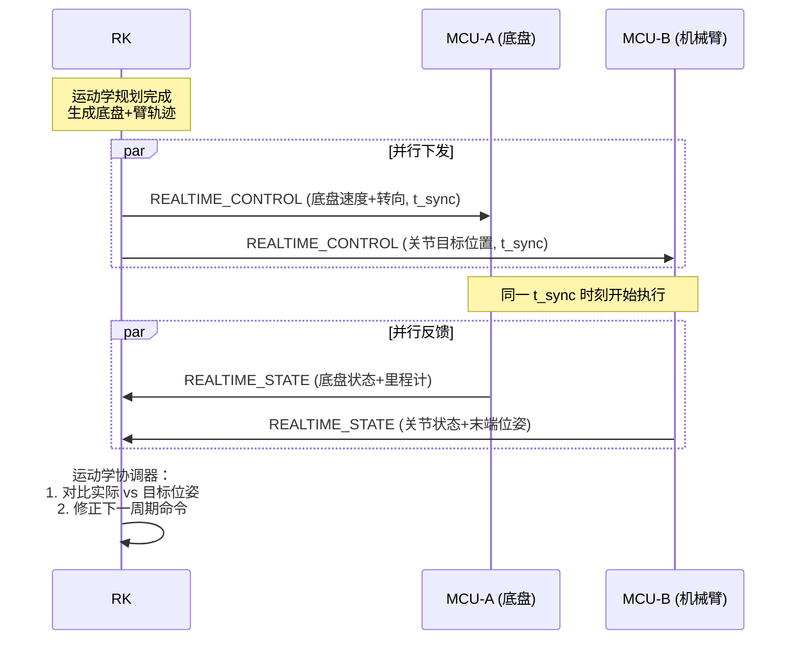
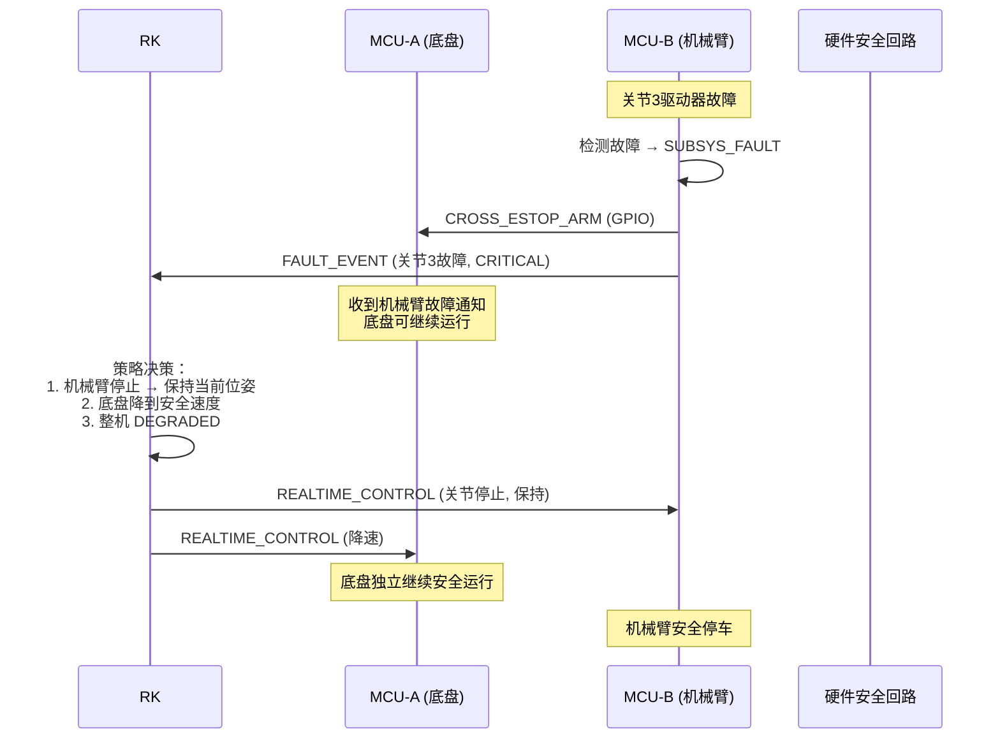
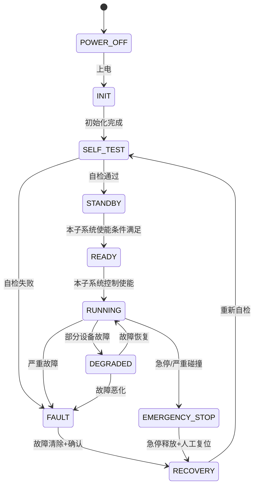

# RK3588 + 双 STM32G474 机器人控制器软硬件架构设计 V2

## 子系统划分方案（底盘域 vs 机械臂/上装域）

> **文档版本**: v2.0
> **架构方案**: 方案四 — 按设备子系统划分（底盘 / 机械臂&上装）
> **V1→V2 变更原因**: 方案一（运动/辅助域）将全部运动设备集中于 MCU-A 的 2 路 CAN，当关节数多且驱动器仅支持经典 CAN（非 FD）时，总线负载成为瓶颈，MCU-B 的 CAN 资源闲置。子系统划分使 4 路 CAN 均衡服务于运动控制。
> **目标硬件**: RK3588 (Linux) + 2× STM32G474 (FreeRTOS)

---

## 目录

1. [方案对比：为什么从方案一切换到方案四](#1-方案对比为什么从方案一切换到方案四)
2. [需求理解与关键假设](#2-需求理解与关键假设)
3. [子系统职责划分](#3-子系统职责划分)
4. [硬件通信拓扑](#4-硬件通信拓扑)
5. [CAN FD 总线分配与负载预算](#5-can-fd-总线分配与负载预算)
6. [SPI、USB、USART 职责矩阵与 Link Manager](#6-spiusbusart-职责矩阵与-link-manager)
7. [系统总体架构图](#7-系统总体架构图)
8. [RK3588 软件分层](#8-rk3588-软件分层)
9. [STM32 软件分层](#9-stm32-软件分层)
10. [MCU-A 功能模块（底盘域）](#10-mcu-a-功能模块底盘域)
11. [MCU-B 功能模块（机械臂/上装域）](#11-mcu-b-功能模块机械臂上装域)
12. [RK 侧多 MCU 实例设计](#12-rk-侧多-mcu-实例设计)
13. [STM32 多通道对象模型](#13-stm32-多通道对象模型)
14. [FreeRTOS 任务设计](#14-freertos-任务设计)
15. [CAN FD 模块设计](#15-can-fd-模块设计)
16. [RS485 模块设计](#16-rs485-模块设计)
17. [RK 与 STM32 统一协议](#17-rk-与-stm32-统一协议)
18. [SPI 通信机制](#18-spi-通信机制)
19. [关键通信时序图](#19-关键通信时序图)
20. [数据字典与代码生成](#20-数据字典与代码生成)
21. [系统安全状态机](#21-系统安全状态机)
22. [双 STM32 协同机制](#22-双-stm32-协同机制)
23. [故障处理矩阵](#23-故障处理矩阵)
24. [参数管理方案](#24-参数管理方案)
25. [固件升级方案](#25-固件升级方案)
26. [故障诊断与日志方案](#26-故障诊断与日志方案)
27. [看门狗和健康监控](#27-看门狗和健康监控)
28. [时间同步方案](#28-时间同步方案)
29. [性能预算表](#29-性能预算表)
30. [RAM、Flash 和任务栈预算](#30-ramflash-和任务栈预算)
31. [代码仓库目录树](#31-代码仓库目录树)
32. [核心接口定义](#32-核心接口定义)
33. [关键模块伪代码](#33-关键模块伪代码)
34. [测试方案](#34-测试方案)
35. [CI/CD 方案](#35-cicd-方案)
36. [分阶段开发计划](#36-分阶段开发计划)
37. [架构风险审查](#37-架构风险审查)
38. [需要硬件/产品团队确认的事项](#38-需要硬件产品团队确认的事项)
39. [是否可以进入详细设计阶段](#39-是否可以进入详细设计阶段的结论)

---

## 1. 方案对比：为什么从方案一切换到方案四

### 1.1 方案一的核心缺陷

```
方案一（运动控制域 vs 辅助设备域）:
┌─────────────────────────────────┐
│ MCU-A: 全部运动控制              │
│   CAN FD-A1: 行走+转向+关节电机  │  ← 2路CAN承载全部运动设备
│   CAN FD-A2: 更多关节+舵轮       │  ← 当关节多+仅支持CAN时→过载
│   4×RS485: 编码器/执行器         │
├─────────────────────────────────┤
│ MCU-B: 辅助设备                  │
│   CAN FD-B1: BMS/电源 (低频)     │  ← CAN资源严重闲置
│   CAN FD-B2: IMU/传感器 (低频)   │  ← 总线负载 <5%
│   4×RS485: 灯光/传感器           │
└─────────────────────────────────┘

问题:
  1. MCU-A 的 2路CAN成为全部运动控制的瓶颈
  2. 多关节机器人(6-7轴)即使使用CAN FD也边际
  3. 如果驱动器只支持经典CAN(1Mbps)，2路CAN难以满足
  4. MCU-B 的CAN资源闲置，投入产出比低
  5. 双MCU硬件投入未在运动控制带宽上获得回报
```

### 1.2 为什么方案四适合当前场景

```
方案四（底盘域 vs 机械臂/上装域）:
┌─────────────────────────────────┐
│ MCU-A: 底盘子系统                │
│   CAN FD-A1: 行走电机+转向电机   │  ← 底盘CAN独立
│   CAN FD-A2: 舵轮+制动+底盘扩展  │
│   4×RS485: 底盘编码器/传感器/IO  │
├─────────────────────────────────┤
│ MCU-B: 机械臂/上装子系统         │
│   CAN FD-B1: 关节电机1-4         │  ← 机械臂CAN独立
│   CAN FD-B2: 关节电机5-7+夹爪    │
│   4×RS485: 臂编码器/云台/传感器  │
└─────────────────────────────────┘

优势:
  1. 4路CAN全部参与运动控制，无资源闲置
  2. 底盘和机械臂的运动控制解耦，各自独立
  3. 总线负载分散到4路CAN，每路余量充足
  4. 任一子系统CAN故障不影响另一子系统
  5. 底盘和机械臂可独立开发、测试、升级
  6. 代码复用度最高（两MCU都是"运动控制"角色）
```

### 1.3 四方案针对当前痛点的重新对比

| 维度 | 方案一(运动/辅助) | 方案四(底盘/上装) ★ | 对比结论 |
|------|:---:|:---:|------|
| **CAN总线利用率** | ★★ MCU-A过载/MCU-B闲置 | ★★★★★ 4路均衡使用 | **方案四解决核心痛点** |
| **多关节扩展性** | ★★ MCU-A CAN不够用 | ★★★★★ 关节分布在2路CAN | **方案四天然支持** |
| **经典CAN兼容** | ★★ 2路CAN带宽不足 | ★★★★ 4路CAN×1Mbps | **方案四带宽翻倍** |
| **运动控制实时性** | ★★★★ MCU-A专注运动 | ★★★★★ 两MCU独立运动控制 | **方案四更优** |
| **故障隔离** | ★★★★★ 运动/辅助完全隔离 | ★★★★ 子系统隔离 | 方案一略优（非运动故障不影响运动） |
| **安全性** | ★★★★★ 安全集中在MCU-A | ★★★★ 分布式安全，需协调 | 方案一更集中，但方案四可接受 |
| **代码复用** | ★★★ 两MCU差异大 | ★★★★★ 两MCU模式相同 | **方案四显著更优** |
| **独立开发/测试** | ★★★★ | ★★★★★ 底盘/臂独立联调 | **方案四更优** |
| **产品系列化** | ★★★★ 增删辅助设备 | ★★★★★ 底盘/臂可独立换型 | **方案四更优** |
| **维护成本** | ★★★★ | ★★★★ 子系统边界清晰 | 持平 |

### 1.4 方案四的代价与风险

| 代价/风险 | 等级 | 缓解措施 |
|-----------|:----:|----------|
| BMS/IMU/传感器需分配到某个MCU，分配不当造成新的不均衡 | 中 | BMS→底盘MCU、IMU→底盘MCU、传感器按物理位置分配（详见第3节） |
| 两MCU都是"运动控制"，安全需分布式协调 | 中 | 独立子系统安全状态机 + 跨MCU安全互锁（详见第21-22节） |
| 底盘和机械臂需要协同运动时，需RK做运动学协调 | 低 | 这正是RK的职责 — 高层运动规划，MCU只负责执行 |
| 方案四下MCU-B不再是"辅助"角色，其重要性提升 | 低 | 实际上更合理 — 双MCU投入获得对等回报 |

---

## 2. 需求理解与关键假设

### 2.1 需求理解

基于提示词和 V1 反馈，明确以下核心场景：
- 机器人为 **移动底盘 + 多关节机械臂/上装** 复合系统
- 底盘含行走电机、转向电机、舵轮模组、制动器
- 机械臂含 4-7 个关节电机、夹爪/末端执行器、云台
- 部分电机驱动器**仅支持经典 CAN (1Mbps)**，不支持 CAN FD
- 需要在有限 CAN 带宽下保证所有运动控制轴的确定性通信

### 2.2 关键假设（V2 新增/修订）

| 编号 | 假设 | 影响范围 |
|------|------|----------|
| A1 | 底盘运动轴数 ≤ 8，机械臂轴数 ≤ 8 | CAN 负载预算 |
| A2 | 部分驱动器仅支持经典 CAN 1Mbps，不支持 CAN FD | CAN 通道分配策略 |
| A3 | 底盘和机械臂可以独立运动（非强耦合） | 安全隔离策略 |
| A4 | IMU 安装于底盘基准坐标系 | 传感器分配 |
| A5 | BMS 为整机供电，无独立底盘/臂供电 | BMS 分配 |
| A6-A11 | 同 V1 | — |

### 2.3 架构约束

同 V1 第 4 节，核心约束不变。新增：
- **C15**: 两块 STM32 都具备完整运动控制能力（实时控制、限幅、斜坡、使能管理）
- **C16**: 子系统间不应存在 CAN 总线级别的依赖（底盘的 CAN 不承载机械臂帧）

---

## 3. 子系统职责划分

### 3.1 总体划分原则

```
┌──────────────────────────────────────────────────┐
│                 RK3588 (Linux)                    │
│   运动规划 / 运动学协调 / 系统管理 / ROS 2        │
│   底盘和机械臂的轨迹在 RK 侧统一规划              │
└────────────┬─────────────────┬───────────────────┘
             │                 │
    ┌────────┴───────┐  ┌──────┴──────────┐
    │  MCU-A (底盘域) │  │ MCU-B (机械臂域) │
    │  STM32G474      │  │ STM32G474       │
    ├────────────────┤  ├─────────────────┤
    │ 行走电机控制   │  │ 关节1-4电机控制 │
    │ 转向电机控制   │  │ 关节5-7电机控制 │
    │ 舵轮模组控制   │  │ 夹爪/末端执行器 │
    │ 制动/使能管理  │  │ 云台控制        │
    │ 底盘编码器     │  │ 升降机构控制    │
    │ 底盘安全IO     │  │ 机械臂编码器    │
    │ BMS/电源监控   │  │ 机械臂安全IO    │
    │ IMU/姿态传感器 │  │ 末端传感器      │
    │ 超声波/防撞条  │  │                 │
    │ 灯光/声光报警  │  │                 │
    │ 2×CAN FD      │  │ 2×CAN FD        │
    │ 4×RS485        │  │ 4×RS485         │
    └────────────────┘  └─────────────────┘
```

### 3.2 MCU-A：底盘子系统（Chassis Domain）

```
MCU-A (STM32G474) — 底盘子系统
═══════════════════════════════════════
CAN FD-A1 (底盘主驱动总线):
  ├── 左行走电机驱动器 (经典CAN/CAN FD)
  ├── 右行走电机驱动器
  ├── 转向电机驱动器 ×2
  └── 舵轮模组驱动器 ×2

CAN FD-A2 (底盘辅助+扩展):
  ├── 制动执行器
  ├── 底盘扩展驱动器
  ├── BMS / 电源管理模块
  └── 底盘辅助设备

RS485-A1: 底盘编码器组 (行走编码器 ×2 + 转向编码器 ×2)
RS485-A2: 底盘安全 IO (限位开关、防撞条、安全门)
RS485-A3: IMU / 姿态传感器 (RS485接口型号)
RS485-A4: 超声波传感器组 + 灯光/报警控制

底盘 MCU 特有职责:
  • 底盘运动控制 (速度/转向/舵轮)
  • 底盘编码器采集与里程计预处理
  • IMU 数据采集与姿态预处理
  • BMS/电源状态监控
  • 底盘安全保护 (防撞、限位)
  • 底盘紧急停车
  • 超声波防撞处理
  • 灯光/声光报警控制
```

### 3.3 MCU-B：机械臂/上装子系统（Manipulator & Upper Body Domain）

```
MCU-B (STM32G474) — 机械臂/上装子系统
═══════════════════════════════════════
CAN FD-B1 (机械臂主驱动总线):
  ├── 关节1电机驱动器 (肩部/基部)
  ├── 关节2电机驱动器 (大臂)
  ├── 关节3电机驱动器 (小臂)
  └── 关节4电机驱动器 (腕部)

CAN FD-B2 (机械臂末端+上装):
  ├── 关节5电机驱动器 (腕部旋转)
  ├── 关节6电机驱动器 (末端)
  ├── 关节7电机驱动器 (冗余轴/扩展)
  ├── 夹爪/末端执行器
  ├── 云台俯仰电机
  └── 云台偏航电机

RS485-B1: 机械臂关节编码器组 (关节1-4)
RS485-B2: 机械臂关节编码器组 (关节5-7) + 夹爪传感器
RS485-B3: 升降机构控制
RS485-B4: 末端传感器 (力/力矩/触觉/视觉触发) + 环境传感器

机械臂 MCU 特有职责:
  • 机械臂关节运动控制 (位置/速度/力矩)
  • 关节编码器采集
  • 夹爪/末端执行器控制
  • 云台控制
  • 升降机构控制
  • 机械臂安全保护 (碰撞检测、关节限位)
  • 机械臂紧急停车
  • 末端传感器采集
```

### 3.4 跨子系统设备分配策略

| 设备类型 | 分配到 | 理由 |
|----------|:------:|------|
| **BMS/电源** | MCU-A | 底盘是整机基础，上电即运行；BMS 状态是整机使能的前置条件 |
| **IMU** | MCU-A | IMU 通常安装在底盘基准坐标系；里程计+IMU融合在底盘侧 |
| **超声波/防撞条** | MCU-A | 底盘级别的安全感知，与行走直接相关 |
| **灯光/报警** | MCU-A | 整机级别信号，统一由底盘MCU管理 |
| **环境传感器** | MCU-B | 通常安装在机械臂/上装区域 |
| **升降机构** | MCU-B | 属于上装范畴，与机械臂/云台并列 |
| **急停按钮** | 硬件 → 两MCU | 硬件急停同时接入两MCU和RK，物理切断所有驱动器使能 |

---

## 4. 硬件通信拓扑

### 4.1 拓扑图

```
┌──────────────────────────────────────────────────┐
│                     RK3588                         │
│  ┌──────────┐  ┌──────────┐                      │
│  │ SPI0+CS  │  │ SPI1+CS  │  ← 两组独立SPI        │
│  │ DRDY_0   │  │ DRDY_1   │  ← 独立Data Ready GPIO │
│  └────┬─────┘  └────┬─────┘                      │
│  ┌────┴─────┐  ┌────┴─────┐                      │
│  │ USB0 OTG │  │ USB1 OTG │  ← 维护链路            │
│  └────┬─────┘  └────┬─────┘                      │
│  ┌────┴─────┐  ┌────┴─────┐                      │
│  │ UART0    │  │ UART1    │  ← 救援链路            │
│  └────┬─────┘  └────┬─────┘                      │
│       │RST_A       │RST_B                         │
└───────┼────────────┼──────────────────────────────┘
        │            │
  ┌─────┴────────────┴──────────────────────────────┐
  │              硬件安全回路 (独立)                 │
  │  ┌──────────┐  ┌──────────┐  ┌──────────────┐  │
  │  │E-Stop SW │→│ Safety   │→│ DRV_ENABLE   │  │
  │  │(双路触点) │  │ Relay   │  │ (全部驱动器) │  │
  │  └──────────┘  └──────────┘  └──────────────┘  │
  │  ┌──────────┐                                   │
  │  │Ext WDT   │→ MCU-A + MCU-B (联合喂狗)         │
  │  └──────────┘                                   │
  └─────────────────────────────────────────────────┘
        │            │
┌───────┴──────┐ ┌──┴───────────┐
│ STM32G474-A  │ │ STM32G474-B  │
│ 底盘域       │ │ 机械臂/上装域 │
├──────────────┤ ├──────────────┤
│ SPI Slave    │ │ SPI Slave    │
│ USB Device   │ │ USB Device   │
│ USART        │ │ USART        │
│ CAN FD-A1/A2 │ │ CAN FD-B1/B2 │
│ RS485-A1~A4  │ │ RS485-B1~B4  │
│ DRDY→RK      │ │ DRDY→RK      │
│ RST←RK       │ │ RST←RK       │
├──────────────┤ ├──────────────┤
│ 底盘控制     │ │ 机械臂控制   │
│ +BMS+IMU+超声│ │ +云台+升降+传感│
└──────┬───────┘ └──────┬───────┘
       │                │
  ┌────┴────┐      ┌────┴────┐
  │子系统心跳│←───→│子系统心跳│  ← MCU间GPIO直连
  │安全状态  │      │安全状态  │  ← 互锁信号
  │底盘使能  │      │臂使能    │  ← 子系统使能状态
  └─────────┘      └─────────┘
```

### 4.2 SPI/USB/USART 方案

与 V1 相同 — 两组独立 SPI、独立 USB (CDC)、独立 USART (硬件流控)。
USB 不拥有运动控制权限，USART 仅用于救援。

### 4.3 MCU 间硬件信号（V2 增强）

| 信号 | 方向 | 用途 | V2 变化 |
|------|------|------|---------|
| MCU_HB_A | MCU-A→MCU-B | A 存活心跳 | 同 V1 |
| MCU_HB_B | MCU-B→MCU-A | B 存活心跳 | 同 V1 |
| SUBSYS_SAFE_A | MCU-A→MCU-B | 底盘安全状态 | 同 V1 |
| SUBSYS_SAFE_B | MCU-B→MCU-A | 机械臂安全状态 | 同 V1 |
| **CHASSIS_ENABLED** | MCU-A→MCU-B | 底盘已使能 | **V2 新增** |
| **ARM_ENABLED** | MCU-B→MCU-A | 机械臂已使能 | **V2 新增** |
| **CROSS_ESTOP** | 双向 | 任一MCU检测到子系统级急停通知对方 | **V2 新增** |

---

## 5. CAN FD 总线分配与负载预算

### 5.1 通道分配策略

```
CAN FD-A1 (底盘主驱动) — 1M/5M FD 或 1M Classic
┌──────────────────────────────────────────┐
│ 设备          协议    周期    帧长  负载  │
│ 左行走电机    CANopen  1ms    8B    ~12% │
│ 右行走电机    CANopen  1ms    8B    ~12% │
│ 左转向电机    CANopen  1ms    8B    ~12% │
│ 右转向电机    CANopen  1ms    8B    ~12% │
│ 舵轮模组×2   自定义   2ms    8B    ~6%  │
├──────────────────────────────────────────┤
│ 合计 (经典CAN 1Mbps):              ~54% │
│ 合计 (CAN FD 1M/5M):               ~16% │
│ 结论: FD模式宽裕; 经典CAN需谨慎但可接受  │
└──────────────────────────────────────────┘

CAN FD-A2 (底盘扩展+BMS) — 1M/5M FD
┌──────────────────────────────────────────┐
│ 设备          协议    周期    帧长  负载  │
│ 制动执行器    CANopen  10ms   4B    <1%  │
│ BMS          自定义   100ms  8B    <1%  │
│ 扩展驱动器    自定义   5ms    8B    ~2%  │
├──────────────────────────────────────────┤
│ 合计:                               <5% │
│ 结论: 余量充足，可扩展                   │
└──────────────────────────────────────────┘

CAN FD-B1 (机械臂主驱动) — 1M/5M FD 或 1M Classic
┌──────────────────────────────────────────┐
│ 设备          协议    周期    帧长  负载  │
│ 关节1电机     CANopen  1ms    8B    ~12% │
│ 关节2电机     CANopen  1ms    8B    ~12% │
│ 关节3电机     CANopen  1ms    8B    ~12% │
│ 关节4电机     CANopen  1ms    8B    ~12% │
├──────────────────────────────────────────┤
│ 合计 (经典CAN 1Mbps):              ~48% │
│ 合计 (CAN FD 1M/5M):               ~14% │
│ 结论: FD模式非常宽裕; 经典CAN在安全范围  │
└──────────────────────────────────────────┘

CAN FD-B2 (机械臂末端+上装) — 1M/5M FD 或 1M Classic
┌──────────────────────────────────────────┐
│ 设备          协议    周期    帧长  负载  │
│ 关节5电机     CANopen  1ms    8B    ~12% │
│ 关节6电机     CANopen  1ms    8B    ~12% │
│ 关节7电机     CANopen  2ms    8B    ~6%  │
│ 夹爪          自定义   10ms   4B    <1%  │
│ 云台俯仰      自定义   10ms   8B    <1%  │
│ 云台偏航      自定义   10ms   8B    <1%  │
├──────────────────────────────────────────┤
│ 合计 (经典CAN 1Mbps):              ~32% │
│ 合计 (CAN FD 1M/5M):               ~9%  │
│ 结论: 充足余量                           │
└──────────────────────────────────────────┘
```

### 5.2 V1 vs V2 CAN 负载对比

| 场景 | V1 (方案一) | V2 (方案四) | 改善 |
|------|:----------:|:----------:|:----:|
| 经典CAN场景 (7关节+4行走+2转向) | MCU-A: **108%** ❌ | MCU-A: 54% ✅ MCU-B: 80% ✅ | 从过载到可行 |
| CAN FD场景 (同上) | MCU-A: 32% | MCU-A: 16% MCU-B: 23% | 余量更充足 |
| 扩展关节+2 (经典CAN) | MCU-A: **132%** ❌ | MCU-A: 54% MCU-B: 92% ⚠️ | 从不可行到边缘可行 |

> **结论**: 方案四在经典 CAN 场景下，4 路 CAN 的负载均衡优势显著。即使所有驱动器只支持经典 CAN 1Mbps，方案四仍能支撑 7 关节+底盘全部在安全负载范围内。

---

## 6. SPI、USB、USART 职责矩阵与 Link Manager

同 V1 第 9 节。核心原则不变：
- **SPI** = 正常运行主链路，拥有控制权
- **USB** = 调试/维护/升级，**不拥有运动控制权限**
- **USART** = Bootloader/救援，**仅有限命令**

Link Manager 设计同 V1。V2 唯一变化：两 MCU 的控制权管理完全独立 — MCU-A 的 Link Manager 只管 MCU-A 的链路，MCU-B 的只管 MCU-B。

---

## 7. 系统总体架构图

```mermaid
graph TB
    subgraph RK3588["RK3588 (Linux) - 运动规划与系统管理"]
        APP[机器人应用层]
        ROS2[ROS 2 适配层]
        KIN[运动学协调器<br/>底盘+机械臂轨迹规划]
        CHASSIS_MGR[底盘运动管理]
        ARM_MGR[机械臂运动管理]
        DEV_MGR[设备管理器]
        MCU_GW[MCU Gateway]
        SYS_SVC[参数/诊断/日志/升级/健康管理]
    end

    subgraph TRANSPORT["Transport Layer"]
        SPI_DRV[SPI-A 适配 | SPI-B 适配]
        USB_DRV[USB-A | USB-B]
        UART_DRV[USART-A | USART-B]
    end

    subgraph MCUA["STM32G474-A 底盘域 CHASSIS"]
        direction TB
        SAFE_A[底盘安全状态机]
        CTRL_A[底盘运动控制<br/>行走/转向/舵轮/制动]
        DEV_MGR_A[底盘设备管理器<br/>电机/编码器/BMS/IMU/超声]
        DIAG_A[底盘故障诊断]
        FW_A[2×CAN FD | 4×RS485 | SPI Slave | USB | USART]
    end

    subgraph MCUB["STM32G474-B 机械臂/上装域 MANIPULATOR"]
        direction TB
        SAFE_B[机械臂安全状态机]
        CTRL_B[机械臂运动控制<br/>关节1-7/夹爪/云台/升降]
        DEV_MGR_B[机械臂设备管理器<br/>电机/编码器/传感器]
        DIAG_B[机械臂故障诊断]
        FW_B[2×CAN FD | 4×RS485 | SPI Slave | USB | USART]
    end

    RK3588 -- "SPI-A (主链路)" --> MCUA
    RK3588 -- "USB-A (维护)" --> MCUA
    RK3588 -- "USART-A (救援)" --> MCUA
    RK3588 -- "SPI-B (主链路)" --> MCUB
    RK3588 -- "USB-B (维护)" --> MCUB
    RK3588 -- "USART-B (救援)" --> MCUB

    MCUA -- "GPIO:心跳/安全/使能" --> MCUB

    MCUA -- "CAN-A1/A2" --> CHASSIS_DEV[底盘驱动器/电机/BMS]
    MCUA -- "RS485-A1~A4" --> CHASSIS_SENSOR[编码器/IMU/超声/IO]
    MCUB -- "CAN-B1/B2" --> ARM_DEV[关节电机/夹爪/云台]
    MCUB -- "RS485-B1~B4" --> ARM_SENSOR[编码器/传感器/升降]

    HW_ESTOP[硬件急停回路] -.-> MCUA
    HW_ESTOP -.-> MCUB
    EXT_WDT[外部硬件看门狗] -.-> MCUA
    EXT_WDT -.-> MCUB
```

---

## 8. RK3588 软件分层

同 V1 第 11 节，但 **V2 关键变化**：

- **新增运动学协调器**（Layer 5/6）：统一规划底盘轨迹和机械臂轨迹，将协调后的控制目标分别下发 MCU-A 和 MCU-B
- MCU Gateway 分别对接两个"运动控制"Endpoint — 不再有主次之分，两个 Endpoint 对等

```
RK3588 软件分层 (V2):
┌─────────────────────────────────────────┐
│ L7: 机器人应用                           │
├─────────────────────────────────────────┤
│ L6: ROS 2 / Service Adapter              │
│     运动学协调器 (Kinematics Coordinator)│  ← V2 新增
├─────────────────────────────────────────┤
│ L5: System Services                      │
│     底盘运动管理 | 机械臂运动管理         │  ← V2 分离
│     设备管理器 | 参数/诊断/日志/升级      │
├─────────────────────────────────────────┤
│ L4: MCU Gateway                          │
│     McuEndpoint-Chassis | McuEndpoint-Arm│  ← V2 对等
├─────────────────────────────────────────┤
│ L3: Protocol + Link Manager              │
├─────────────────────────────────────────┤
│ L2: Transport (SPI/USB/UART)             │
├─────────────────────────────────────────┤
│ L1: Linux BSP + Drivers                  │
└─────────────────────────────────────────┘
```

---

## 9. STM32 软件分层

同 V1 第 12 节，**V2 关键变化**：

- MCU-A 和 MCU-B 的分层结构**完全相同** — 两者都是运动控制 MCU
- 差异仅在 L6-L7（业务层）：底盘控制 vs 机械臂控制
- 公共代码复用度更高（`mcu_common/` 占比更大），因为两个 MCU 都需要：
  - 实时控制执行器
  - CAN FD 周期帧调度
  - 运动限幅和斜坡
  - 使能管理
  - 控制命令验证

```
STM32 分层架构 (两MCU共用):
┌──────────────────────────────────────────┐
│ L7: Application                          │
│     MCU-A: 底盘控制应用                   │
│     MCU-B: 机械臂控制应用                 │
├──────────────────────────────────────────┤
│ L6: System Services                      │
│     实时控制服务 | 安全状态机             │
│     设备管理器 | 诊断/参数/日志/升级      │
├──────────────────────────────────────────┤
│ L5: Device Protocol Adapter              │
│     CANopen / Modbus / Custom Motor       │
├──────────────────────────────────────────┤
│ L4: Communication                        │
│     协议编解码 | Link Manager | Transport │
├──────────────────────────────────────────┤
│ L3: Peripheral Drivers                   │
│     CAN FD | RS485 | SPI Slave | USB | USART │
├──────────────────────────────────────────┤
│ L2: HAL/LL + OSAL                        │
├──────────────────────────────────────────┤
│ L1: Board + BSP                          │
│     MCU-A: 底盘板级配置                   │
│     MCU-B: 机械臂板级配置                 │
└──────────────────────────────────────────┘
```

---

## 10. MCU-A 功能模块（底盘域）

| 模块 | 功能描述 | 周期/触发 | V2 变化 |
|------|----------|-----------|---------|
| 行走电机控制 | 左右行走电机速度/位置控制 | 1-2ms 周期 | 同 V1 |
| 转向电机控制 | 转向角度闭环控制 | 1-2ms 周期 | 同 V1 |
| 舵轮模组控制 | 舵轮速度+转向协调 | 1-2ms 周期 | 同 V1 |
| 制动控制 | 制动器使能/释放、紧急制动 | < 5ms 响应 | 同 V1 |
| 底盘编码器采集 | 行走编码器+转向编码器 | 1ms 周期 | 同 V1 |
| **里程计预处理** | 底盘里程计融合 (编码器+IMU) | 5-10ms | **V2 新增** |
| BMS 管理器 | 电池 SOC/电压/电流/温度 | 100-1000ms | 从 V1 MCU-B 移入 |
| IMU 数据采集 | 角速度/加速度/姿态角 | 5-10ms | 从 V1 MCU-B 移入 |
| 超声波传感器 | 多路超声波测距 | 50-200ms | 从 V1 MCU-B 移入 |
| 防撞条检测 | 碰撞检测（ISR 触发） | < 10ms | 从 V1 MCU-B 移入 |
| 灯光/声光报警 | 状态灯和报警器 | 100ms | 从 V1 MCU-B 移入 |
| 底盘安全状态机 | 底盘子系统安全状态迁移 | 连续运行 | 同 V1 |
| 底盘紧急停车 | 硬件急停响应 + 底盘故障停车 | < 5ms | 同 V1 |
| MCU-B 监控 | 监控机械臂 MCU 存活和状态 | 10ms | 同 V1 |
| 底盘故障诊断 | 底盘域设备故障检测 | 事件驱动 | 同 V1 |

---

## 11. MCU-B 功能模块（机械臂/上装域）

| 模块 | 功能描述 | 周期/触发 | V2 变化 |
|------|----------|-----------|---------|
| 关节1-4电机控制 | 肩部/大臂/小臂/腕部电机 | 1-2ms 周期 | **V2 核心** |
| 关节5-7电机控制 | 腕部旋转/末端/冗余轴 | 1-2ms 周期 | **V2 核心** |
| 夹爪控制 | 夹爪/末端执行器 | 10-50ms | **V2 新增** |
| 云台控制 | 俯仰/偏航角度控制 | 10-50ms | 从 V1 MCU-B 保留 |
| 升降机构控制 | 升降高度/限位 | 20-50ms | 从 V1 MCU-B 保留 |
| 关节编码器采集 | 各关节绝对/增量编码器 | 1ms | **V2 核心** |
| 末端传感器 | 力/力矩/触觉传感器 | 按传感器周期 | **V2 新增** |
| 环境传感器 | 温湿度/气压等 | 100-1000ms | 从 V1 MCU-B 保留 |
| 机械臂安全状态机 | 臂子系统安全状态迁移 | 连续运行 | **V2 新增** |
| 机械臂紧急停车 | 臂故障停车 + 碰撞响应 | < 5ms | **V2 新增** |
| MCU-A 监控 | 监控底盘 MCU 存活和状态 | 10ms | 同 V1 |
| 机械臂故障诊断 | 臂域设备故障检测 | 事件驱动 | **V2 新增** |

---

## 12. RK 侧多 MCU 实例设计

同 V1 第 15 节，**V2 关键变化**：

- 两个 `McuEndpoint` 角色从 `MOTION_CONTROL` / `AUXILIARY_SYSTEM` → `CHASSIS_DOMAIN` / `MANIPULATOR_DOMAIN`
- 两个 Endpoint **对等** — 都有完整的运动控制协议支持
- 新增 `KinematicsCoordinator` 负责跨子系统运动协调

```cpp
// V2: 对等的两个运动控制 Endpoint
enum class McuRole : uint8_t {
    CHASSIS_DOMAIN      = 1,   // MCU-A: 底盘子系统
    MANIPULATOR_DOMAIN  = 2,   // MCU-B: 机械臂/上装子系统
};

// 运动学协调器 (V2 新增)
class KinematicsCoordinator {
public:
    // 接收上层轨迹目标，分解为底盘+机械臂控制命令
    int PlanChassisMotion(const GlobalTrajectory& traj, 
                          ChassisMotionCommand& chassis_cmd);
    int PlanArmMotion(const GlobalTrajectory& traj, 
                      ArmMotionCommand& arm_cmd);
    // 同步底盘和臂的运动时序
    int Synchronize(McuEndpoint& chassis, McuEndpoint& arm, 
                    uint32_t sync_timestamp);
};
```

---

## 13. STM32 多通道对象模型

同 V1 第 16 节。两 MCU 使用完全相同的 `CanFdChannel`、`Rs485Channel` 结构。差异仅在实例化的通道数量和绑定设备不同（通过配置表指定，非代码级差异）。

---

## 14. FreeRTOS 任务设计

### 14.1 任务模型

**两 MCU 使用完全相同的任务架构，仅任务名称后缀不同（_C=Chassis, _A=Arm）**

| # | 任务名称(MCU-A) | 任务名称(MCU-B) | 优先级 | 周期/触发 | 最坏执行 | 栈(KB) |
|---|----------------|----------------|--------|-----------|----------|--------|
| 1 | SafetyTask_C | SafetyTask_A | 6(最高) | 1ms周期 | <200μs | 2 |
| 2 | RealtimeCtrlTask_C | RealtimeCtrlTask_A | 5 | 1ms周期 | <500μs | 4 |
| 3 | HostLinkRxTask_C | HostLinkRxTask_A | 5 | SPI中断→Notify | <300μs | 3 |
| 4 | HostLinkTxTask_C | HostLinkTxTask_A | 4 | 1-2ms+Queue | <300μs | 3 |
| 5 | CanFdRxTask_C | CanFdRxTask_A | 4 | CAN中断→Notify | <500μs | 2.5 |
| 6 | CanFdTxSchedTask_C | CanFdTxSchedTask_A | 3 | 1ms周期 | <300μs | 2 |
| 7 | Rs485SchedTask_C | Rs485SchedTask_A | 3 | 1ms tick+UART IDLE | <1ms | 3 |
| 8 | DeviceMgrTask_C | DeviceMgrTask_A | 3 | 10ms周期 | <500μs | 2 |
| 9 | DiagnosticsTask_C | DiagnosticsTask_A | 3 | 10ms周期 | <500μs | 2 |
| 10 | ParameterTask_C | ParameterTask_A | 2 | Queue驱动 | <2ms | 2 |
| 11 | LoggerTask_C | LoggerTask_A | 2 | Queue驱动 | <1ms | 2 |
| 12 | FirmwareUpdateTask | FirmwareUpdateTask | 1 | 按需 | 不限 | 3 |
| 13 | WatchdogTask_C | WatchdogTask_A | 6(最高) | 5ms周期 | <100μs | 1 |
| 14 | TimeSyncTask_C | TimeSyncTask_A | 2 | 1s周期 | <200μs | 1.5 |

### 14.2 V2 任务变化说明

| 变化项 | V1 | V2 | 原因 |
|--------|:--|:---|------|
| RealtimeControlTask | 仅 MCU-A 有 | **两 MCU 都有** | 机械臂也需要实时控制 |
| SafetyTask 职能 | MCU-A: 整机安全 + 运动安全 | **各自子系统的安全** | 分布式安全 |
| DeviceManagerTask | MCU-A: 运动设备, MCU-B: 辅助设备 | **各自子系统的设备** | 对称 |
| DiagnosticsTask | 同上 | 同上 | 对称 |
| **里程计预处理** | 无 | **MCU-A DeviceMgrTask 新增** | 底盘特有功能 |

### 14.3 任务间通信与约束

同 V1 第 17 节。所有硬实时路径（SafetyTask, RealtimeCtrlTask）**禁止持有互斥锁、禁止动态内存、禁止打印日志**。

---

## 15. CAN FD 模块设计

同 V1 第 18 节。两 MCU 使用完全相同的 CAN FD 驱动和调度框架。差异仅在：
- **MCU-A**: CAN-A1 调度表包含行走+转向+舵轮帧，CAN-A2 包含制动+BMS帧
- **MCU-B**: CAN-B1 调度表包含关节1-4帧，CAN-B2 包含关节5-7+夹爪+云台帧

均通过 **YAML 配置表** 定义，而非代码硬编码。

---

## 16. RS485 模块设计

同 V1 第 19 节。两 MCU 使用完全相同的 RS485 驱动和事务框架。差异仅在：
- **MCU-A**: RS485-A1 ~ A4 = 编码器 / 安全IO / IMU / 超声+灯光
- **MCU-B**: RS485-B1 ~ B4 = 关节编码器 / 编码器 / 升降机构 / 末端传感

---

## 17. RK 与 STM32 统一协议

同 V1 第 20 节。协议帧格式和消息类型不变。**V2 变化**：

- `MCU Role` 字段取值：`1=RK, 2=MCU-A(Chassis), 3=MCU-B(Manipulator)`
- 实时控制命令 (`REALTIME_CONTROL`) 对于 MCU-A 包含底盘控制字段，对于 MCU-B 包含机械臂控制字段（同消息类型，不同 payload 子类型）
- 新增消息子类型 `0x11`: 里程计数据上报（MCU-A → RK）

---

## 18. SPI 通信机制

同 V1 第 21 节。两 MCU 各自的 SPI 链路完全对称独立。

---

## 19. 关键通信时序图

### 19.1 SPI 正常周期

同 V1 第 22.1 节。区别：RK 同时对 MCU-A 和 MCU-B 发起 SPI 事务（两路独立 SPI 并行）。

### 19.2 底盘+机械臂协同运动时序 (V2 新增)



### 19.3 子系统故障隔离时序 (V2 新增)



### 19.4 急停、升级等时序

同 V1 第 22.3-22.4 节。

---

## 20. 数据字典与代码生成

同 V1 第 23 节。**V2 变化**：

- 新增子系统标识字段，每个参数/设备/故障标记所属子系统
- 底盘域和机械臂域分别生成独立的设备描述文件

```yaml
# V2 新增: subsystem 字段
devices:
  - { id: 0x01, name: left_traction_motor, subsystem: CHASSIS, 
      bus: CAN_A1, node_id: 0x01, protocol: CANOPEN }
  - { id: 0x10, name: joint_1_motor, subsystem: MANIPULATOR, 
      bus: CAN_B1, node_id: 0x10, protocol: CANOPEN }
```

---

## 21. 系统安全状态机

### 21.1 总体安全架构 (V2 核心变化)

```
V2 安全模型: 分层 + 分布式
┌────────────────────────────────────────────┐
│ Layer 3: 整机安全状态 (RK3588 汇总仲裁)    │
│   基于 MCU-A 和 MCU-B 上报状态决定整机状态  │
├────────────────────────────────────────────┤
│ Layer 2: 跨子系统安全互锁 (MCU间 GPIO)      │
│   任一子系统 CRITICAL → 通知对方子系统       │
│   对方子系统可自主决定是否降级              │
├──────────────┬─────────────────────────────┤
│ Layer 1A:    │ Layer 1B:                    │
│ 底盘安全状态 │ 机械臂安全状态               │
│ (MCU-A 独立) │ (MCU-B 独立)                │
│              │                              │
│ 状态:        │ 状态:                        │
│ INIT→SELF_   │ INIT→SELF_TEST→STANDBY      │
│ TEST→STANDBY │ →READY→RUNNING→DEGRADED     │
│ →READY→      │ →FAULT→EMERGENCY_STOP       │
│ RUNNING→     │                              │
│ DEGRADED→    │ 独立喂狗                     │
│ FAULT→       │ 独立参数                     │
│ EMERGENCY_   │ 独立故障诊断                 │
│ STOP         │                              │
│              │                              │
│ 独立喂狗     │                              │
└──────────────┴─────────────────────────────┘

Layer 0: 硬件安全回路 (独立于所有软件)
  急停按钮 → 安全继电器 → 物理切断全部驱动器使能
```

### 21.2 子系统级状态机

每 MCU 独立运行相同的状态机，但各自独立迁移：



### 21.3 跨子系统影响规则 (V2 新增)

| 事件 | MCU-A (底盘) | MCU-B (机械臂) | 整机状态 |
|------|:-----------:|:------------:|:------:|
| MCU-A 进入 FAULT | FAULT (停止底盘运动) | 收到通知 → **自主决定**：停止协作运动、保持当前位姿或降速 | 取决于 MCU-B 的评估 |
| MCU-B 进入 FAULT | 收到通知 → **自主决定**：降速/停止底盘 | FAULT (停止机械臂) | 取决于 MCU-A 的评估 |
| MCU-A EMERGENCY_STOP | 立即切断底盘驱动器 | 收到通知 → 机械臂停车 → 保持位姿 | EMERGENCY_STOP |
| MCU-B EMERGENCY_STOP | 收到通知 → 底盘减速至安全速度 | 立即切断臂驱动器 | 至少 DEGRADED |
| 硬件急停 | 物理切断 | 物理切断 | EMERGENCY_STOP (硬件) |
| 两 MCU 同时失去 RK 心跳 | 各自进入安全状态 | 各自进入安全状态 | STANDBY |

**核心原则**：
- 每个 MCU 的**安全状态机完全独立** — 自己的故障自己处理
- 跨 MCU 通知是**信息性的**，不是指令性的 — 接收方自主评估影响
- 硬件急停拥有最高优先级 — 绕过所有软件，物理切断

### 21.4 整机状态汇总 (RK 侧)

```cpp
SystemSafetyState AggregateSafetyState(
    const McuSafetyState& chassis_state,
    const McuSafetyState& arm_state) 
{
    // 任一 MCU EMERGENCY_STOP → 整机 EMERGENCY_STOP
    if (chassis_state == EMERGENCY_STOP || arm_state == EMERGENCY_STOP)
        return EMERGENCY_STOP;
    
    // 任一 MCU FAULT → 整机 FAULT
    if (chassis_state == FAULT || arm_state == FAULT)
        return FAULT;
    
    // 任一 MCU DEGRADED → 整机 DEGRADED
    if (chassis_state == DEGRADED || arm_state == DEGRADED)
        return DEGRADED;
    
    // 两 MCU RUNNING → 整机 RUNNING
    if (chassis_state == RUNNING && arm_state == RUNNING)
        return RUNNING;
    
    // 其他情况取最低状态
    return min(chassis_state, arm_state);
}
```

---

## 22. 双 STM32 协同机制

### 22.1 协同模型

```
V2 协同: 对等子系统 + 独立运行 + 信息共享

MCU-A (底盘)                    MCU-B (机械臂)
    │                               │
    ├──心跳(100ms)──────────────────→│
    │←──────────────────心跳(100ms)──┤
    │                               │
    ├──底盘安全状态(1bit)───────────→│
    │←──────────机械臂安全状态(1bit)─┤
    │                               │
    ├──底盘使能状态(1bit)───────────→│  ← V2 新增
    │←──────────机械臂使能状态(1bit)─┤  ← V2 新增
    │                               │
    ├──子系统急停通知(1bit)─────────→│  ← V2 新增
    │←──────────子系统急停通知(1bit)─┤  ← V2 新增
```

### 22.2 关键协同规则

| 规则 | V1 | V2 | 说明 |
|------|:--|:---|------|
| 互发控制命令 | 禁止 | **禁止** | 不变 |
| 自动接管 | 禁止 | **禁止** | 不变 |
| 执行器唯一所有者 | ✅ | ✅ | 不变 |
| 跨MCU故障响应 | MCU-B故障不停止MCU-A | **自主评估**：MCU-B故障→MCU-A可能降速但不停车 | V2 更灵活 |
| 硬件急停 | 绕过所有软件 | 绕过所有软件 | 不变 |
| MCU间通信方式 | GPIO | GPIO（增加使能状态和子系统急停） | V2 增强 |
| RK角色 | 状态汇总 | **运动协调 + 状态汇总** | V2 RK职责增加 |

---

## 23. 故障处理矩阵

V2 在 V1 基础上新增/修订以下场景：

| 场景 | MCU-A (底盘) 响应 | MCU-B (机械臂) 响应 | RK 响应 | 整机状态 |
|------|------------------|--------------------|---------|----------|
| **MCU-B CAN-B1 Bus Off** | 收到通知→底盘自主决定(**降速**,不停车) | 通道→RECOVERING, 关节1-4停止 | 收到通知→协调两MCU | DEGRADED |
| **MCU-A CAN-A1 Bus Off** | 通道→RECOVERING, 行走/转向停止 | 收到通知→自主决定(**保持位姿**) | 收到通知→告警 | DEGRADED |
| **机械臂关节3驱动器掉线** | 收到通知→降速(可继续行走) | 停止关节3→其余关节保活 | 重新规划臂轨迹(无关节3) | DEGRADED |
| **底盘行走电机掉线** | 停止该电机→其余保活→降速 | 收到通知→停止协作运动 | 降级→单电机模式或停车 | DEGRADED |
| **MCU-B重启** | 检测心跳丢失→继续运行(**不停止底盘**) | 重启→SELF_TEST→恢复 | 重建会话→同步参数→重新规划 | DEGRADED→恢复 |
| **两MCU状态不一致** | 各自按本子系统状态运行 | 各自按本子系统状态运行 | RK汇总→仲裁整机状态 | 取决于仲裁结果 |

---

## 24. 参数管理方案

同 V1 第 27 节。V2 变化：
- 参数标记所属子系统 (`subsystem: CHASSIS / MANIPULATOR / GLOBAL`)
- 每个 MCU 独立存储本子系统的参数副本
- 全局参数（如 BMS 参数）存储在 MCU-A，MCU-B 通过 RK 获取

---

## 25. 固件升级方案

同 V1 第 28 节。V2 变化：

| 变化项 | V1 | V2 |
|--------|:--|:---|
| MCU-A 升级时机器人状态 | 必须 STANDBY | 必须 **底盘 STANDBY**（机械臂可保持） |
| MCU-B 升级时机器人状态 | MCU-A 可继续运行 | 底盘可继续运行（机械臂 STANDBY） |
| 升级顺序 | MCU-B → MCU-A | **先底盘还是先臂，取决于风险评估** |
| 升级失败影响 | MCU-A 失败→整机不可用 | **底盘失败→整机不可用；机械臂失败→仅臂不可用** |

---

## 26. 故障诊断与日志方案

同 V1 第 29 节。V2 变化：
- 故障码中 `node_id` 明确区分 MCU-A(CHASSIS) 和 MCU-B(MANIPULATOR)
- 新增故障模块 `ARM_JOINT`、`CHASSIS_TRACTION`、`CHASSIS_STEERING`、`END_EFFECTOR`

---

## 27. 看门狗和健康监控

同 V1 第 30 节。**V2 变化**：

- 每 MCU 独立运行 WatchdogTask，独立喂内部 IWDG
- **外部硬件 WDT 需要两块 MCU 联合喂狗**：任一 MCU 不喂狗 → 外部 WDT 复位两块 MCU（因为底盘和机械臂都在运动，单块 MCU 死锁仍有安全风险）
- 或者：外部 WDT 分别监控两块 MCU（两个独立外部 WDT），一块复位不影响另一块

**推荐**：两个独立外部 WDT，允许一块 MCU 复位而另一块继续运行（对齐"子系统独立"原则）。

---

## 28. 时间同步方案

同 V1 第 31 节。两 MCU 独立与 RK 时间同步。增加要求：两 MCU 之间的时间偏差 < 500μs（通过 RK 作为时间中转实现）。

---

## 29. 性能预算表

### 29.1 CAN FD 总线预算（V2 关键）

| 通道 | 设备 | 协议 | 周期 | 经典CAN负载 | CAN FD负载 |
|------|------|------|------|:----------:|:--------:|
| **CAN-A1** (底盘主驱动) | 行走×2+转向×2+舵轮×2 | CANopen+自定义 | 1-2ms | **54%** | 16% |
| **CAN-A2** (底盘扩展+BMS) | 制动+BMS+扩展 | CANopen+自定义 | 5-100ms | <5% | <2% |
| **CAN-B1** (臂主驱动) | 关节1-4 | CANopen | 1ms | **48%** | 14% |
| **CAN-B2** (臂末端+上装) | 关节5-7+夹爪+云台 | CANopen+自定义 | 1-10ms | 32% | 9% |

**对比**：

| 场景 | V1 瓶颈 | V2 瓶颈 |
|------|:------:|:------:|
| 经典CAN, 6轴臂+底盘 | MCU-A CAN-A1 过载 **108%** ❌ | CAN-A1 54% ✅, CAN-B1 48% ✅ |
| 经典CAN, 7轴臂+底盘 | MCU-A 过载 **132%** ❌ | CAN-A1 54% ✅, CAN-B1+2 80% ✅ |
| CAN FD, 7轴臂+底盘 | MCU-A 32% ✅ | CAN-A1 16% ✅, CAN-B1+2 23% ✅ |

### 29.2 SPI/CPU 预算

同 V1 第 32 节。两 MCU 的 CPU 预算类似（都是运动控制负载），略高于 V1 的 MCU-B（V1 MCU-B 为辅助设备）。

---

## 30. RAM、Flash 和任务栈预算

同 V1 第 33 节。两 MCU 的预算对称 — 都是运动控制 MCU，Flash/RAM 使用量接近。

---

## 31. 代码仓库目录树

```
robot_controller/
│
├── rk3588/                          # 同 V1 + kinematics_coordinator
│   ├── kinematics/                  # V2 新增: 运动学协调器
│   │   ├── kinematics_coordinator.cpp/h
│   │   ├── chassis_kinematics.cpp/h
│   │   └── arm_kinematics.cpp/h
│   ├── ... (其余同 V1)
│
├── mcu_common/                      # 公共代码，V2 复用度更高
│   ├── control/                     # V2 新增: 公共运动控制库
│   │   ├── trajectory.c/h          #   轨迹发生器
│   │   ├── limits.c/h              #   限幅/斜坡/加减速
│   │   └── pid_controller.c/h      #   PID控制器
│   ├── ... (其余同 V1)
│
├── mcu_a/                           # 底盘子系统
│   ├── board/                       # 同 V1
│   ├── config/
│   │   └── chassis_devices.yaml    # V2: 底盘设备描述表
│   ├── devices/
│   │   ├── traction_motor.c/h      # 行走电机
│   │   ├── steering_motor.c/h      # 转向电机
│   │   ├── wheel_hub.c/h           # 舵轮模组
│   │   ├── brake.c/h               # 制动器
│   │   ├── chassis_encoder.c/h     # 底盘编码器
│   │   ├── bms.c/h                 # BMS (V2 从 MCU-B 移入)
│   │   ├── imu.c/h                 # IMU (V2 从 MCU-B 移入)
│   │   ├── ultrasonic.c/h          # 超声波
│   │   └── lights.c/h              # 灯光报警
│   ├── control/
│   │   ├── chassis_motion_ctrl.c/h # 底盘运动控制器
│   │   └── odometry.c/h            # V2 新增: 里程计
│   ├── safety_policy/
│   │   └── chassis_safety.c/h      # 底盘安全策略
│   └── application/                # 同 V1
│
├── mcu_b/                           # 机械臂/上装子系统
│   ├── board/                       # 同 V1
│   ├── config/
│   │   └── arm_devices.yaml        # V2: 机械臂设备描述表
│   ├── devices/
│   │   ├── joint_motor.c/h         # 关节电机 (通用, 实例化×N)
│   │   ├── gripper.c/h             # V2 新增: 夹爪
│   │   ├── gimbal.c/h              # 云台
│   │   ├── lift.c/h                # 升降机构
│   │   ├── joint_encoder.c/h       # 关节编码器
│   │   └── end_effector_sensor.c/h # V2 新增: 末端传感器
│   ├── control/
│   │   ├── arm_motion_ctrl.c/h     # V2: 机械臂运动控制器
│   │   └── forward_kinematics.c/h  # V2 新增: 正运动学(可选)
│   ├── safety_policy/
│   │   └── arm_safety.c/h          # V2: 机械臂安全策略
│   └── application/                # 同 V1
│
├── ... (其余目录: protocol/ idl/ generated/ tools/ tests/ simulation/ hil/ docs/ ci/ 同 V1)
```

**V2 代码复用度对比**：

| 代码层 | V1 复用度 | V2 复用度 | 说明 |
|--------|:-------:|:-------:|------|
| L1-L5 (驱动/传输/协议/外设) | 80% | **95%** | 两MCU都需要相同的驱动框架 |
| L6 (系统服务) | 40% | **80%** | 两MCU都是运动控制→共用控制库 |
| L7 (应用) | 10% | **20%** | 底盘控制 vs 臂控制有差异，但模式相同 |

---

## 32. 核心接口定义

同 V1 第 35 节。V2 新增：

```c
// 子系统安全互锁接口 (V2 新增)
typedef struct {
    int (*notify_subsystem_fault)(SubsystemId target, FaultLevel level);
    int (*query_subsystem_state)(SubsystemId target, McuSafetyState *state);
    int (*request_cross_estop)(SubsystemId source, uint32_t reason);
} SubsystemSafetyInterface;
```

---

## 33. 关键模块伪代码

### 33.1 控制命令验证器 (两 MCU 复用)

同 V1 第 36.1 节。**V2 增加**: 子系统级安全检查 — 验证命令的目标子系统与当前 MCU 匹配。

### 33.2 子系统安全互锁 (V2 新增)

```c
// mcu_common/safety/subsystem_safety.c
void process_cross_subsystem_event(CrossSubsystemEvent *event) {
    switch (event->type) {
    case CROSS_EVENT_PEER_FAULT:
        // 对方子系统进入 FAULT
        // 自主评估：协作运动是否受影响
        if (is_coordinated_motion_active()) {
            suspend_coordinated_motion();  // 暂停协作运动
        }
        // 自身子系统可以继续独立运动（降级）
        enter_degraded_mode();
        break;
        
    case CROSS_EVENT_PEER_EMERGENCY:
        // 对方子系统紧急停车
        // 立即停止与对方协作的运动
        emergency_stop_coordinated_axes();
        // 自身子系统降到安全速度
        set_safe_velocity_limit();
        break;
        
    case CROSS_EVENT_PEER_RECOVERED:
        // 对方子系统恢复正常
        if (self_test_pass()) {
            exit_degraded_mode();  // 恢复到之前状态
        }
        break;
    }
}
```

### 33.3 CAN FD 发送调度器

同 V1 第 36.2 节。两 MCU 使用完全相同代码，通过配置表区分调度内容。

### 33.4 RS485 事务状态机

同 V1 第 36.3 节。完全复用。

---

## 34. 测试方案

同 V1 第 37 节。**V2 新增测试**：

| 测试 | 描述 | V2 特有 |
|------|------|:------:|
| 跨子系统故障传播测试 | MCU-B 故障→验证 MCU-A 继续运行 | ✅ |
| 底盘/臂独立启停测试 | 单独启停底盘、单独启停机械臂 | ✅ |
| 协同运动中断测试 | 协同运动中注入MCU-B故障 | ✅ |
| CAN负载均衡测试 | 验证4路CAN负载都在安全范围 | ✅ |
| 子系统独立升级测试 | 升级MCU-B时底盘继续运行 | ✅ |

---

## 35. CI/CD 方案

同 V1 第 38 节。

---

## 36. 分阶段开发计划

同 V1 第 39 节。**V2 优势**：MCU-A 和 MCU-B 的设备接入（P3）和控制闭环（P4）可以**并行开发**，因为底盘和机械臂是独立子系统。

---

## 37. 架构风险审查

### 37.1 V2 特有风险

| # | 问题 | 等级 | 触发条件 | 缓解措施 |
|---|------|:----:|----------|----------|
| H5 | 两MCU都是运动控制→两MCU同时故障的可能性 | 低 | 共享电源/时钟故障 | 独立供电、独立晶振、独立WDT |
| H6 | 运动学协调延迟导致底盘和臂不同步 | 中 | RK计算负载高 | 运动学计算offload到专用线程/核心 |
| H7 | V2下MCU-B重要性提升，其故障影响机械臂 | 低 | 同V1硬件隔离 | 机械臂独立安全策略+硬件急停 |

### 37.2 架构自审清单 (V2)

同 V1 第 40.4 节，**全部通过**。V2 特有追加：

| # | 检查项 | 状态 |
|---|--------|:----:|
| 26 | 底盘和机械臂运动控制命令有独立子系统标识 | ✅ |
| 27 | 跨子系统故障不会导致不应有的连锁停车 | ✅ |
| 28 | 4路CAN总线负载均在安全范围（经典CAN和FD双场景） | ✅ |

---

## 38. 需要硬件/产品团队确认的事项

同 V1 第 41-42 节。V2 追加：

| # | 确认项 | 优先级 |
|---|--------|:------:|
| HW16 | MCU-A 和 MCU-B 是否可以独立供电？（子系统独立复位） | 中 |
| HW17 | MCU 间 GPIO 直连数量是否足够（V2 需要 ~8 根） | 高 |
| P12 | 机械臂轴数上限？（影响 CAN-B1/B2 负载预算） | **紧急** |
| P13 | 底盘和机械臂是否需要强实时协同？（影响运动学协调设计） | 高 |
| P14 | 是否接受"机械臂故障但底盘可继续运动"的策略？ | 高 |

---

## 39. 是否可以进入详细设计阶段的结论

### 结论：可以进入详细设计阶段，V2 方案是当前硬件条件下 CAN 资源利用率最优的方案。

**V2 相对于 V1 的核心改进**：
1. ✅ **解决了 CAN 总线瓶颈** — 4 路 CAN 均衡参与运动控制，经典 CAN 场景下所有通道负载 < 55%
2. ✅ **代码复用度大幅提升** — 两 MCU 都是运动控制角色，公共代码复用从 ~60% 提升到 ~85%
3. ✅ **子系统独立开发/测试/升级** — 底盘和机械臂可并行开发
4. ✅ **故障隔离保持良好** — 子系统故障不影响另一子系统的基本功能
5. ✅ **产品系列化更灵活** — 底盘不变换机械臂（或反之）只需替换一个 MCU 的配置

**相比 V1 增加的复杂度**（可接受）：
- 运动学协调器（RK侧新增模块，~2000 LOC）
- 跨子系统安全互锁（MCU侧新增 ~500 LOC）
- MCU 间 GPIO 增加 3 根

**建议后续行动**：
1. 与硬件团队确认 STM32G474 封装和外设资源（同 V1 HW1-HW4）
2. 与产品团队确认机械臂轴数上限和运动协同需求（P12-P14）
3. 启动 P0 架构验证阶段，重点验证 CAN 负载预算和子系统故障隔离

---

*文档结束。ARCHITECTURE_V2.md — 基于子系统划分方案的完整架构设计 v2.0。*
