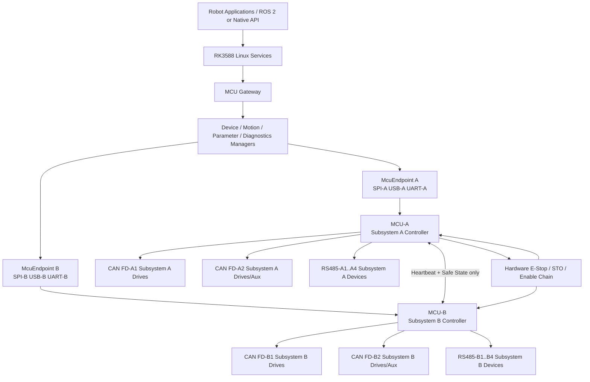
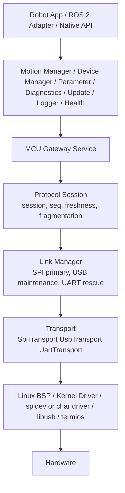
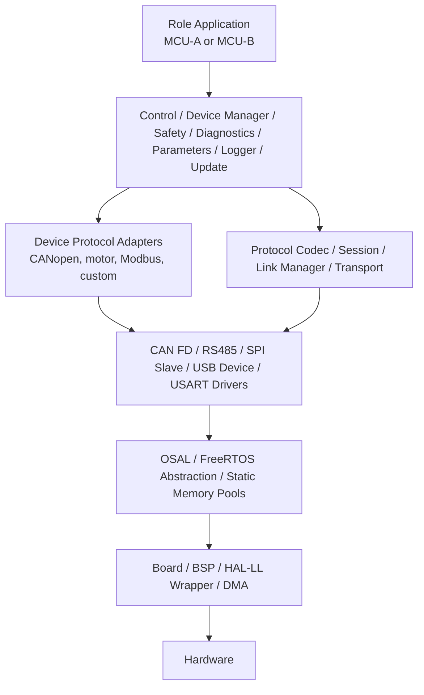
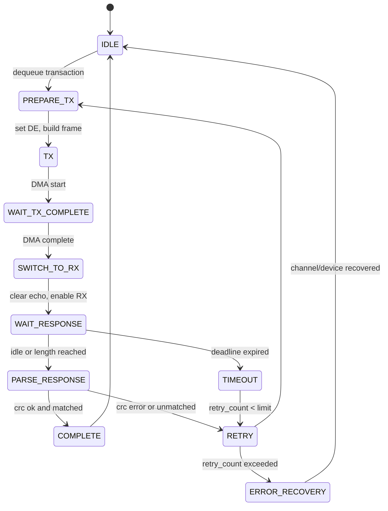
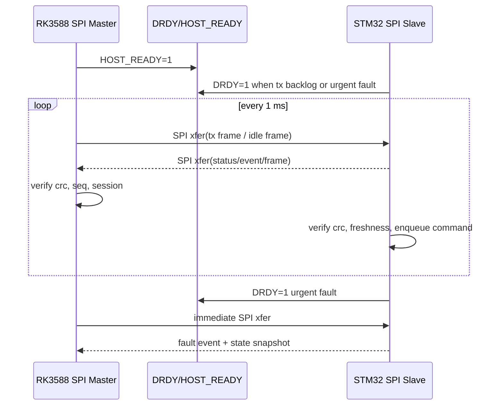
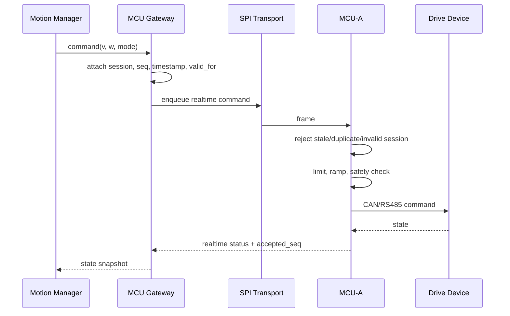
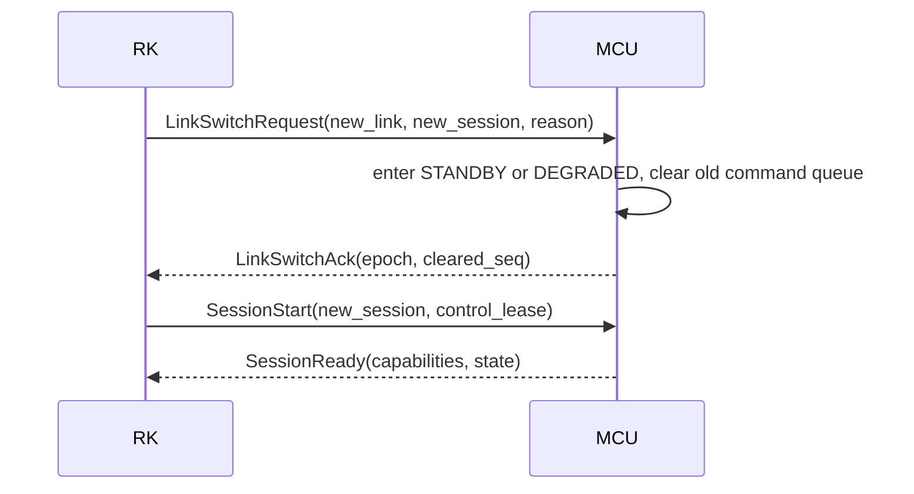
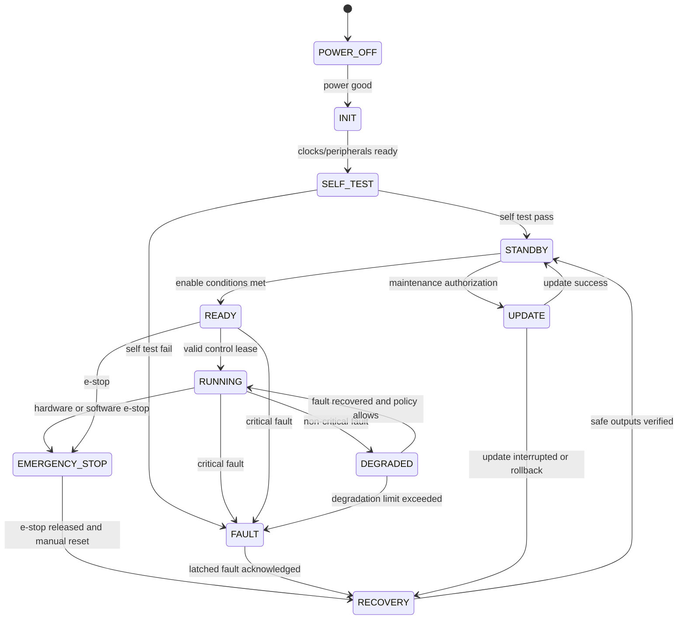
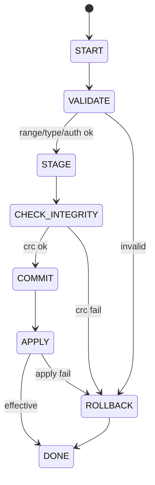
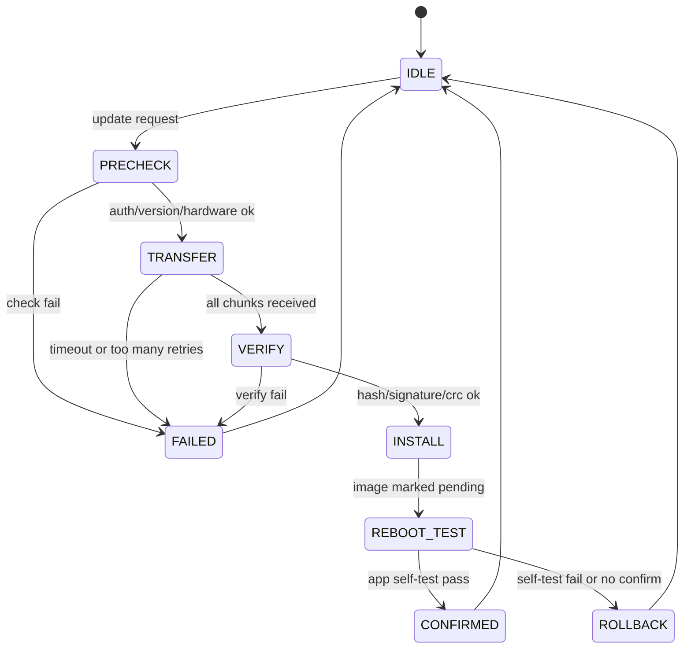

# RK3588 + 双 STM32G474 机器人控制器软硬件架构设计

## 1. 需求理解

本控制器由 1 颗 RK3588 和 2 颗 STM32G474 组成。RK3588 运行 Linux，负责上层算法、任务规划、系统管理、设备抽象、日志、参数、升级和对外 API；两颗 STM32G474 运行 FreeRTOS，负责实时设备通信、执行器控制、安全状态执行、故障诊断和本地保护。

架构目标不是做一次性 Demo，而是建立可产品化、可系列化、可测试、可升级的控制器平台。核心边界如下：

- 硬实时控制和安全保护在 STM32，本地闭环和急停不能依赖 RK3588 在线。
- RK3588 只下发带序列号、时间戳、有效期、会话 ID、控制模式的意图或控制命令。
- 每个执行器只有一个控制所有者，不允许双 MCU 同时控制。
- SPI、USB、USART 共用统一应用协议，但同一时刻只有一个有效控制主链路。
- CAN FD 和 RS485 以物理通道为隔离边界，单通道故障不得拖垮其他通道。
- 参数、协议、故障码和设备描述采用单一事实源生成，避免 RK 与 MCU 手工维护重复结构。

## 2. 已知硬件条件

| 项目 | 已知条件 |
| --- | --- |
| 主处理器 | RK3588，运行 Linux，后续可运行 ROS 2 或非 ROS 服务化架构 |
| 实时控制器 | STM32G474 x2，分别定义为 MCU-A、MCU-B |
| RK 到每颗 MCU 链路 | SPI、USB、USART |
| 每颗 STM32 外部资源 | 2 路 CAN FD、4 路 RS485 |
| 整机外部资源 | 4 路 CAN FD、8 路 RS485 |
| MCU OS | FreeRTOS |
| 主要业务 | 运动控制、执行器控制、传感器采集、CAN FD/RS485 设备管理、参数、诊断、安全、日志、升级、网关 |

需要原理图或具体型号确认：

- STM32G474 具体封装、FDCAN 实例数量、USB FS、SPI 从机、USART、UART、DMA、中断和引脚复用是否能同时满足 2 CAN FD + 4 RS485 + SPI + USB + USART + SWD。
- RK3588 可用 SPI 控制器、片选、DMA、GPIO 中断、USB Host 口、UART 资源。
- CAN 收发器、RS485 收发器、隔离、电源域、终端电阻、方向控制、故障输出和 ESD 设计。
- 急停、STO、驱动器使能、故障继电器、外部看门狗、硬件复位线是否已设计。

## 3. 关键假设

| 假设 | 取值 | 后续确认 |
| --- | --- | --- |
| STM32 主频 | 170 MHz 级别 | 以具体型号和时钟树为准 |
| SPI 主链路 | RK Master，STM32 Slave | 需验证 STM32 SPI Slave + DMA 稳定性 |
| SPI 频率 | 起步 10 MHz，验证后提升到 20-30 MHz | 需板级 SI 和 Linux 驱动验证 |
| SPI 轮询周期 | 1 ms 控制周期，状态 1-5 ms | 由控制频率确认 |
| CAN FD | 仲裁 500 k/1 M，数据段 2-5 M，启用 BRS | 按设备能力配置 |
| RS485 | 9.6 kbps-3 Mbps，半双工，DMA RX/TX | 按设备协议配置 |
| 控制命令有效期 | 2-3 个控制周期 | 按控制周期配置 |
| 安全停机 | MCU 本地超时后执行斜坡停机或输出切断 | 取决于驱动器安全能力 |
| 日志 | 实时路径只记录事件码，不格式化文本 | RK 侧负责文本化 |

## 4. 架构约束

- RK3588 不执行硬实时安全闭环，不直接控制电机使能 GPIO。
- STM32 不依赖 RK 持续在线才能执行急停、命令超时保护、驱动器失联保护。
- 实时路径禁止 `malloc/free`，使用静态内存池、环形缓冲区和固定队列。
- ISR 只做时间戳、搬运指针、写 ring buffer、释放 semaphore 或 task notification。
- 业务层禁止直接调用 `HAL_FDCAN_*`、`HAL_UART_*`、`HAL_SPI_*`、`HAL_GPIO_*`。
- 驱动必须多实例化，不允许单一全局 CAN、UART、设备或电机对象。
- USB 和 USART 默认是维护/升级链路，不具备运动控制权。
- Bootloader、应用固件、协议和数据字典必须版本化并兼容检查。
- 自动生成代码不得手工修改，CI 必须检查生成结果一致性。

## 5. 硬实时、软实时和非实时功能划分

| 类别 | 执行位置 | 典型周期 | 功能 | 约束 |
| --- | --- | ---: | --- | --- |
| 硬实时 | STM32 | 0.5-5 ms | 命令有效期检查、运动输出限制、急停输出、驱动器使能、安全 IO | 不依赖 RK，不阻塞，不动态分配 |
| 软实时 | STM32/RK | 5-50 ms | 设备轮询、状态汇总、故障检测、参数热更新 | 允许有限排队和超时 |
| 非实时 | RK | 50 ms-秒级 | UI/API、日志持久化、升级包管理、云端、ROS 2 适配 | 可重启，不影响本地安全 |

## 6. 双 STM32 职责方案对比

原先“运动控制域 + 辅助设备域”的优势是职责直观，但对本项目不是最优默认方案。两颗 MCU 的主要目的之一是提供更多独立 CAN 物理接口；当多个关节、电机驱动器或舵轮模组只支持 Classical CAN、且需要高频控制时，把所有运动设备压到 MCU-A 的 2 路 CAN 上会很快遇到带宽、仲裁延迟和故障隔离瓶颈。

| 方案 | 实时性 | CAN 资源利用 | 故障隔离 | 安全性 | 扩展性 | 测试复杂度 | 结论 |
| --- | --- | --- | --- | --- | --- | --- | --- |
| 运动控制域 + 辅助设备域 | MCU-A 压力高，运动设备集中 | 差，运动设备只能主要使用 MCU-A 两路 CAN | 运动与辅助隔离清晰，但运动域内部拥塞 | 运动策略集中，简单 | 辅助扩展好，运动扩展差 | 中 | 不作为默认 |
| 空间区域划分 | 局部实时性好 | 中，按区域分摊 CAN | 区域故障隔离好 | 跨区域安全条件复杂 | 中 | 高 | 适合左右/前后强解耦设备 |
| 主控制 MCU + 监控 MCU | 主控路径集中 | 差，接口资源未充分利用 | 监控与控制耦合，易形成双主 | 权限边界难 | 差 | 高 | 不推荐 |
| 子系统划分 | 每个子系统独立实时控制 | 好，可把 4 路 CAN 分配给不同运动/执行子系统 | 好，故障限制在子系统 | 需要系统级安全汇总 | 好，适合多关节、多电机和多产品 | 中高 | 推荐 |

推荐改为“按设备子系统划分”。该方案优先围绕 CAN 总线负载、执行器所有权和物理故障隔离来分配两颗 MCU，而不是简单把全部运动设备放到一颗 MCU 上。

## 7. 推荐的双 STM32 职责划分

推荐默认采用“子系统划分 + 通道容量约束”的方法。一个子系统是一组在控制周期、安全策略、总线协议和机械功能上高度相关的设备，例如底盘左侧、底盘右侧、前桥、后桥、机械臂、云台、升降机构或上装执行机构。

默认分配建议：

| MCU | 默认角色 | 控制所有权 | CAN/RS485 使用原则 | 典型设备 | 关键职责 |
| --- | --- | --- | --- | --- | --- |
| MCU-A | 子系统 A：底盘/运动主子系统 1 | 分配到子系统 A 的电机、制动、编码器、运动安全 IO | CAN FD-A1/A2 优先给高频运动 CAN；RS485-A1-A4 给该子系统传感器/执行器 | 左驱/前桥/主舵轮组/部分关节电机 | 本子系统高频命令执行、限幅、斜坡、命令超时、驱动器故障、安全输出 |
| MCU-B | 子系统 B：底盘/运动主子系统 2 或上装执行子系统 | 分配到子系统 B 的电机、制动、编码器、辅助安全 IO | CAN FD-B1/B2 优先给另一组高频运动 CAN 或上装运动 CAN；RS485-B1-B4 给该子系统设备 | 右驱/后桥/副舵轮组/机械臂/云台/升降/BMS | 本子系统实时控制、设备管理、局部安全状态、系统条件汇总 |

设备分配规则：

- 先按 CAN 物理总线容量分配，再按机械/功能子系统分配。
- 同一 CAN 总线上的设备应属于同一控制周期和相近安全策略，避免高频电机帧与低频维护帧互相干扰。
- 同一个执行器及其使能、反馈、故障处理必须归属同一 MCU。
- BMS、电源、防撞条等系统条件设备可以归属 MCU-B，但其状态通过 RK 和 MCU 间安全摘要参与整机 READY/RUNNING 判断。
- 如果机械臂或多个关节电机需要高频 Classical CAN，优先将其独占 MCU-B 的一到两路 CAN，而不是挤占 MCU-A 的底盘 CAN。

典型产品映射：

| 产品形态 | MCU-A | MCU-B |
| --- | --- | --- |
| 四轮差速/四舵轮底盘 | 左侧/前桥驱动 CAN + 对应 RS485 | 右侧/后桥驱动 CAN + BMS/辅助设备 |
| 底盘 + 机械臂 | 底盘驱动与制动 | 机械臂关节 CAN + 上装传感器 |
| AMR + 云台/升降 | 行走子系统 | 云台、升降、BMS、防撞与环境传感 |
| 多关节执行平台 | 关节组 1 | 关节组 2 |

代价和风险：

- 两颗 MCU 都可能承担运动控制，安全状态和运动模式必须做系统级一致性管理。
- RK 的运动管理层需要把整机运动命令拆分为子系统命令，并处理两个子系统状态不一致。
- 不能让两颗 MCU 互相接管执行器；冗余接管必须由硬件安全设计明确支持。
- 需要更严格的 CAN 负载预算和设备描述表，避免产品变体随意把高频设备塞到同一总线。

备选方案：对于运动设备很少、辅助设备很多的低配产品，可以通过配置退化为“MCU-A 运动、MCU-B 辅助”，但这只是产品变体，不是默认架构。

## 8. 推荐硬件通信拓扑

推荐拓扑：两组独立 SPI + 独立 USB + 独立 USART + 独立 GPIO。

| 链路 | 推荐连接 | 用途 | 关键 GPIO |
| --- | --- | --- | --- |
| SPI-A | RK SPI 控制器 0 -> MCU-A SPI Slave | MCU-A 正常主数据链路 | CS_A、DRDY_A、HOST_READY_A、RESET_A |
| SPI-B | RK SPI 控制器 1 -> MCU-B SPI Slave | MCU-B 正常主数据链路 | CS_B、DRDY_B、HOST_READY_B、RESET_B |
| USB-A/B | RK 独立 Host 口或受控 Hub -> MCU USB Device | 调试、日志导出、维护、升级 | USB VBUS/枚举状态 |
| USART-A/B | RK UART -> MCU USART | 救援升级、低速维护 | 维护授权跳线或按键 |
| MCU-A/B 直连 | GPIO 或低速 UART/CAN | 心跳、安全状态摘要 | HEARTBEAT、SAFE_STATE |

不推荐共享 SPI 作为默认方案，因为任一 MCU MISO 异常或总线电气故障可能影响另一颗 MCU。单 MCU 级联也不推荐，因为会引入软件级单点故障。

## 9. SPI、USB 和 USART 职责矩阵

| 链路 | 默认权限 | 是否可控制运动 | 典型业务 | 切换条件 |
| --- | --- | --- | --- | --- |
| SPI | 主链路 | 是，仅在有效会话和控制租约内 | 控制命令、状态、故障、参数、时间同步、小日志 | 正常运行默认 |
| USB | 维护链路 | 默认否；人工授权维护模式可有限控制 | 调试、批量日志、升级、诊断 | SPI 故障后只允许降级诊断，不自动接管运动 |
| USART | 救援链路 | 否 | Bootloader 救援、最小诊断 | 需物理授权，维护模式 |

控制权机制：

- 正常运行只有 SPI 会话持有控制租约。
- USB/USART 不能绕过 SPI 直接控制执行器。
- 链路切换必须创建新 session_id，清空旧命令队列，递增 epoch，并要求人工确认。
- 多个 USB 上位机连接时，只允许一个维护会话，其他连接只读或拒绝。

## 10. 系统总体架构图



## 11. RK3588 软件分层图



推荐 RK 进程划分：

| 进程 | 职责 | IPC |
| --- | --- | --- |
| `mcu_gatewayd` | 两颗 MCU 通信、协议会话、链路管理 | Unix Domain Socket + shared memory 状态快照 |
| `robot_managerd` | 设备抽象、运动管理、系统状态仲裁 | UDS/gRPC |
| `diagnosticsd` | 故障、日志、黑匣子索引 | UDS |
| `updated` | RK/MCU 升级 | UDS |
| `ros2_adapter` | ROS 2 Topic/Service/Action 适配 | ROS 2 DDS |

底层 `mcu_gatewayd` 不依赖 ROS 2。实时控制命令不建议直接通过 ROS Topic 进入 MCU 协议，应经 `robot_managerd` 做权限、频率、有效期和安全状态检查。

## 12. STM32 软件分层图



依赖规则：

- 上层可依赖下层接口，下层禁止反向依赖业务层。
- 业务层只能通过 `DeviceInterface`、`CanFdInterface`、`Rs485Interface` 等接口访问设备。
- Board 层隔离引脚、DMA、中断和时钟差异。
- MCU-A/MCU-B 共享 `mcu_common`，角色差异由设备描述、配置表、Kconfig 和编译目标注入。

## 13. MCU-A 功能模块

| 模块 | 职责 |
| --- | --- |
| MotionCommandValidator | 校验 session、序列号、时间戳、有效期、控制模式 |
| SubsystemControlService | 子系统 A 命令限幅、斜坡、输出调度、本地闭环 |
| SubsystemDeviceManager | 子系统 A 驱动器、编码器、制动器、传感器生命周期和状态 |
| LocalSafetyPolicy | 急停、失联、驱动器故障、速度/力矩限制、子系统安全输出 |
| CanFdA1/A2 | 子系统 A 高频 CAN 设备，优先分配电机/关节/舵轮驱动器 |
| Rs485A1-A4 | 子系统 A 串口设备、编码器、传感器或执行器 |
| LocalBlackbox | 关键控制量、故障上下文、复位原因 |

## 14. MCU-B 功能模块

| 模块 | 职责 |
| --- | --- |
| MotionCommandValidator | 校验属于子系统 B 的控制命令，拒绝子系统 A 执行器命令 |
| SubsystemControlService | 子系统 B 实时控制，可用于右侧/后桥/机械臂/上装运动 |
| SubsystemDeviceManager | 子系统 B 驱动器、BMS、电源、传感器、辅助执行器生命周期和状态 |
| LocalSafetyPolicy | 本子系统故障处理、电源条件、防撞条件和安全输出 |
| SystemStateAggregator | 汇总子系统 B 与系统条件状态，并上报 RK 与 MCU-A |
| CanFdB1/B2 | 子系统 B 高频 CAN 设备或 BMS/电源 CAN，按产品配置独占 |
| Rs485B1-B4 | 子系统 B 串口设备、传感器、辅助执行器和通用设备 |

## 15. RK 侧多 MCU 实例设计

```cpp
enum class McuRole { SubsystemA, SubsystemB };

struct McuEndpoint {
    uint8_t node_id;
    McuRole role;
    std::unique_ptr<Transport> spi;
    std::unique_ptr<Transport> usb;
    std::unique_ptr<Transport> uart;
    LinkManager link_manager;
    ProtocolSession session;
    DeviceDomain domain;
    VersionInfo protocol_version;
    VersionInfo firmware_version;
    VersionInfo bootloader_version;
    CapabilitySet capabilities;
    HeartbeatState heartbeat;
    TimeSyncState time_sync;
    CommStatistics statistics;
    FaultState faults;
    ParameterSyncState parameter_sync;
    UpdateState update;
};

class McuManager {
public:
    McuEndpoint& endpoint(NodeId id);
    void poll();
private:
    McuEndpoint mcu_a_;
    McuEndpoint mcu_b_;
};
```

两颗 MCU 的接收、发送、超时和重连线程独立运行。任一 MCU 离线不得阻塞另一颗 MCU 的处理线程或 IPC 服务。

## 16. STM32 多通道对象模型

```c
typedef struct {
    uint8_t channel_id;
    void *driver_handle;
    CanFdConfig config;
    CanFdRxRingBuffer rx_buffer;
    CanFdTxQueue tx_queue;
    CanFdFilterTable filters;
    CanFdStatistics statistics;
    CanFdErrorState error_state;
    uint32_t last_rx_timestamp_us;
    uint32_t last_tx_timestamp_us;
} CanFdChannel;

typedef struct {
    uint8_t channel_id;
    void *uart_handle;
    void *tx_dma_handle;
    void *rx_dma_handle;
    Rs485Config config;
    Rs485DirectionControl direction_control;
    Rs485RxRingBuffer rx_buffer;
    Rs485TransactionQueue transaction_queue;
    Rs485ProtocolParser parser;
    Rs485Statistics statistics;
    Rs485ChannelState state;
    uint32_t transaction_deadline_us;
} Rs485Channel;

typedef struct {
    CanFdChannel canfd[2];
    Rs485Channel rs485[4];
    HostEndpoint spi_endpoint;
    HostEndpoint usb_endpoint;
    HostEndpoint uart_endpoint;
    DeviceRegistry devices;
    SafetyContext safety;
} McuRuntimeContext;
```

禁止一个全局缓冲区供所有通道共用。每个设备绑定到唯一通道、唯一协议适配器和唯一所有 MCU。

## 17. FreeRTOS 任务设计表

推荐模型：CAN FD 接收使用 ISR + 通道 ring buffer + 统一 `CanFdRxTask`；CAN FD 发送由统一 `CanFdTxSchedulerTask` 调度两个通道；RS485 由统一 `Rs485SchedulerTask` 管理四个通道的独立事务状态机。不为每个 RS485 设备创建任务。

| 任务 | 优先级 | 触发 | 周期/超时 | WCET 目标 | 栈估算 | 阻塞 | 动态内存 | 通信 | 看门狗 |
| --- | ---: | --- | --- | ---: | ---: | --- | --- | --- | --- |
| SafetyTask | 最高 | 周期 + EventGroup | 1 ms | <100 us | 1.5 KB | 否 | 否 | direct notify/event | 必须 |
| RealtimeControlTask | 高 | 周期 | 1-2 ms | <250 us | 2 KB | 否 | 否 | queue snapshot | 必须 |
| HostLinkRxTask | 高 | SPI/USB/UART notify | 1 ms 超时 | <200 us | 2 KB | 有限 | 否 | ring/queue | 必须 |
| HostLinkTxTask | 中高 | queue + DRDY | 1-5 ms | <300 us | 2 KB | 有限 | 否 | tx queue | 必须 |
| CanFdRxTask | 高 | ISR notify | 1 ms 预算 | <200 us/批 | 2 KB | 有限 | 否 | ring -> device queue | 必须 |
| CanFdTxSchedulerTask | 中高 | 周期 + queue | 1 ms | <200 us | 1.5 KB | 有限 | 否 | priority queue | 必须 |
| Rs485SchedulerTask | 中 | 周期 + DMA notify | 1 ms tick | <300 us | 2.5 KB | 有限 | 否 | transaction queue | 必须 |
| DeviceManagerTask | 中 | 周期 | 5-20 ms | <500 us | 2 KB | 有限 | 否 | queues/events | 必须 |
| DiagnosticsTask | 中低 | 周期 + event | 10-100 ms | <1 ms | 2 KB | 是 | 否 | fault queue | 必须 |
| ParameterTask | 低 | command queue | 按需 | <2 ms/块 | 2 KB | 是 | 否 | queue | 非关键 |
| LoggerTask | 低 | event queue | 按需 | 限流 | 2 KB | 是 | 否 | log queue | 非关键 |
| FirmwareUpdateTask | 低 | command | 维护模式 | 分片限时 | 3 KB | 是 | 静态池 | update queue | 维护态 |
| WatchdogTask | 最高后置 | 周期 | 10-50 ms | <100 us | 1 KB | 否 | 否 | health table | 独立 |
| TimeSyncTask | 中低 | 周期 | 100-1000 ms | <200 us | 1 KB | 有限 | 否 | protocol | 非关键 |

回答关键调度问题：

- 周期任务：Safety、RealtimeControl、CAN TX、RS485 Scheduler、DeviceManager、Diagnostics、Watchdog、TimeSync。
- ISR + Task Notification：SPI DMA 完成、UART IDLE、UART DMA 完成、FDCAN RX、GPIO DRDY。
- Queue：主机命令、设备事件、CAN TX、RS485 事务、故障、日志。
- EventGroup：安全状态、链路状态、升级状态、全局模式。
- 不允许持有互斥锁：SafetyTask、RealtimeControlTask、WatchdogTask、ISR。
- 优先级反转：实时路径不用 mutex；共享快照用双缓冲或 seqlock；低优先级持锁资源使用 priority inheritance 且不可被实时任务依赖。
- CAN 高峰防饿死：每次批处理设置帧数和时间预算，超过预算保留 backlog 并上报丢帧风险。
- RS485 超时不阻塞：每通道事务状态机独立推进，单设备超时只结束当前事务并进入重试/离线计数。
- 实时路径日志：只记录固定事件 ID 和快照，不格式化字符串，不写 Flash。

## 18. CAN FD 模块设计

每个 CAN FD 通道包含独立配置、过滤器、RX FIFO、ring buffer、TX 优先级队列、周期帧调度表、事件帧队列、节点在线表、错误状态和统计。

虽然 MCU 外设是 FDCAN，但架构必须把“Classical CAN 设备”作为一等约束处理。很多电机驱动器只支持 1 Mbps Classical CAN，不能依赖 CAN FD 数据段带宽来消化高频控制帧。因此设备分配时先做 Classical CAN 最坏负载预算，再决定该设备归属 MCU-A 还是 MCU-B。

| 层 | 职责 |
| --- | --- |
| FDCAN Driver | HAL/LL 封装、DMA/中断、Bus Off 检测、错误计数 |
| CanFdChannel | 通道上下文、过滤器、RX/TX 队列、统计 |
| CanProtocolAdapter | 原始 CAN、CAN FD、自定义电机协议、CANopen 等 |
| Device Driver | 品牌设备对象，状态机和命令接口 |
| Device Manager | 设备注册、在线检测、故障上报 |

调度规则：

- 紧急帧优先级最高，抢占普通事件帧和周期诊断帧。
- 周期控制帧使用 deadline + priority 调度。
- 低优先级帧采用 deficit round-robin，避免长期饥饿。
- Bus Off 后通道进入 `BUS_OFF_SAFE`；若该通道承载运动或执行器控制，对应所属 MCU 的子系统进入 DEGRADED/FAULT 或 EMERGENCY_STOP。恢复需要满足冷却时间、错误计数归零和安全策略确认。
- 接收中断只搬运帧到通道 ring buffer 并通知 `CanFdRxTask`。
- 高负载场景启用静态内存池；设备状态可采用零拷贝快照，但跨任务传递只传指针和长度。

CAN 通道分配约束：

| 约束 | 推荐规则 |
| --- | --- |
| Classical CAN 高频电机 | 单路 CAN 峰值负载按 <= 50%-60% 设计，超过即拆分到另一 CAN 或另一 MCU |
| 多关节控制 | 按关节组/机械链/控制周期分配到 CAN-A1/A2/B1/B2，不默认集中在 MCU-A |
| CAN FD 设备 | 可与低频诊断或传感器共享，但不得挤占高频 Classical CAN 电机周期 |
| BMS/电源 CAN | 若低频，可放在 MCU-B 的非高频 CAN；若 MCU-B 两路 CAN 都给运动子系统，则需迁移到 RS485、独立网关或重新分配 |
| 同一执行器相关帧 | 命令、反馈、使能、故障必须在同一 MCU 内闭环 |
| 跨 MCU 协调 | 只交换状态摘要，不通过一颗 MCU 转发另一颗 MCU 的高频电机命令 |

CAN FD 总线负载公式：

```text
bus_load = sum(frame_bits_i / period_i) / arbitration_or_data_rate
recommended_peak_load <= 60%, emergency_margin >= 20%
```

Classical CAN 示例计算应按最坏位填充、仲裁、应答和帧间隔估算。工程上可先按 130-160 bit/8 字节帧粗算：

```text
classic_can_load = sum(frame_count_per_cycle_i * 160 bits / cycle_i) / 1 Mbps
```

如果 8 个关节每个关节 1 条命令帧 + 1 条反馈帧，周期 1 ms，则粗略负载约 `8 * 2 * 160 / 0.001 / 1e6 = 256%`，必须拆分到多路 CAN、降低频率、减少帧数或改用支持 CAN FD/更高速总线的驱动器。

## 19. RS485 模块设计

每个 RS485 通道独立包含 UART 配置、方向控制、DMA TX、DMA 循环 RX、IDLE 检测、环形缓冲区、事务队列、轮询表、协议解析器、错误统计和通道状态机。

支持协议：

- Modbus RTU：地址、功能码、CRC16、3.5 字符间隔、请求响应事务。
- 自定义协议：以适配器形式实现 `encode/decode/match_response`。
- VESC 类串口协议：长度、命令 ID、CRC、粘包/残帧处理由 parser 负责。

RS485 事务状态机：



公平性和故障处理：

- 紧急命令、周期轮询、普通命令分队列，使用权重调度。
- 单设备最大重试次数和最大连续占用时间受限。
- 设备超时只标记该设备，不阻塞同通道其他设备。
- 残帧和噪声按 parser 规则丢弃并计数；错误波特率设备隔离为 offline。
- 通道持续占线触发通道级 recovery：关闭接收、重新初始化 UART/DMA、清空残帧、上报故障。

## 20. RK 与 STM32 统一协议

协议与物理链路无关，运行于 SPI、USB、USART。推荐“固定公共头 + TLV Payload + 数据字典生成 ID”的二进制协议。实时控制命令使用固定布局 payload，参数、能力、日志、升级使用 TLV。

帧头：

```c
#define RC_MAGIC 0x52434231u /* RCB1 */

typedef struct {
    uint32_t magic;
    uint8_t protocol_major;
    uint8_t protocol_minor;
    uint8_t header_len;
    uint8_t header_crc8;
    uint16_t msg_type;
    uint16_t msg_subtype;
    uint8_t src_node_id;
    uint8_t dst_node_id;
    uint8_t mcu_role;
    uint8_t flags;
    uint32_t session_id;
    uint32_t sequence;
    uint64_t timestamp_us;
    uint32_t valid_for_us;
    uint16_t payload_len;
    uint16_t fragment_id;
    uint16_t fragment_count;
    uint32_t payload_crc32;
} RcFrameHeader;
```

消息类型：心跳、能力查询、版本查询、实时控制、实时状态、设备状态、故障事件、参数读写、参数同步、时间同步、日志、调试命令、固件升级、Bootloader 控制、链路切换、会话建立/结束、安全状态。

关键策略：

- 实时控制命令不做无限 ACK/重传；只做状态反馈携带最新已接收序列号。过期命令直接拒绝。
- 参数写入、升级、Bootloader 控制必须 ACK，并支持重传、超时和幂等。
- 状态反馈丢失不重传，下一周期覆盖。
- 任一端复位后 session_id 变化，旧 session 命令全部拒绝。
- 支持 credit/window 流控，升级和日志使用分片。
- 大报文按 fragment_id 重组，乱序只允许维护链路；控制链路要求单调序列。
- 字节序固定 little-endian，禁止直接发送编译器结构体内存布局，所有字段由生成代码序列化。

序列化方案对比：

| 方案 | 实时性 | RAM | 扩展 | 调试 | 结论 |
| --- | --- | --- | --- | --- | --- |
| 自定义定长二进制 | 最高 | 低 | 差 | 一般 | 适合实时 payload |
| TLV | 高 | 低 | 好 | 好 | 推荐作为通用 payload |
| nanopb | 中 | 中 | 好 | 好 | 可用于非实时复杂消息 |
| FlatBuffers | 中 | 高 | 好 | 一般 | MCU 侧过重 |
| CBOR/MessagePack | 中 | 中 | 好 | 好 | 可用于工具链，不作为控制链路默认 |

## 21. SPI 通信机制

推荐：RK Master，STM32 Slave，独立 SPI，模式 0 或模式 3 由板级验证决定，固定长度 mailbox 事务，事务内全双工上下行。

| 项目 | 推荐 |
| --- | --- |
| 事务长度 | 256/512 字节固定长度起步，升级可用 1024 字节维护事务 |
| 周期 | 1 ms 控制轮询，空闲时 5 ms |
| DMA | 双端启用 DMA，STM32 双缓冲 |
| 空闲填充 | `IDLE` 帧，带有效 header 和空 payload |
| DRDY | STM32 有紧急数据或 TX backlog 时拉高 |
| HOST_READY | RK 表示可调度 SPI |
| CRC 错误 | 丢弃帧，统计，连续错误触发 resync |
| 重同步 | 搜索 magic + header_crc + payload_crc，或 session reset |
| 复位检测 | 版本/boot counter/session_id 变化 |

SPI 时序图：



## 22. 关键通信时序图

控制命令：



链路切换：



## 23. 数据字典与代码生成

推荐使用 YAML 作为单一事实源，生成 C/C++ 类型、枚举、序列化、消息 ID、参数 ID、故障码、协议文档、日志解析器、Wireshark 定义和 Python 测试定义。DBC 可作为 CAN 设备子协议输入，但不作为全系统唯一数据源。

目录：

```text
idl/
  messages.yaml
  parameters.yaml
  faults.yaml
  devices/
    motion_drives.yaml
    bms.yaml
tools/codegen/
generated/
  rk3588/
  stm32/
  python/
  docs/
```

规则：

- YAML schema 受版本控制，字段只能追加或明确废弃，不能静默改变语义。
- 生成文件头部标记 `DO NOT EDIT`。
- CI 执行 codegen 后检查 git diff 为空。
- 协议兼容检查比较 message_id、field_id、类型、默认值、必选/可选状态。

## 24. 系统安全状态机



状态命令约束：

| 状态 | 允许 | 禁止 |
| --- | --- | --- |
| INIT/SELF_TEST | 自检、版本、能力、日志 | 运动控制、参数写入生效、升级执行 |
| STANDBY | 参数、诊断、升级准备、使能检查 | 执行器输出 |
| READY | 控制会话建立、低风险设备控制 | 超出租约的运动控制 |
| RUNNING | 有效实时控制、状态上报 | 升级、关键参数写入 |
| DEGRADED | 限速/限能运行、辅助设备隔离 | 高风险动作 |
| FAULT | 故障读取、黑匣子导出、人工复位 | 自动恢复运动 |
| EMERGENCY_STOP | 输出切断、故障记录 | 任何运动输出 |
| UPDATE | 固件升级、回滚 | 运动控制 |

关键场景：

- RK 与 MCU-A 中断：MCU-A 所属子系统命令超时后斜坡停机或切断输出，整机根据子系统重要性进入 DEGRADED/FAULT。
- RK 与 MCU-B 中断：MCU-B 所属子系统命令超时后斜坡停机或切断输出；若 MCU-B 承载机械臂/右侧驱动等运动设备，处理等级与 MCU-A 相同。
- 任一 MCU 的运动 CAN Bus Off：所属子系统进入安全停机，Bus Off 恢复需安全策略确认。
- MCU-B 上的 BMS 掉线：禁止进入 READY；RUNNING 时根据电源状态保持时长进入 DEGRADED 后停车。
- 控制命令序列倒退：拒绝，记录协议故障，连续出现触发会话重建。
- 急停按下：硬件链路最高优先级，软件只记录和上报。
- 急停释放：不自动恢复，必须人工复位并重新进入 READY。

## 25. 双 STM32 协同机制

推荐两颗 STM32 只交换心跳、安全状态和关键系统摘要，不互发普通执行器控制命令，不自动接管对方执行器。

| 数据 | 方向 | 周期 | 内容 |
| --- | --- | ---: | --- |
| Heartbeat | A <-> B | 10-50 ms | node_id、boot_counter、state、fault_level |
| SafeState | A <-> B | 10 ms 或事件 | e-stop、ready、running、fault、degraded |
| SystemCondition | B -> A 或按设备归属 | 20-100 ms | BMS OK、电源 OK、防撞条、系统安全条件 |
| SubsystemSummary | A <-> B | 20-100 ms | 子系统运动状态、限速状态、急停状态、控制租约状态 |

最终执行器使能权限：

- 本地执行器由所属 MCU 管理。
- 硬件急停和安全继电器高于所有软件。
- RK 负责正常状态汇总，不是硬实时安全仲裁者。

## 26. 故障处理矩阵

| 故障 | 检测方 | 处理 | 状态 | 恢复 |
| --- | --- | --- | --- | --- |
| RK-MCU-A SPI 中断 | MCU-A/RK | MCU-A 子系统命令超时停车或安全输出关闭，RK 标记子系统 A 离线 | FAULT/DEGRADED | 链路恢复 + 新会话 + 人工确认 |
| RK-MCU-B SPI 中断 | MCU-B/RK | MCU-B 子系统命令超时停车或安全输出关闭，RK 标记子系统 B 离线 | FAULT/DEGRADED | 链路恢复 + 新会话 + 人工确认 |
| MCU-A 重启 | RK/MCU-B | RK 停止向子系统 A 下发控制，所属驱动器使能关闭；整机按配置停车或降级 | FAULT | 自检 + 会话重建 |
| MCU-B 重启 | RK/MCU-A | RK 停止向子系统 B 下发控制，所属驱动器/辅助设备进入安全态；整机按配置停车或降级 | FAULT/DEGRADED | 自检 + 会话重建 |
| CAN Bus Off | 对应 MCU | 通道安全停机或隔离 | DEGRADED/FAULT | 冷却 + 恢复 + 策略确认 |
| RS485 设备超时 | 对应 MCU | 单设备离线，通道继续调度 | WARNING/DEGRADED | 连续成功响应 |
| 参数 CRC 错 | RK/MCU | 使用上一版本或出厂默认 | FAULT | 参数恢复 |
| 固件版本不兼容 | RK/MCU | 拒绝 RUNNING | FAULT | 升级匹配版本 |
| 看门狗复位 | 本节点 | 记录复位原因，进入 SELF_TEST | FAULT/RECOVERY | 人工复位或策略允许 |

## 27. 参数管理方案

三级参数：

| 层级 | 存储 | 示例 | 修改权限 |
| --- | --- | --- | --- |
| 出厂参数 | MCU Flash 双区 + RK 备份 | 校准、硬件版本、序列号 | 工厂授权 |
| 机器人型号参数 | RK 主库 + MCU 必要子集 | 轮距、设备拓扑、协议参数 | 工程授权 |
| 运行时参数 | RK + 所属 MCU | 限速、滤波、轮询周期 | 运行授权 |

参数字段：id、name、type、default、min、max、unit、permission、owner_node、apply_policy、reboot_required、hot_update_allowed、version、crc。

更新事务：



Flash 策略：双区存储、版本号、CRC、提交标记、磨损均衡；高频运行参数不直接写 MCU Flash，先由 RK 持久化并按策略同步。

## 28. 固件升级方案

升级包元数据：目标节点、硬件型号、固件角色、版本号、最低兼容版本、文件长度、hash、签名、CRC、分片大小、依赖协议版本、防降级计数器。

升级状态机：



策略：

- 任一承载运动/执行器控制的 MCU 升级必须在 STANDBY/UPDATE，所属子系统输出关闭。
- 另一个 MCU 是否可继续保持低风险监控或维持静止状态，取决于产品安全策略；默认整机不得进入新的 RUNNING。
- 两颗 MCU 固件版本不兼容时拒绝 READY/RUNNING。
- MCU Bootloader 升级风险高，需双 Bootloader 或 ROM/USART 物理救援授权。
- USART 救援升级必须有物理操作授权，不能远程静默进入。
- 未签名或签名错误固件拒绝运行。

## 29. 故障诊断与日志方案

故障记录字段：模块、节点 ID、通道 ID、设备 ID、等级、故障码、首次时间、最近时间、次数、当前状态、恢复状态、锁存、自动恢复条件、人工复位要求、上下文快照、固件版本、通信统计。

| 日志位置 | 内容 | 策略 |
| --- | --- | --- |
| STM32 RAM ring | 实时事件、关键快照、高频计数 | 不阻塞，不格式化 |
| STM32 Flash | 复位原因、锁存故障、升级记录、少量黑匣子 | 限流、合并、磨损均衡 |
| RK 存储 | 完整日志、故障数据库、黑匣子导出、设备历史 | 持久化、索引、压缩 |

高频故障合并：同一 fault key 在窗口内只更新 count 和 last_time；超过等级阈值才上报事件。日志导出由 RK 拉取 STM32 ring 和 Flash 摘要。

## 30. 看门狗和健康监控

任务健康表：

| 任务 | 最大周期 | 最大执行时间 | 进展条件 |
| --- | ---: | ---: | --- |
| SafetyTask | 2 ms | 150 us | 状态机 tick 增长 |
| RealtimeControlTask | 3 ms | 300 us | accepted_seq 或 timeout 状态更新 |
| HostLinkRxTask | 5 ms | 300 us | rx counter 或 idle tick 更新 |
| CanFdRxTask | 5 ms | 300 us | ring watermark 被处理 |
| Rs485SchedulerTask | 5 ms | 400 us | transaction state 推进 |
| DeviceManagerTask | 50 ms | 1 ms | device scan generation 增长 |
| WatchdogTask | 50 ms | 100 us | health decision 完成 |

联合喂狗伪代码：

```c
void WatchdogTask(void *arg)
{
    for (;;) {
        uint32_t now = monotonic_ms();
        bool ok = true;

        for (size_t i = 0; i < critical_task_count; ++i) {
            TaskHealth *h = &health_table[i];
            ok &= (now - h->last_alive_ms) <= h->max_period_ms;
            ok &= h->last_exec_us <= h->max_exec_us;
            ok &= h->progress_counter != h->last_checked_progress;
            h->last_checked_progress = h->progress_counter;
        }

        ok &= safety_outputs_are_consistent();
        ok &= scheduler_tick_is_running();

        if (ok) {
            record_watchdog_feed(now);
            hardware_watchdog_feed();
        } else {
            record_watchdog_block_reason(now);
        }

        vTaskDelay(pdMS_TO_TICKS(10));
    }
}
```

连续多次看门狗复位后进入 RECOVERY 或救援模式，禁止自动 RUNNING。

## 31. 时间同步方案

推荐：SPI 周期消息中实现简化 NTP/PTP 式四时间戳同步，必要时增加 GPIO 同步脉冲用于更高精度日志对齐。

| 方法 | 精度 | 代价 | 结论 |
| --- | --- | --- | --- |
| 简单周期校时 | ms 级 | 低 | 仅适合日志粗对齐 |
| NTP 式往返 | 100 us-ms | 低 | 默认推荐 |
| 简化 PTP | 10-100 us | 中 | SPI 延迟可建模时使用 |
| GPIO 同步脉冲 | us 级 | 增加引脚 | 高精度传感器时间戳可选 |
| PPS | us 级 | 外部源 | 特殊产品可选 |

协议使用 RK 单调时钟作为系统时间源，STM32 保留本地 monotonic tick 和 `time_offset_us`。控制命令有效期使用 RK timestamp + STM32 估计 offset 判定，同时保留本地接收时间兜底。

## 32. 性能预算表

示例预算仅用于详细设计起点，最终值需实测。

| 项目 | 示例目标 | 计算/说明 |
| --- | ---: | --- |
| SPI 时钟 | 10-20 MHz 起步 | 板级 SI 稳定后提升 |
| SPI 事务 | 512 B @ 1 ms | 512*8/10M=0.41 ms，含开销约 50% 利用率 |
| 控制命令频率 | 100-500 Hz | 由运动控制周期确定 |
| 状态反馈 | 100-500 Hz 关键状态，10-50 Hz 普通状态 | 分级上报 |
| RK->MCU 延迟 | 1-2 个 SPI 周期 | 排队 + 轮询 |
| STM32->RK 延迟 | 1-2 个 SPI 周期，紧急 DRDY 抢占 | 取决于 RK 调度 |
| CAN FD 负载 | 峰值 <= 60% | 保留紧急帧余量 |
| RS485 轮询 | `sum(tx+rx+gap+timeout)` | 按设备最坏响应计算 |
| STM32 CPU | 平均 <= 60%，峰值 <= 80% | 预留安全余量 |
| 中断占用 | <= 15% | 高峰需实测 |
| RAM 余量 | >= 25% | 含栈高水位 |
| Flash 余量 | >= 20% | 支持升级增长 |

## 33. RAM、Flash 和任务栈预算

以 STM32G474 中等资源封装为初始估算，需按具体型号修正。

| 类别 | 预算 |
| --- | ---: |
| FreeRTOS heap/static pools | 16-32 KB |
| 任务栈总计 | 25-35 KB |
| CAN RX/TX buffers | 8-16 KB |
| RS485 DMA/ring/transactions | 12-24 KB |
| Host link buffers | 8-16 KB |
| Device states | 8-24 KB |
| Diagnostics/log ring | 8-16 KB |
| 参数缓存 | 4-8 KB |

栈必须启用 high water mark 检查，CI/HIL 阶段输出最小余量。关键任务栈低于 30% 余量需调整。

## 34. 代码仓库目录树

```text
robot_controller/
  rk3588/
    drivers/
    transport/
    protocol/
    mcu_gateway/
    device_manager/
    motion_manager/
    diagnostics/
    parameter_service/
    update_service/
    health_manager/
    logger/
    ros2_adapter/
    applications/
  mcu_common/
    bsp_interface/
    drivers/
    osal/
    transport/
    protocol/
    canfd/
    rs485/
    device_framework/
    diagnostics/
    parameters/
    safety/
    logger/
    watchdog/
    bootloader/
  mcu_a/
    board/
    config/
    devices/
    control/
    safety_policy/
    application/
  mcu_b/
    board/
    config/
    devices/
    control/
    safety_policy/
    application/
  idl/
  protocol/
  generated/
  bootloader/
  tools/
  tests/
    unit/
    integration/
    protocol/
    mock/
    fault_injection/
  simulation/
  hil/
  docs/
  ci/
```

构建建议：CMake 管理 RK 和 STM32 公共模块；Kconfig 管理产品型号和角色配置；CubeMX 生成代码隔离在 `board/cubemx_generated/`，业务不得修改生成文件，只通过 wrapper 和 user hooks 接入。

## 35. 核心接口定义

```c
typedef enum {
    RC_OK = 0,
    RC_ERR_INVALID_ARG = -1,
    RC_ERR_TIMEOUT = -2,
    RC_ERR_BUSY = -3,
    RC_ERR_CRC = -4,
    RC_ERR_NOT_SUPPORTED = -5,
    RC_ERR_NOT_READY = -6
} RcStatus;

typedef struct {
    int (*open)(void *context);
    int (*close)(void *context);
    int (*send)(void *context, const uint8_t *data, uint32_t length, uint32_t timeout_ms);
    int (*receive)(void *context, uint8_t *data, uint32_t capacity, uint32_t *actual, uint32_t timeout_ms);
    int (*get_status)(void *context, void *status);
    int (*set_event_callback)(void *context, void (*cb)(void *user, uint32_t event), void *user);
} TransportInterface;

typedef struct {
    int (*init)(CanFdChannel *channel);
    int (*send)(CanFdChannel *channel, const CanFdFrame *frame);
    int (*receive)(CanFdChannel *channel, CanFdFrame *frame);
    int (*recover_bus_off)(CanFdChannel *channel);
    int (*get_statistics)(CanFdChannel *channel, CanFdStatistics *statistics);
} CanFdInterface;

typedef struct {
    int (*submit_transaction)(Rs485Channel *channel, const Rs485Transaction *transaction);
    int (*cancel_transaction)(Rs485Channel *channel, uint32_t transaction_id);
    int (*poll)(Rs485Channel *channel, uint32_t now_us);
    int (*get_statistics)(Rs485Channel *channel, Rs485Statistics *statistics);
} Rs485Interface;

typedef struct {
    int (*init)(void *device);
    int (*start)(void *device);
    int (*stop)(void *device);
    int (*process)(void *device, uint32_t now_ms);
    int (*set_command)(void *device, const void *command);
    int (*get_state)(void *device, void *state);
    int (*get_fault)(void *device, void *fault);
} DeviceInterface;
```

接口规范：

- 返回值统一使用 `RcStatus`，禁止混用 HAL 返回值。
- 调用方拥有输入 buffer，接口不得异步保存栈上指针。
- 实时任务调用的接口必须声明是否可阻塞。
- 回调只发布事件，不执行复杂业务。
- 错误通过返回值 + Diagnostics 事件双通道传播。

## 36. 关键模块伪代码

命令新鲜度检查：

```c
bool accept_control_command(Session *s, const RcFrameHeader *h)
{
    uint64_t now = synced_time_us();
    if (h->session_id != s->active_session_id) return false;
    if (seq_less_or_equal(h->sequence, s->last_control_seq)) return false;
    if (now > h->timestamp_us + h->valid_for_us) return false;
    if (!safety_state_allows_control(h->flags)) return false;

    s->last_control_seq = h->sequence;
    s->last_control_rx_us = now;
    return true;
}
```

CAN TX 调度：

```c
void CanFdTxSchedulerTask(void *arg)
{
    for (;;) {
        uint32_t budget_us = 200;
        uint32_t start = timer_us();
        for (size_t ch = 0; ch < CANFD_CHANNEL_COUNT; ++ch) {
            while (timer_us() - start < budget_us) {
                CanFdFrame frame;
                if (!can_tx_pick_next(&canfd[ch], &frame)) break;
                if (canfd_send(&canfd[ch], &frame) != RC_OK) break;
            }
        }
        vTaskDelay(pdMS_TO_TICKS(1));
    }
}
```

链路切换清理：

```c
void link_switch_commit(LinkManager *lm, LinkId new_link, uint32_t new_session)
{
    disable_control_output_until_ready();
    clear_realtime_command_queue();
    protocol_session_reset(&lm->session, new_session);
    lm->active_control_link = new_link;
    lm->epoch++;
}
```

## 37. 测试方案

| 测试层级 | 工具 | 覆盖 |
| --- | --- | --- |
| 单元测试 | GoogleTest/Ceedling/Unity | 算法、协议编解码、CRC、序列号、状态机 |
| Mock 集成 | PC 模拟驱动、Python pytest | CAN/RS485/SPI/USB 虚拟设备、参数、升级 |
| STM32 板级 | HIL 脚本、逻辑分析仪 | DMA、中断、Bus Off、RS485 占线、看门狗 |
| RK-MCU 联调 | Python 压测、fault injection | 丢帧、乱序、重复帧、链路切换、重启 |
| 整机验证 | HIL + 实车台架 | 急停、驱动器掉线、BMS 掉线、长稳 |
| 量产测试 | 自动夹具 | 通信资源、Flash、Bootloader、序列号 |

阶段准入：

- 架构验证：协议、状态机、任务模型 PC 测试通过。
- 驱动开发：每个外设 loopback/压力测试通过。
- 协议联调：SPI/USB/USART 统一协议通过兼容测试。
- 设备接入：每类设备 mock + 实物基本测试通过。
- 整机联调：关键故障注入测试通过。
- 产品验证：长稳、升级断电、急停、安全策略通过。

## 38. CI/CD 方案

每次提交：

- RK C++ 构建、clang-format、clang-tidy、单元测试。
- STM32 多目标交叉编译，固件大小/RAM map 检查。
- codegen 一致性检查。
- 协议兼容性检查。
- Cppcheck 或等效静态分析。
- 协议 Python 测试和 mock 集成测试。

合并请求：

- 覆盖率不下降。
- 自动生成文件变化必须附带 IDL 变化。
- MCU-A/MCU-B 协议版本矩阵通过。
- 关键安全状态机测试通过。

发布：

- 版本号由 git tag + 构建号生成。
- 固件签名，产物归档 hash、map、日志、测试报告。
- 发布包声明 RK、MCU-A、MCU-B、Bootloader、协议和数据字典版本。

## 39. 分阶段开发计划

| 阶段 | 目标 | 主要产物 |
| --- | --- | --- |
| P0 架构验证 | 验证协议、任务模型、SPI mailbox | PC mock、状态机、接口定义 |
| P1 板级 bring-up | 外设可用性验证 | SPI/USB/UART/CAN/RS485 驱动 |
| P2 协议联调 | RK 与双 MCU 稳定通信 | mcu_gatewayd、协议测试 |
| P3 设备框架 | CAN/RS485 设备接入 | 设备描述、协议适配器 |
| P4 安全与诊断 | 故障矩阵和状态机闭环 | 急停、看门狗、黑匣子 |
| P5 升级参数 | 参数、升级、回滚 | codegen、A/B、签名 |
| P6 整机验证 | HIL 和台架验证 | 故障注入、长稳报告 |
| P7 产品化 | 量产和维护工具 | 产测、日志导出、版本矩阵 |

## 40. 架构风险审查

| 等级 | 问题 | 触发条件 | 后果 | 修改建议 |
| --- | --- | --- | --- | --- |
| 严重 | 当前普通 STM32 + 软件不能宣称达到高等级功能安全 | 需要 ISO 13849/IEC 61508 等 | 安全认证不成立 | 增加安全 MCU、双通道急停、安全继电器/STO |
| 严重 | SPI/USB/USART 多链路控制权不清 | 调试软件误发控制 | 执行器误动作 | 控制租约 + session + 维护授权 + 默认 USB/USART 无控制权 |
| 严重 | 任一 MCU 失联后另一 MCU 自动接管其执行器 | 软件尝试冗余 | 双主控制或安全失效 | 禁止自动接管，除非硬件安全设计支持 |
| 高 | STM32 封装资源不足或 DMA 冲突 | 2 CAN + 4 RS485 + USB + SPI 同时启用 | 返板或降功能 | 原理图和 CubeMX 资源矩阵前置验证 |
| 高 | 多个高频 Classical CAN 电机集中到单路 CAN | 设备不支持 CAN FD 且控制周期高 | 仲裁延迟、反馈超时、控制抖动 | 按最坏负载把关节组拆分到 CAN-A1/A2/B1/B2 |
| 高 | CAN Bus Off 自动恢复不受控 | 总线噪声或短路恢复 | 运动突然恢复 | 恢复进入 DEGRADED，需策略确认 |
| 高 | RS485 单设备超时阻塞调度器 | 设备不响应或占线 | 通道设备全部掉线 | 独立事务状态机和最大占用时间 |
| 高 | 看门狗被单任务代喂 | 某关键任务死亡 | 故障未复位 | 联合健康表判定后喂狗 |
| 一般 | 协议 TLV 过度灵活 | 实时 payload 任意扩展 | MCU 解析复杂 | 实时消息固定布局，非实时 TLV |
| 一般 | codegen 工具链维护成本 | 数据字典复杂 | 上手慢 | schema 简化，CI 强制，生成文档 |

结论：架构可以进入详细设计阶段，但硬件资源、急停/STO、安全等级目标和 SPI 从机稳定性必须优先确认。

## 41. 需要硬件团队确认的事项

- STM32G474 具体型号和封装是否同时支持 2 FDCAN、4 UART/USART RS485、SPI Slave、USB Device、调试口和足够 DMA。
- 每路 CAN FD 收发器型号、隔离、电源域、终端、故障输出和 Bus Off 可观测性。
- 每路 RS485 收发器方向控制、隔离、偏置、终端、故障保护和总线占线检测。
- RK3588 是否有两组独立 SPI 控制器、DMA、片选和 GPIO 中断。
- 独立 USB Host 口还是 USB Hub；Hub 故障是否会同时影响两颗 MCU。
- RK-MCU RESET、DRDY、HOST_READY、心跳 GPIO、硬件急停输入、驱动器使能输出、故障继电器。
- 是否需要安全继电器、安全 MCU、双通道急停、STO 和认证器件。
- Bootloader 救援物理授权方式：跳线、按键、钥匙开关或工装。

## 42. 需要产品团队确认的事项

- 目标机器人类型：底盘、机械臂、复合机器人或多产品系列。
- MCU-A/MCU-B 默认子系统边界、设备清单和执行器所有权。
- 每个电机/关节驱动器是否支持 CAN FD；若只支持 Classical CAN，需要确认控制周期、帧数量和总线拆分策略。
- 失联、降级、停车、急停释放后的用户体验和人工复位要求。
- 是否有功能安全等级目标或客户认证要求。
- ROS 2 是否作为正式产品接口，还是仅作为适配层。
- 维护模式权限、远程升级权限、日志保留周期和隐私要求。
- 参数权限分级和现场工程师可修改范围。
- 固件防降级、签名、离线升级和救援升级流程。

## 43. 是否可以进入详细设计阶段的结论

可以进入详细设计阶段，前提是先完成硬件资源矩阵和安全目标确认。当前推荐架构已经明确 RK3588、MCU-A、MCU-B 的职责边界，定义了主链路仲裁、统一协议、多通道对象模型、FreeRTOS 任务模型、故障安全状态机、参数和升级机制，能够直接指导后续原理图审查、代码仓库搭建和模块详细设计。

进入详细设计前必须冻结或确认以下五项：

1. STM32G474 具体封装和全部外设/DMA/引脚复用资源。
2. 硬件急停、驱动器使能、STO 或安全继电器方案。
3. SPI 独立链路、DRDY/HOST_READY/RESET GPIO 和 USB/USART 维护链路拓扑。
4. 首批机器人型号的子系统划分、执行器所有权、每路 CAN 的设备清单和 Classical CAN 最坏负载预算。
5. 控制周期、CAN/RS485 波特率、设备反馈频率和安全停机策略。
